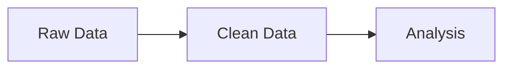

# CLAUDE.md - AI Assistant Guide

This document provides context for AI assistants (like Claude) working on this project.

---

## Project Overview

**Project Name:** Understanding Data Roles in Tech  
**Type:** Static documentation website built with MkDocs  
**Purpose:** Educational guide helping people explore 20 data career paths through hands-on projects  
**Target Audience:** Career changers, students, professionals exploring data roles  
**Author:** Gemma Down  
**GitHub:** [@glsdown](https://github.com/glsdown)

---

## Key Project Details

### Language & Style

- **Language:** British English (analyse, organisation, visualisation, behaviour, etc.)
- **Tone:** Friendly, practical, encouraging, conversational
- **Voice:** Second person ("you"), active voice
- **Code:** Keep American spellings in code examples (e.g., `color=`, `optimize`)

### Content Format

- **NO VIDEOS** - This is a text/code-based guide only. Do not suggest or reference video content
- Focus on written tutorials, code examples, diagrams (Mermaid), and hands-on exercises
- Use interactive code examples where possible (StackBlitz, CodePen embeds)

### Technical Stack

- **Static Site Generator:** MkDocs 1.6+
- **Theme:** Material for MkDocs 9.5+
- **Hosting Options:** 
  - GitHub Pages (primary): `glsdown.github.io/data-roles-guide`
  - AWS S3 + CloudFront (custom domain): `data-roles.sproodlebuzz.com`
- **Deployment:** GitHub Actions (automatic on push to main)
- **Version Control:** Git/GitHub

---

## Project Structure

```
data-roles-guide/
├── docs/                           # All content lives here
│   ├── index.md                   # Homepage
│   ├── getting-started/           # Intro and setup
│   ├── fundamentals/              # Data concepts
│   ├── roles/                     # 20 role deep dives
│   │   ├── infrastructure/        # Backend, DBA, Platform, DevOps
│   │   ├── data-pipeline/         # Data Engineer, Analytics Engineer, DataOps
│   │   ├── analysis/              # Analyst, BI Engineer, Data Scientist, ML Scientist
│   │   ├── production/            # ML Engineer, AI Engineer, MLOps
│   │   ├── support/               # QA, Governance, Frontend
│   │   └── strategic/             # Architect, Product Manager, Engineering Manager
│   ├── hands-on/                  # Practical projects (NO VIDEOS)
│   ├── scenarios/                 # Real-world examples
│   ├── career-paths/              # Self-assessment, roadmaps
│   └── reference/                 # Glossary, tools, FAQ
├── mkdocs.yml                     # Site configuration
├── requirements.txt               # Python dependencies
└── README.md                      # Project documentation
```

---

## The 20 Roles Covered

### Infrastructure & Platform (4)
1. Backend Engineer
2. Database Administrator
3. Platform Engineer
4. DevOps Engineer

### Data Pipeline (3)
5. Data Engineer
6. Analytics Engineer
7. DataOps Engineer

### Analysis & Intelligence (4)
8. Data Analyst
9. BI Engineer
10. Data Scientist
11. ML Scientist/Researcher

### Production (3)
12. ML Engineer
13. AI Engineer
14. MLOps Engineer

### Support & Quality (3)
15. QA Engineer
16. Data Governance Specialist
17. Frontend Engineer

### Strategic (3)
18. Data Architect
19. Data Product Manager
20. Engineering Manager

---

## Content Guidelines

### Writing Style

✅ **DO:**

- Use British English spellings
- Write in second person ("you")
- Keep paragraphs short (3-4 sentences)
- Use active voice
- Include practical code examples
- Add Mermaid diagrams for visual concepts
- Use admonitions for tips/warnings/notes
- Link related pages together
- End sections with "Next Steps"
- **Always add blank line before lists** (see Markdown formatting below)

❌ **DON'T:**

- Suggest or reference video content
- Use American spellings (except in code)
- Write in third person or passive voice
- Create walls of text
- Make assumptions about prior knowledge
- Use gendered language

### Markdown Formatting Rules

!!! warning "Critical: List Formatting"
    Lists MUST have a blank line before them to render correctly.
    
    **Correct:**
    ```markdown
    Here's a list:
    
    - Item 1
    - Item 2
    ```
    
    **Incorrect:**
    ```markdown
    Here's a list:
    - Item 1
    - Item 2
    ```
    
    This applies to:
    - Bullet lists after paragraphs
    - Bullet lists after headings
    - Bullet lists after bold text (e.g., `**Pros:**`)
    - Numbered lists
    - Lists inside admonitions
    
    **Common pattern to avoid:**
    ```markdown
    **Pros:**
    - Item 1  ❌ Missing blank line
    ```
    
    **Correct version:**
    ```markdown
    **Pros:**
    
    - Item 1  ✅ Blank line added
    ```

### Code Examples

- Always include complete, working examples
- Add comments explaining key concepts
- Use syntax highlighting with language tags
- Provide copy button (automatic in Material theme)
- Test code before including
- Show both "before" and "after" for transformations

### Diagrams

- Use Mermaid.js for flowcharts, diagrams
- Keep diagrams simple and focused
- Add labels and legends
- Use consistent colour scheme
- Example:

````markdown

````

---

## Hands-On Project: BookStore Analytics

The core teaching method is a **complete e-commerce analytics system** that students build throughout the guide.

### What Students Build

- Data pipeline in Apache Airflow
- Data transformations with dbt
- SQL analysis queries
- Looker Studio dashboard
- ML models (recommendations, churn prediction)
- Production ML API with Flask
- Monitoring and quality checks

### Teaching Approach

**NOT a video course.** Each hands-on section should include:

1. **Written explanation** of what they'll build and why
2. **Step-by-step instructions** with code snippets
3. **Complete working code** in GitHub repo
4. **Expected output** (screenshots, sample results)
5. **Common errors** and how to fix them
6. **Exercises** to reinforce learning
7. **"What you learned"** summary

### Sample Data

Located in separate repo (to be created):

- CSV files (orders, customers, products)
- JSON event logs
- SQL database schemas
- All synthetic/fake data

---

## Page Template for Roles

Each role page should follow this structure:

1. **Quote** - "In their own words" from someone in the role
2. **Overview** - Table with key facts (salary, experience, remote-friendliness)
3. **What They Do** - Core responsibilities with code examples
4. **Day in the Life** - Realistic daily schedule
5. **Key Skills** - Table with proficiency levels needed
6. **Tools** - Daily tools with examples
7. **Hands-On Project** - Link to relevant tutorial
8. **Career Path** - Entry points and progression
9. **When This Fits** - Success/warning criteria
10. **Interview Questions** - Common questions with good answers
11. **Learning Resources** - Courses, books, communities (NO VIDEOS unless user specifically asks)
12. **Related Roles** - Comparison with similar roles
13. **Next Steps** - Call to action

See `docs/roles/data-pipeline/data-engineer.md` for complete example.

---

## Common Tasks

### Creating a New Role Page

```bash
# 1. Create file in appropriate category
touch docs/roles/[category]/[role-name].md

# 2. Use Data Engineer page as template
cp docs/roles/data-pipeline/data-engineer.md docs/roles/[category]/[role-name].md

# 3. Update mkdocs.yml navigation
# Add entry under appropriate section

# 4. Test locally
mkdocs serve
```

### Adding a New Hands-On Tutorial

```bash
# 1. Create file
touch docs/hands-on/[##-tutorial-name].md

# 2. Structure:
# - Learning objectives
# - Prerequisites  
# - Step-by-step instructions (written, NOT video)
# - Complete code
# - Expected output
# - Troubleshooting
# - What you learned
# - Next steps

# 3. Update navigation in mkdocs.yml

# 4. Add to project overview
# Update docs/hands-on/project-overview.md
```

### Using Admonitions

```markdown
!!! note "Optional Title"
    This is a note

!!! tip
    Helpful tip for the reader

!!! warning
    Something to be careful about

!!! danger
    Critical warning

!!! example "Try It Yourself"
    Hands-on exercise

!!! success
    You'll love this if...

!!! info "Who Does This?"
    Role information
```

### Creating Tabbed Content

```markdown
=== "Option 1"
    Content for first tab

=== "Option 2"
    Content for second tab

=== "Option 3"
    Content for third tab
```

---

## Development Workflow

### Local Development

```bash
# Start development server
mkdocs serve

# Site available at http://localhost:8000
# Auto-reloads on file changes
```

### Content Changes

```bash
# 1. Make changes in docs/
# 2. Test locally (mkdocs serve)
# 3. Commit
git add .
git commit -m "Add [role/tutorial/section]"

# 4. Push (auto-deploys via GitHub Actions)
git push origin main
```

### Build

```bash
# Build static site
mkdocs build

# Output in site/ directory
# Ready for deployment
```

---

## Deployment

### GitHub Pages (Current)

- **Automatic:** Push to main branch triggers GitHub Actions
- **URL:** `https://glsdown.github.io/data-roles-guide`
- **Custom Domain:** Can point `data-roles.sproodlebuzz.com` here
- **Cost:** Free

### AWS S3 + CloudFront (Optional)

- **Setup:** See DEPLOYMENT.md
- **URL:** `https://data-roles.sproodlebuzz.com`
- **Cost:** £2-13/month (likely £2-5)
- **Benefits:** More control, better analytics

---

## Content Status

### Complete

- ✅ Project structure
- ✅ MkDocs configuration
- ✅ Homepage
- ✅ Fundamentals: What is Data? (complete lesson)
- ✅ Data Engineer role page (complete template)
- ✅ Deployment guides
- ✅ Setup scripts

### In Progress

- 🔄 Getting Started section
- 🔄 Remaining fundamentals pages
- 🔄 19 other role pages
- 🔄 Hands-on tutorials (10 total)
- 🔄 Scenarios section
- 🔄 Career paths section
- 🔄 Reference section

### Content Priorities

1. **Complete fundamentals** (data lifecycle, modern stack, project overview)
2. **Create 5 key role pages** (Analyst, Scientist, Engineer, BI, Analytics Engineer)
3. **Write first 3 hands-on tutorials** (setup, pipeline, dbt)
4. **Add self-assessment framework**
5. **Complete remaining role pages**
6. **Finish all hands-on tutorials**
7. **Add scenarios and career paths**

---

## Important Notes for AI Assistants

### When Helping with Content

1. **Always use British English** in prose
2. **No video references** - this is a written guide with code examples only
3. **Include complete code examples** - no placeholders or "TODO" comments
4. **Add Mermaid diagrams** where helpful for visual learners
5. **Link related pages** to help navigation
6. **Test markdown syntax** - ensure proper formatting
7. **Be practical** - focus on real-world applicability
8. **Encourage experimentation** - learning by doing

### When Creating Role Pages

1. Use the Data Engineer page as your template
2. Research current job descriptions for accuracy
3. Include realistic salary ranges (in GBP for UK context)
4. Show actual code/queries that role would write
5. Make "Day in the Life" realistic, not idealised
6. Include both positives and challenges of the role

### When Writing Tutorials

1. **No video walkthroughs** - everything must be text/code
2. Assume reader is following step-by-step
3. Explain *why* not just *how*
4. Include common error messages and fixes
5. Add checkpoints ("At this point, you should see...")
6. Provide complete working code in code blocks
7. Link to GitHub repo for full project code

### When Suggesting Resources

- ✅ Books, articles, documentation
- ✅ Online courses (text/interactive based)
- ✅ Communities (Slack, Reddit, Discord)
- ✅ Tools and software
- ❌ Video tutorials or YouTube channels (unless specifically requested)
- ❌ Paid courses without free alternatives

---

## File Naming Conventions

- Use kebab-case: `data-engineer.md`, `what-is-data.md`
- Be descriptive: `self-assessment.md` not `assessment.md`
- Number tutorials: `01-setup.md`, `02-pipeline.md`
- Use consistent prefixes for categories

---

## Testing Checklist

Before committing new content:

- [ ] British English spellings checked
- [ ] All links work (no 404s)
- [ ] Code examples tested and working
- [ ] Mermaid diagrams render correctly
- [ ] Navigation updated in mkdocs.yml
- [ ] No video references or suggestions
- [ ] Page renders properly in local preview
- [ ] Mobile-responsive (test in narrow window)
- [ ] Admonitions formatted correctly
- [ ] Tabs work if used
- [ ] No placeholder text remains

---

## Questions?

When in doubt:

1. Check existing pages for patterns
2. Refer to Material for MkDocs docs
3. Test locally before committing
4. Keep it practical and hands-on
5. Remember: **No videos**, written content only

---

## Contact

**Author:** Gemma Down  
**GitHub:** [@glsdown](https://github.com/glsdown)  
**Project:** [data-roles-guide](https://github.com/glsdown/data-roles-guide)

---

*Last Updated: November 2025*