# The Data Lifecycle

!!! tip "Learning Objectives"
    By the end of this lesson, you'll be able to:
    
    - Map the 7 stages of the data lifecycle
    - Understand what happens at each stage
    - Identify which roles work at each stage
    - Recognise common challenges and solutions
    - See how data flows through a real organisation

---

## Overview: The Complete Journey

Data doesn't just exist—it has a lifecycle. From the moment it's created to when it drives business decisions, data moves through distinct stages, each with its own challenges, tools, and roles.

```mermaid
graph TB
    A[1. Generation<br/>Data Created] --> B[2. Collection<br/>Data Captured]
    B --> C[3. Storage<br/>Data Stored]
    C --> D[4. Transformation<br/>Data Cleaned]
    D --> E[5. Analysis<br/>Insights Created]
    E --> F[6. Visualisation<br/>Insights Shared]
    F --> G[7. Action<br/>Decisions Made]
    G -.-> A
    
    H[Undercurrents:<br/>Quality • Governance • Monitoring] -.-> A
    H -.-> B
    H -.-> C
    H -.-> D
    H -.-> E
    H -.-> F
    H -.-> G
    
    style H fill:#f0f0f0,stroke:#666,stroke-dasharray: 5 5
```



Let's explore each stage in detail.

---

## Stage 1: Generation

### What Happens Here

Data is **created** by systems, users, or devices. This is the starting point of all data work.

### Common Sources

=== "User Actions"
    - Clicks on a website
    - Form submissions
    - Search queries
    - Purchases
    - Social media posts
    
    ```json
    {
      "event": "button_click",
      "user_id": "user_123",
      "button": "add_to_cart",
      "timestamp": "2025-11-15T14:32:15Z"
    }
    ```

=== "System Events"
    - Application logs
    - Error messages
    - Performance metrics
    - API calls
    - Database transactions
    
    ```log
    2025-11-15 14:32:15 INFO OrderService: Order created
    2025-11-15 14:32:16 INFO PaymentService: Payment processed
    2025-11-15 14:32:17 ERROR EmailService: SMTP timeout
    ```

=== "IoT & Sensors"
    - Temperature readings
    - GPS coordinates
    - Fitness tracker data
    - Smart home devices
    - Industrial sensors
    
    ```json
    {
      "sensor_id": "temp_sensor_01",
      "temperature": 22.5,
      "humidity": 45,
      "timestamp": "2025-11-15T14:32:15Z"
    }
    ```

=== "External Data"
    - Weather data
    - Stock prices
    - Social media feeds
    - Government datasets
    - Third-party APIs

### Who's Involved

- **Backend Engineers** - Build APIs that capture events
- **Frontend Engineers** - Instrument user interactions
- **Platform Engineers** - Ensure systems can generate data reliably

### Common Challenges

!!! warning "Data Quality Starts Here"
    - **Incomplete data** - Missing fields, null values
    - **Inconsistent formats** - Different date/time formats
    - **Duplicate events** - Same action captured multiple times
    - **Schema drift** - Structure changes over time
    
    **The fix:** Input validation, schema enforcement, data contracts

---

## Stage 2: Collection

### What Happens Here

Generated data is **captured and transported** from sources to storage systems.

### Collection Patterns

=== "Batch Processing"
    **When:** Data collected in chunks at intervals
    
    **Example:** Nightly export of daily orders
    
    ```python
    # Run every night at midnight
    SELECT * FROM orders
    WHERE order_date = CURRENT_DATE
    ```
    
    **Pros:**
    - ✅ Simpler to implement
    - ✅ Lower resource usage
    - ✅ Easier to retry on failure
    
    **Cons:**
    - ❌ Not real-time
    - ❌ Data arrives in bursts
    - ❌ Delay between event and availability

=== "Streaming"
    **When:** Data collected continuously in real-time
    
    **Example:** Live clickstream events
    
    ```python
    # Kafka consumer
    for message in consumer:
        event = json.loads(message.value)
        process_event(event)
    ```
    
    **Pros:**
    - ✅ Real-time insights
    - ✅ Immediate alerting
    - ✅ Smoother load distribution
    
    **Cons:**
    - ❌ More complex infrastructure
    - ❌ Harder to debug
    - ❌ Higher operational cost

=== "Change Data Capture (CDC)"
    **When:** Tracking database changes automatically
    
    **Example:** Every update to customer table triggers event
    
    ```sql
    -- Before: customer_name = "Jon Smith"
    -- After:  customer_name = "John Smith"
    -- CDC captures: {"old": "Jon Smith", "new": "John Smith"}
    ```
    
    **Pros:**
    - ✅ No custom code needed
    - ✅ Captures all changes
    - ✅ Minimal source system impact
    
    **Cons:**
    - ❌ Requires database setup
    - ❌ Can be high volume
    - ❌ Schema changes need handling

### Tools Used

- **Message Queues:** Kafka, RabbitMQ, AWS Kinesis
- **ETL Tools:** Fivetran, Airbyte, Stitch
- **Custom Scripts:** Python, Go, Java applications

### Who's Involved

- **Data Engineers** - Build collection pipelines
- **Platform Engineers** - Manage message queue infrastructure
- **Backend Engineers** - Emit events from applications

### Common Challenges

!!! warning "Collection Can Fail"
    - **Network issues** - Lost connections, timeouts
    - **Rate limiting** - API throttling
    - **Volume spikes** - Black Friday traffic surge
    - **Schema changes** - Breaking changes in source systems
    
    **The fix:** Retry logic, backpressure handling, monitoring, alerting

---

## Stage 3: Storage

### What Happens Here

Collected data is **persisted** in databases, warehouses, or lakes for later use.

### Storage Types

=== "Transactional Database (OLTP)"
    **Purpose:** Power live applications
    
    **Characteristics:**
    - ⚡ Fast reads and writes
    - 🔒 ACID transactions (safe)
    - 📊 Normalised (efficient)
    - 🎯 Optimised for single-row operations
    
    **Examples:** PostgreSQL, MySQL, SQL Server
    
    **What's stored:** Current orders, user accounts, inventory levels
    
    ```sql
    -- Fast lookup of single order
    SELECT * FROM orders WHERE order_id = 'ORD_123';
    -- Returns in milliseconds
    ```

=== "Data Warehouse (OLAP)"
    **Purpose:** Analytical queries over historical data
    
    **Characteristics:**
    - 📈 Optimised for aggregations
    - 🗄️ Stores years of history
    - 🔗 Denormalised (fast queries)
    - 🎯 Optimised for scanning large datasets
    
    **Examples:** Snowflake, BigQuery, Redshift
    
    **What's stored:** Historical orders, customer analytics, sales trends
    
    ```sql
    -- Aggregate millions of rows
    SELECT 
        DATE_TRUNC('month', order_date) as month,
        SUM(total_amount) as revenue
    FROM orders
    WHERE order_date >= '2024-01-01'
    GROUP BY month;
    -- Returns in seconds, scanning millions of rows
    ```

=== "Data Lake"
    **Purpose:** Store raw, unstructured data cheaply
    
    **Characteristics:**
    - 💰 Very cheap storage
    - 📦 Any format (CSV, JSON, Parquet, images)
    - 🗃️ Schema-on-read (structure applied later)
    - 🎯 Optimised for large-scale processing
    
    **Examples:** Amazon S3, Azure Blob Storage, Google Cloud Storage
    
    **What's stored:** Logs, clickstreams, images, videos, raw data dumps
    
    ```python
    # Read Parquet files from data lake
    df = spark.read.parquet('s3://datalake/events/2025/11/15/')
    # Process terabytes of data
    ```

### Data Architecture Patterns


### Who's Involved

- **Database Administrators** - Manage databases, tune performance
- **Data Engineers** - Design warehouse schemas, manage data lakes
- **Data Architects** - Design overall storage strategy
- **Platform Engineers** - Provision and maintain infrastructure

### Common Challenges

!!! warning "Storage Issues"
    - **Performance degradation** - Queries slow as data grows
    - **Cost explosion** - Storage bills skyrocket
    - **Data silos** - Data scattered across systems
    - **Backup failures** - Data loss risk
    
    **The fix:** Partitioning, archiving old data, consolidation, monitoring

---

## Stage 4: Transformation

### What Happens Here

Raw, messy data is **cleaned, standardised, and structured** for analysis.

### Common Transformations

=== "Cleaning"
    **Fixing data quality issues**
    
    ```sql
    -- Before
    customer_name: "Jon Smith", "John Smith", "J. Smith", NULL
    
    -- After: Standardise and fill nulls
    SELECT 
        COALESCE(
            TRIM(UPPER(customer_name)),
            'UNKNOWN'
        ) as customer_name_clean
    FROM raw_customers
    ```

=== "Standardising"
    **Making formats consistent**
    
    ```sql
    -- Before: Mixed date formats
    order_date: "2025-11-15", "15/11/2025", "Nov 15, 2025"
    
    -- After: ISO 8601 standard
    SELECT 
        CAST(order_date AS DATE) as order_date_iso
    FROM raw_orders
    ```

=== "Enriching"
    **Adding calculated or derived fields**
    
    ```sql
    -- Add calculated columns
    SELECT 
        order_id,
        order_date,
        total_amount,
        -- New: Revenue bucket
        CASE 
            WHEN total_amount < 50 THEN 'Small'
            WHEN total_amount < 200 THEN 'Medium'
            ELSE 'Large'
        END as order_size,
        -- New: Days since order
        DATEDIFF(day, order_date, CURRENT_DATE) as days_since_order
    FROM orders
    ```

=== "Joining"
    **Combining related data**
    
    ```sql
    -- Create complete order view
    SELECT 
        o.order_id,
        o.order_date,
        c.customer_name,
        c.customer_segment,
        p.product_name,
        p.category,
        o.quantity * p.unit_price as revenue
    FROM orders o
    JOIN customers c ON o.customer_id = c.customer_id
    JOIN products p ON o.product_id = p.product_id
    ```

=== "Aggregating"
    **Summarising data**
    
    ```sql
    -- Customer lifetime value
    SELECT 
        customer_id,
        COUNT(DISTINCT order_id) as total_orders,
        SUM(total_amount) as lifetime_value,
        AVG(total_amount) as average_order_value,
        MAX(order_date) as last_order_date
    FROM orders
    GROUP BY customer_id
    ```

### The dbt Way

Modern transformation uses tools like **dbt** (data build tool):

```sql
-- models/staging/stg_orders.sql
with source as (
    select * from {{ source('raw', 'orders') }}
),

cleaned as (
    select
        order_id,
        customer_id,
        cast(order_date as date) as order_date,
        cast(total_amount as decimal(10,2)) as total_amount,
        lower(trim(status)) as status
    from source
    where order_id is not null
)

select * from cleaned
```

**:

- ✅ Version controlled (Git)
- ✅ Tested (data quality checks)
- ✅ Documented (auto-generated docs)
- ✅ Modular (reusable models)

### Who's Involved

- **Analytics Engineers** - Own transformation layer (primary role)
- **Data Engineers** - Build transformation pipelines
- **Data Analysts** - Define business logic requirements

### Common Challenges

!!! warning "Transformation Gotchas"
    - **Complexity explosion** - Too many transformations, hard to debug
    - **Performance issues** - Slow queries on large datasets
    - **Business logic drift** - Calculations change, results inconsistent
    - **Hidden bugs** - Errors in transformation logic
    
    **The fix:** Modular design, testing, documentation, code reviews

---

## Stage 5: Analysis

### What Happens Here

Clean data is **queried and analysed** to answer business questions and build models.

### Types of Analysis

=== "Descriptive"
    **What happened?**
    
    ```sql
    -- Revenue by month
    SELECT 
        DATE_TRUNC('month', order_date) as month,
        SUM(total_amount) as revenue,
        COUNT(DISTINCT customer_id) as customers
    FROM orders
    GROUP BY month
    ORDER BY month DESC;
    ```
    
    **Output:** Reports, dashboards, metrics

=== "Diagnostic"
    **Why did it happen?**
    
    ```sql
    -- Why did revenue drop in October?
    SELECT 
        customer_segment,
        product_category,
        COUNT(*) as order_count,
        SUM(total_amount) as revenue
    FROM orders
    WHERE DATE_TRUNC('month', order_date) = '2025-10-01'
    GROUP BY customer_segment, product_category
    ORDER BY revenue DESC;
    ```
    
    **Output:** Root cause analysis, drill-down reports

=== "Predictive"
    **What will happen?**
    
    ```python
    # Predict customer churn
    from sklearn.ensemble import RandomForestClassifier
    
    # Features: purchase frequency, recency, value
    X = customer_features[['days_since_last_order', 
                           'total_orders', 
                           'lifetime_value']]
    y = customer_features['churned']
    
    model = RandomForestClassifier()
    model.fit(X, y)
    
    # Predict future churn
    predictions = model.predict(new_customers)
    ```
    
    **Output:** Forecasts, predictions, risk scores

=== "Prescriptive"
    **What should we do?**
    
    ```python
    # Recommend optimal pricing
    # Given: demand elasticity, costs, competition
    
    def optimise_price(product):
        demand_curve = estimate_demand(product)
        costs = get_costs(product)
        competition = get_competitor_prices(product)
        
        optimal_price = maximise_profit(
            demand_curve, costs, competition
        )
        
        return optimal_price
    ```
    
    **Output:** Recommendations, optimisation, action plans

### Who's Involved

- **Data Analysts** - Descriptive and diagnostic analysis
- **Data Scientists** - Predictive and prescriptive modelling
- **ML Scientists** - Advanced algorithm development
- **Business Analysts** - Define questions and requirements

### Common Challenges

!!! warning "Analysis Pitfalls"
    - **Data quality issues** - Garbage in, garbage out
    - **Selection bias** - Non-representative samples
    - **Correlation ≠ causation** - Spurious relationships
    - **Overfitting models** - Works on training, fails in production
    
    **The fix:** Data validation, statistical rigour, cross-validation, domain expertise

---

## Stage 6: Visualisation

### What Happens Here

Insights are **displayed visually** to make them accessible and actionable.

### Visualisation Types

=== "Dashboards"
    **Real-time operational metrics**
    
    ```
    ┌─────────────────────────────────────┐
    │  Sales Dashboard                    │
    ├─────────────────────────────────────┤
    │  Today's Revenue: £45,230  ↑ 12%   │
    │  Orders: 342               ↓ 3%    │
    │                                     │
    │  [Line chart: Revenue trend]        │
    │  [Bar chart: Top products]          │
    │  [Map: Orders by region]            │
    └─────────────────────────────────────┘
    ```
    
    **Tools:** Looker, Tableau, Power BI, Looker Studio

=== "Reports"
    **Periodic business summaries**
    
    - Weekly revenue summary
    - Monthly customer retention report
    - Quarterly business review
    - Annual financial statements
    
    **Tools:** Google Slides, PowerPoint, PDF generators

=== "Ad-hoc Visualisations"
    **Exploratory analysis**
    
    ```python
    import matplotlib.pyplot as plt
    
    # Quick scatter plot
    plt.scatter(df['customer_age'], df['lifetime_value'])
    plt.xlabel('Customer Age')
    plt.ylabel('Lifetime Value (£)')
    plt.title('Age vs. Lifetime Value')
    plt.show()
    ```
    
    **Tools:** Matplotlib, Seaborn, Plotly, ggplot2

### Design Principles

!!! tip "Good Visualisation"
    ✅ **Clear purpose** - Answers specific question  
    ✅ **Right chart type** - Bar for comparisons, line for trends  
    ✅ **Minimal clutter** - Remove unnecessary elements  
    ✅ **Accessible** - Colour-blind friendly, proper contrast  
    ✅ **Actionable** - Leads to decisions  

!!! danger "Bad Visualisation"
    ❌ **3D pie charts** - Distorts proportions  
    ❌ **Too many colours** - Confusing, overwhelming  
    ❌ **Truncated axes** - Misleading comparisons  
    ❌ **No context** - Numbers without benchmarks  

### Who's Involved

- **BI Engineers** - Build dashboards and reporting systems
- **Data Analysts** - Create visualisations and reports
- **Frontend Engineers** - Embed visualisations in applications
- **Designers** - Ensure usability and accessibility

### Common Challenges

!!! warning "Visualisation Problems"
    - **Slow dashboards** - Queries take too long
    - **Information overload** - Too many metrics
    - **Misleading charts** - Distorted or confusing
    - **Stale data** - Dashboards show outdated info
    
    **The fix:** Optimise queries, focus on key metrics, design best practices, refresh automation

---

## Stage 7: Action

### What Happens Here

Insights drive **decisions and actions** that impact the business.

### Types of Action

=== "Manual Decisions"
    **Humans make choices based on insights**
    
    - Executive reviews dashboard, decides to invest in marketing
    - Manager sees churn risk report, reaches out to customers
    - Analyst identifies trend, recommends new product line
    
    **Characteristics:**
    - 👤 Human judgment involved
    - 🧠 Context and nuance considered
    - 🐌 Slower response time
    - 💰 Higher-value decisions

=== "Automated Actions"
    **Systems act on insights automatically**
    
    ```python
    # Automated churn prevention
    if customer_churn_score > 0.8:
        send_discount_email(customer_id, discount=20)
        assign_account_manager(customer_id)
        log_action('churn_prevention', customer_id)
    ```
    
    **Characteristics:**
    - 🤖 No human in the loop
    - ⚡ Immediate response
    - 📊 Large scale (thousands/second)
    - 🎯 Lower-value, repetitive decisions

=== "Machine Learning Products"
    **ML models power features**
    
    - Netflix recommendations
    - Spotify Discover Weekly
    - Amazon product suggestions
    - Gmail spam filtering
    - Google search ranking
    
    **Characteristics:**
    - 🧬 Continuously learning
    - 👥 Personalised to each user
    - 🔄 Improves over time
    - 🎯 Core product value

### Measuring Impact

```sql
-- A/B test: Did the action work?
SELECT 
    experiment_group,
    COUNT(DISTINCT user_id) as users,
    SUM(revenue) as total_revenue,
    AVG(revenue) as revenue_per_user
FROM experiment_results
WHERE experiment_name = 'discount_campaign'
GROUP BY experiment_group;

-- Results:
-- control:   £10.50 per user
-- treatment: £12.30 per user (+17%)
```

### Who's Involved

- **Product Managers** - Define actions and features
- **Business Leaders** - Make strategic decisions
- **ML Engineers** - Deploy automated systems
- **Backend Engineers** - Implement actions in code

### Common Challenges

!!! warning "Action Stage Issues"
    - **Slow decision-making** - Insights unused
    - **Wrong actions** - Misinterpret data
    - **No feedback loop** - Don't measure impact
    - **Model drift** - ML predictions degrade
    
    **The fix:** Clear ownership, experimentation, measurement, monitoring

---

## The Undercurrents

Three critical processes run **continuously throughout** the data lifecycle:

### 1. Data Quality

```python
# Continuous validation
def validate_orders(df):
    assert df['order_id'].is_unique, "Duplicate order IDs"
    assert (df['total_amount'] > 0).all(), "Negative amounts found"
    assert df['order_date'].max() <= date.today(), "Future dates found"
    assert df['customer_id'].notna().all(), "Null customer IDs"
    
    return True
```

**Who:** QA Engineers, DataOps Engineers, Analytics Engineers

### 2. Data Governance

```sql
-- Access control
GRANT SELECT ON revenue_table TO finance_team;
GRANT SELECT ON customer_table TO marketing_team;
REVOKE SELECT ON customer_pii FROM all_users;

-- Compliance
-- GDPR: Right to be forgotten
DELETE FROM customers WHERE customer_id = :id;
DELETE FROM orders WHERE customer_id = :id;
DELETE FROM logs WHERE customer_id = :id;
```

**Who:** Data Governance Specialists, Legal, Security, DBAs

### 3. Monitoring & Observability

```yaml
# Monitoring alerts
alerts:
  - name: pipeline_failure
    condition: status == 'FAILED'
    severity: HIGH
    notify: data-engineering@company.com
  
  - name: data_freshness
    condition: last_updated > 25 hours ago
    severity: MEDIUM
    notify: slack://data-team
  
  - name: dashboard_slow
    condition: load_time > 10 seconds
    severity: LOW
    notify: bi-team@company.com
```

**Who:** DevOps Engineers, DataOps Engineers, MLOps Engineers

---

## Putting It All Together

Let's trace a single customer order through the entire lifecycle:


**Timeline:**
1. **Generation:** Order placed (0 seconds)
2. **Collection:** Pipeline runs (1 hour later)
3. **Storage:** Data in warehouse (1 hour 5 mins)
4. **Transformation:** dbt runs (2 hours)
5. **Analysis:** Metrics computed (2 hours 10 mins)
6. **Visualisation:** Dashboard refreshes (2 hours 15 mins)
7. **Action:** Manager sees data, makes decision (next day)

---

## Key Takeaways

!!! success "Remember"
    - ✅ Data flows through **7 stages**: Generation → Collection → Storage → Transformation → Analysis → Visualisation → Action
    - ✅ **Quality, governance, and monitoring** run throughout the entire lifecycle
    - ✅ **Different roles** own different stages
    - ✅ **Each stage has unique challenges** that require specific skills and tools
    - ✅ The lifecycle is a **continuous loop**—actions generate new data

---

## What's Next?

Now that you understand the data lifecycle, let's explore the tools that power each stage:

[Modern Data Stack →](modern-data-stack.md){ .md-button .md-button--primary }

Or see how it all comes together in a real project:

[The BookStore Project →](the-project.md){ .md-button }

---

## Further Reading

- [:fontawesome-solid-book: The Data Warehouse Toolkit](https://www.kimballgroup.com/) - Ralph Kimball's dimensional modelling
- [:fontawesome-solid-book: Fundamentals of Data Engineering](https://www.oreilly.com/library/view/fundamentals-of-data/9781098108298/) - Modern data practices
- [:fontawesome-brands-github: dbt Documentation](https://docs.getdbt.com/) - Transformation best practices