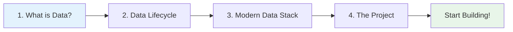

# Fundamentals

Before diving into specific data roles, let's build a solid foundation. This section covers the essential concepts you need to understand how data works in technology companies.

---

## What You'll Learn

By the end of this section, you'll understand:

- ✅ What "data" really means in the tech industry
- ✅ How data flows through organisations
- ✅ The tools that power modern data work
- ✅ The hands-on project you'll build throughout this guide

---

## Lessons

-   :material-database:{ .lg .middle } __What is Data?__

    ---

    Follow a simple book purchase through an entire data system. See what happens at each stage and which roles are involved.
    
    [:octicons-arrow-right-24: Start Here](what-is-data.md)

-   :material-chart-timeline:{ .lg .middle } __The Data Lifecycle__

    ---

    Learn the 7 stages every piece of data goes through: Generation, Collection, Storage, Transformation, Analysis, Visualisation, and Action.
    
    [:octicons-arrow-right-24: Learn the Lifecycle](data-lifecycle.md)

-   :material-toolbox:{ .lg .middle } __Modern Data Stack__

    ---

    Explore the tools data professionals use daily: Snowflake, dbt, Airflow, Looker, and more. Understand why each tool exists.
    
    [:octicons-arrow-right-24: Explore Tools](modern-data-stack.md)

-   :material-rocket-launch:{ .lg .middle } __The BookStore Project__

    ---

    Preview the complete e-commerce analytics system you'll build. See what you'll create and which roles you'll experience.
    
    [:octicons-arrow-right-24: View the Project](the-project.md)

---

## Learning Path

We recommend following these lessons in order:

**Estimated time:** 2-3 hours to complete all fundamentals lessons

---

## Why Start Here?

!!! tip "Foundation First"
    Understanding these fundamentals will make everything else in this guide make sense. You'll see how all 20 data roles fit together into a bigger picture.
    
    Without this context, role descriptions might seem abstract. With it, you'll understand exactly where each role fits and why it matters.

---

## What Comes Next?

After completing the fundamentals:

1. **Explore the 20 roles** - Deep dive into what each role does
2. **Start building** - Begin the hands-on tutorials
3. **Find your path** - Use self-assessment to identify your ideal role

---

## Ready?

Let's start by understanding what "data" really means in tech:

[What is Data? →](what-is-data.md){ .md-button .md-button--primary }

---

## Quick Links

- [Browse All Roles](../roles/index.md) - Jump straight to role descriptions
- [Start Building](../hands-on/project-overview.md) - Skip to hands-on tutorials
- [Self-Assessment](../career-paths/self-assessment.md) - Find your ideal role