# The Modern Data Stack

!!! tip "Learning Objectives"
    By the end of this lesson, you'll be able to:
    
    - Understand what the "modern data stack" means
    - Identify tools for each layer of the stack
    - Know which tools you'll use in this course
    - Recognise the shift from traditional to modern approaches
    - Make informed tool choices for your projects

---

## What is the "Modern Data Stack"?

The **modern data stack** refers to the current generation of cloud-based, modular tools that data teams use to build data platforms. It's characterised by:

- ☁️ **Cloud-native** - Everything runs in the cloud, no on-premise servers
- 🧩 **Modular** - Best-of-breed tools that integrate well
- 💰 **Pay-as-you-go** - Usage-based pricing, not licenses
- 🚀 **Fast to set up** - Minutes to deploy, not months
- 🔄 **ELT over ETL** - Load first, transform in the warehouse

---

## The Stack at a Glance

```mermaid
graph TB
    subgraph Sources["📥 DATA SOURCES"]
        S1[Databases]
        S2[APIs]
        S3[Files]
        S4[SaaS Apps]
    end
    
    subgraph Ingestion["🔄 DATA INGESTION"]
        I1[Fivetran]
        I2[Airbyte]
        I3[Custom<br/>Scripts]
    end
    
    subgraph Storage["🗄️ DATA STORAGE"]
        ST1[Snowflake]
        ST2[BigQuery]
        ST3[Redshift]
        ST4[Data Lakes<br/>S3/GCS]
    end
    
    subgraph Transform["⚙️ TRANSFORMATION"]
        T1[dbt]
        T2[SQL]
        T3[Spark]
    end
    
    subgraph Orchestrate["🎭 ORCHESTRATION"]
        O1[Airflow]
        O2[Dagster]
        O3[Prefect]
    end
    
    subgraph Visualise["📊 VISUALISATION"]
        V1[Looker]
        V2[Tableau]
        V3[Power BI]
        V4[Metabase]
    end
    
    subgraph Analyse["🔬 ANALYSIS"]
        A1[Python/<br/>Jupyter]
        A2[R]
        A3[SQL IDEs]
    end
    
    Sources --> Ingestion
    Ingestion --> Storage
    Storage --> Transform
    Transform --> Visualise
    Transform --> Analyse
    Orchestrate -.-> Ingestion
    Orchestrate -.-> Transform
    
    style Sources fill:#e3f2fd
    style Storage fill:#f3e5f5
    style Transform fill:#fff9c4
    style Visualise fill:#e8f5e9
```



Let's explore each layer in detail.

---

## Layer 1: Data Sources

### What They Are

Where your data originates—the systems that generate or store data before it enters your data platform.

### Common Source Types

=== "Operational Databases"
    **The live application databases**
    
    - PostgreSQL, MySQL, SQL Server
    - MongoDB, Cassandra (NoSQL)
    - Used by: Web apps, mobile apps, microservices
    
    **Challenge:** Can't run heavy analytical queries here (would slow down the app)

=== "SaaS Applications"
    **Third-party cloud services**
    
    - Salesforce (CRM)
    - Stripe (payments)
    - Google Analytics (web analytics)
    - HubSpot (marketing)
    - Zendesk (support tickets)
    
    **Challenge:** Each has different API, authentication, rate limits

=== "Event Streams"
    **Real-time event data**
    
    - Kafka topics
    - AWS Kinesis
    - User clickstreams
    - IoT sensor data
    
    **Challenge:** High volume, needs real-time processing

=== "Files"
    **Flat files and spreadsheets**
    
    - CSV, JSON, Parquet
    - Excel spreadsheets
    - Partner data feeds
    - Manual uploads
    
    **Challenge:** Inconsistent formats, manual processes

### Key Consideration

!!! tip "Source Stability"
    Your data is only as good as your sources. If source systems are unreliable, everything downstream suffers.

---

## Layer 2: Data Ingestion

### What It Does

**Moves data** from sources into your data warehouse. This is the "Extract" and "Load" in ELT.

### Popular Tools

=== "Fivetran"
    **Fully managed, no-code ingestion**
    
    **Pros:**
    - ✅ 200+ pre-built connectors
    - ✅ Automatic schema detection
    - ✅ Handles API changes
    - ✅ Zero maintenance
    
    **Cons:**
    - ❌ Expensive (usage-based pricing)
    - ❌ Less customisation
    
    **Best for:** Teams that want turnkey solutions
    
    ```yaml
    # Fivetran config (UI-based)
    Connector: Salesforce
    Destination: Snowflake
    Sync Frequency: Every hour
    Tables: accounts, opportunities, contacts
    ```

=== "Airbyte"
    **Open-source alternative to Fivetran**
    
    **Pros:**
    - ✅ Free, self-hosted option
    - ✅ 300+ connectors
    - ✅ Build custom connectors
    - ✅ Growing community
    
    **Cons:**
    - ❌ More operational overhead
    - ❌ Fewer enterprise features
    
    **Best for:** Cost-conscious teams, custom sources
    
    ```yaml
    # Airbyte connection config
    source:
      type: postgres
      host: db.example.com
      database: production
    
    destination:
      type: snowflake
      database: analytics
    
    sync_mode: incremental
    schedule: "0 * * * *"  # Hourly
    ```

=== "Custom Scripts"
    **Python/Go code you write**
    
    **Pros:**
    - ✅ Complete control
    - ✅ No licensing costs
    - ✅ Perfect fit for your needs
    
    **Cons:**
    - ❌ Requires engineering time
    - ❌ You own all maintenance
    - ❌ Reinventing the wheel
    
    **Best for:** Unique sources, complex transformations
    
    ```python
    # Custom ingestion script
    import requests
    import snowflake.connector
    
    # Extract from API
    response = requests.get(
        'https://api.example.com/orders',
        headers={'Authorization': f'Bearer {API_KEY}'}
    )
    orders = response.json()
    
    # Load to Snowflake
    conn = snowflake.connector.connect(...)
    cursor = conn.cursor()
    
    for order in orders:
        cursor.execute("""
            INSERT INTO raw.orders (order_id, amount, date)
            VALUES (%s, %s, %s)
        """, (order['id'], order['amount'], order['date']))
    
    conn.commit()
    ```

### In This Course

We'll use **custom Python scripts** and **Airflow** to give you hands-on experience with how ingestion actually works. In the real world, you'd likely use Fivetran or Airbyte for most sources.

---

## Layer 3: Data Storage

### What It Does

**Persists data** for analysis. This is where your data lives long-term.

### Cloud Data Warehouses

=== "Snowflake"
    **The market leader**
    
    **Architecture:**
    - Separate storage and compute
    - Automatic scaling
    - Multi-cloud (AWS, Azure, GCP)
    
    **Pricing:**
    - Storage: ~£23/TB/month
    - Compute: ~£2/hour for small warehouse
    
    **Strengths:**
    - ⭐ Best performance
    - ⭐ Zero maintenance
    - ⭐ Easy to use
    
    **Weaknesses:**
    - 💰 Can get expensive at scale
    
    **Best for:** Teams that want simplicity and performance

=== "Google BigQuery"
    **Serverless data warehouse**
    
    **Architecture:**
    - Fully serverless (no clusters)
    - Columnar storage
    - Integrated with Google Cloud
    
    **Pricing:**
    - Storage: £15/TB/month
    - Queries: £4/TB scanned
    
    **Strengths:**
    - ⭐ Pay only for queries
    - ⭐ Scales to petabytes
    - ⭐ Fast setup (seconds)
    
    **Weaknesses:**
    - ⚠️ Query costs can surprise you
    - ⚠️ Less SQL feature-rich
    
    **Best for:** Google Cloud users, unpredictable workloads

=== "Amazon Redshift"
    **AWS's data warehouse**
    
    **Architecture:**
    - Cluster-based (provision nodes)
    - Columnar storage
    - Deeply integrated with AWS
    
    **Pricing:**
    - £0.25/hour for small node
    - Reserved instances for discounts
    
    **Strengths:**
    - ⭐ Mature, stable
    - ⭐ AWS ecosystem integration
    - ⭐ Predictable costs
    
    **Weaknesses:**
    - ⚠️ Requires more management
    - ⚠️ Slower to scale
    
    **Best for:** AWS-heavy organisations

=== "Data Lakes (S3, GCS, Azure Blob)"
    **Raw file storage**
    
    **Architecture:**
    - Object storage
    - Any file format
    - Cheap at scale
    
    **Pricing:**
    - £15-20/TB/month (very cheap)
    
    **Strengths:**
    - ⭐ Very inexpensive
    - ⭐ Store anything
    - ⭐ Massive scale
    
    **Weaknesses:**
    - ⚠️ Slower queries
    - ⚠️ Requires additional tools (Spark, Athena)
    
    **Best for:** ML training data, archives, raw data

### Comparison

| Feature | Snowflake | BigQuery | Redshift | Data Lake |
|---------|-----------|----------|----------|-----------|
| **Ease of Use** | ⭐⭐⭐⭐⭐ | ⭐⭐⭐⭐⭐ | ⭐⭐⭐ | ⭐⭐ |
| **Performance** | ⭐⭐⭐⭐⭐ | ⭐⭐⭐⭐ | ⭐⭐⭐⭐ | ⭐⭐⭐ |
| **Cost** | £££ | ££ | ££ | £ |
| **Scaling** | Auto | Auto | Manual | Infinite |
| **SQL Support** | Full | Limited | Full | Varies |

### In This Course

We'll use **Snowflake** (free trial) because it's beginner-friendly, widely used, and has excellent performance.

---

## Layer 4: Data Transformation

### What It Does

**Transforms raw data** into clean, analysis-ready tables. This is the "T" in ELT.

### The Tool: dbt (data build tool)

**What it is:** A transformation framework that lets you write SQL models as code.

**Why it's revolutionary:**

```sql
-- Traditional approach: One giant SQL file
-- Hard to maintain, test, or understand

-- dbt approach: Modular models
-- models/staging/stg_orders.sql
select
    order_id,
    customer_id,
    cast(order_date as date) as order_date,
    total_amount
from {{ source('raw', 'orders') }}
where order_id is not null

-- models/marts/fct_orders.sql  
select
    o.order_id,
    o.order_date,
    c.customer_name,
    p.product_name,
    o.total_amount
from {{ ref('stg_orders') }} o
join {{ ref('stg_customers') }} c using (customer_id)
join {{ ref('stg_products') }} p using (product_id)
```

**Key features:**

- **Version control** - All SQL in Git
- **Testing** - Data quality tests built-in
- **Documentation** - Auto-generated docs
- **Dependencies** - Automatic DAG creation
- **Modularity** - Reusable components

### dbt Workflow


### Alternatives

- **SQL in notebooks** (Jupyter, Databricks) - Less structured
- **Stored procedures** - Traditional, hard to version
- **Apache Spark** - For very large datasets (PySpark, Scala)

### In This Course

We'll use **dbt Cloud** (free tier) extensively. You'll learn to write models, tests, and documentation.

---

## Layer 5: Orchestration

### What It Does

**Schedules and monitors** data pipelines. Ensures everything runs in the right order, at the right time.

### Popular Tools

=== "Apache Airflow"
    **The industry standard**
    
    ```python
    from airflow import DAG
    from airflow.operators.python import PythonOperator
    from datetime import datetime
    
    dag = DAG(
        'daily_pipeline',
        start_date=datetime(2025, 1, 1),
        schedule_interval='@daily',
        catchup=False
    )
    
    extract = PythonOperator(
        task_id='extract_data',
        python_callable=extract_orders,
        dag=dag
    )
    
    load = PythonOperator(
        task_id='load_data',
        python_callable=load_to_warehouse,
        dag=dag
    )
    
    transform = PythonOperator(
        task_id='run_dbt',
        python_callable=run_dbt_models,
        dag=dag
    )
    
    # Define dependencies
    extract >> load >> transform
    ```
    
    **Pros:**
    - ✅ Mature, battle-tested
    - ✅ Huge community
    - ✅ Rich UI for monitoring
    
    **Cons:**
    - ❌ Steep learning curve
    - ❌ Requires maintenance

=== "Dagster"
    **Modern alternative to Airflow**
    
    **Focus on:**
    - Data-aware orchestration
    - Software-defined assets
    - Better testing tools
    
    **Best for:** Teams building new platforms

=== "Prefect"
    **Pythonic workflow orchestration**
    
    **Focus on:**
    - Developer experience
    - Simpler than Airflow
    - Hybrid execution
    
    **Best for:** Python-first teams

### In This Course

We'll use **Apache Airflow** because it's the most widely used and will be valuable on your CV.

---

## Layer 6: Business Intelligence & Visualisation

### What It Does

**Displays data** to business users through dashboards and reports.

### Popular Tools

=== "Looker (Google)"
    **Code-based BI platform**
    
    **Unique feature:** LookML - Define metrics as code
    
    ```lookml
    view: orders {
      dimension: order_id {
        primary_key: yes
        type: string
        sql: ${TABLE}.order_id ;;
      }
      
      measure: total_revenue {
        type: sum
        sql: ${TABLE}.total_amount ;;
        value_format_name: gbp
      }
    }
    ```
    
    **Pros:**
    - ✅ Single source of truth
    - ✅ Version controlled
    - ✅ Powerful modelling
    
    **Cons:**
    - ❌ Expensive
    - ❌ Steeper learning curve

=== "Tableau"
    **Drag-and-drop BI**
    
    **Strengths:**
    - Easy to learn
    - Beautiful visualisations
    - Large community
    
    **Best for:** Analysts who want flexibility

=== "Power BI (Microsoft)"
    **Microsoft's BI tool**
    
    **Strengths:**
    - Integrates with Microsoft ecosystem
    - Lower cost
    - DAX for calculations
    
    **Best for:** Microsoft-heavy organisations

=== "Looker Studio (Google)"
    **Free BI tool**
    
    **Strengths:**
    - Completely free
    - Easy to use
    - Good for small teams
    
    **Weaknesses:**
    - Less powerful
    - Slower with large data
    
    **Best for:** Beginners, small projects

### In This Course

We'll use **Looker Studio** (free) so you can build dashboards without any cost.

---

## Layer 7: Data Science & ML

### What It Does

**Analyses data** and **builds models** for predictions and insights.

### Tools by Use Case

=== "Exploratory Analysis"
    **Interactive notebooks**
    
    - **Jupyter** - Python notebooks
    - **RStudio** - R notebooks
    - **Databricks** - Collaborative notebooks
    
    ```python
    # Quick analysis in Jupyter
    import pandas as pd
    import matplotlib.pyplot as plt
    
    df = pd.read_sql("""
        SELECT order_date, SUM(total_amount) as revenue
        FROM orders
        GROUP BY order_date
    """, conn)
    
    df.plot(x='order_date', y='revenue')
    plt.show()
    ```

=== "Model Training"
    **ML libraries**
    
    - **scikit-learn** - Classical ML
    - **TensorFlow** - Deep learning
    - **PyTorch** - Deep learning
    - **XGBoost** - Gradient boosting
    
    ```python
    from sklearn.ensemble import RandomForestClassifier
    
    # Train churn model
    model = RandomForestClassifier()
    model.fit(X_train, y_train)
    
    # Evaluate
    accuracy = model.score(X_test, y_test)
    print(f"Accuracy: {accuracy:.2%}")
    ```

=== "Feature Engineering"
    **Data preparation for ML**
    
    - **dbt** - SQL-based features
    - **Feast** - Feature store
    - **pandas** - Python transformations
    
    ```python
    # Create features
    features = df.groupby('customer_id').agg({
        'order_date': 'max',  # Recency
        'order_id': 'count',  # Frequency
        'total_amount': 'sum' # Monetary
    })
    ```

=== "Model Deployment"
    **Serving predictions**
    
    - **Flask/FastAPI** - REST APIs
    - **MLflow** - Model registry
    - **Seldon** - Kubernetes deployment
    
    ```python
    from flask import Flask, request
    import joblib
    
    app = Flask(__name__)
    model = joblib.load('model.pkl')
    
    @app.route('/predict', methods=['POST'])
    def predict():
        features = request.json['features']
        prediction = model.predict([features])
        return {'prediction': int(prediction[0])}
    ```

### In This Course

We'll use **Python with Jupyter notebooks** for analysis and **scikit-learn** for ML models. Simple and effective.

---

## Traditional vs Modern Stack

### How Things Changed

| Aspect | Traditional Stack | Modern Stack |
|--------|------------------|--------------|
| **Infrastructure** | On-premise servers | Cloud services |
| **Setup Time** | 6-12 months | Hours to days |
| **Cost Model** | Upfront licenses | Pay-as-you-go |
| **Scaling** | Buy more hardware | Click a button |
| **Approach** | ETL (transform before load) | ELT (load then transform) |
| **Integration** | Custom code | Pre-built connectors |
| **Maintenance** | DBA-heavy | Mostly automated |

### Why ELT Instead of ETL?

**Old way (ETL):**


Problems:
- ❌ Transformation logic in multiple places
- ❌ Hard to iterate (must re-extract)
- ❌ Limited by transformation server

**New way (ELT):**


Benefits:
- ✅ All data available in warehouse
- ✅ Use warehouse's compute power
- ✅ Easy to iterate (just re-run SQL)
- ✅ Single source of truth

---

## Choosing Tools for Your Stack

### Consider These Factors

**:

- Small (<5): Use managed services (Fivetran, dbt Cloud)
- Medium (5-20): Mix of managed and open-source
- Large (20+): Can invest in open-source infrastructure

**:

- Tight: Open-source (Airbyte, self-hosted Airflow)
- Flexible: Managed services for productivity

**:

- <1TB: Any warehouse works
- 1-10TB: Snowflake, BigQuery, Redshift all viable
- >10TB: Optimise for cost (BigQuery, data lakes)

**:

- AWS? Consider Redshift
- Google Cloud? BigQuery is natural choice
- Multi-cloud? Snowflake

**:

- SQL-strong: dbt, Looker
- Python-strong: Custom scripts, Jupyter
- Mixed: Focus on SQL tools

---

## The Stack We'll Use

For this course, we've chosen tools that are:

- ✅ Widely used in industry
- ✅ Have free tiers or trials
- ✅ Beginner-friendly
- ✅ Good for learning

| Layer | Tool | Why |
|-------|------|-----|
| **Sources** | CSV files, PostgreSQL | Easy to set up locally |
| **Ingestion** | Python + Airflow | Learn the fundamentals |
| **Storage** | Snowflake | Free trial, industry standard |
| **Transformation** | dbt Cloud | Free tier, modern approach |
| **Orchestration** | Apache Airflow | Most common in industry |
| **Visualisation** | Looker Studio | Free, easy to use |
| **Analysis** | Python + Jupyter | Universal skill |

---

## What's Next?

Now you understand the modern data stack and the tools available. Let's see how we'll use these tools in a real project:

[The BookStore Analytics Project →](the-project.md){ .md-button .md-button--primary }

Or jump straight to setting up your environment:

[Start Building →](../hands-on/01-setup-environment.md){ .md-button }

---

## Further Reading

- [:fontawesome-solid-globe: The Modern Data Stack Ecosystem](https://airbyte.com/blog/modern-data-stack) - Airbyte's overview
- [:fontawesome-solid-book: Analytics Engineering Guide](https://www.getdbt.com/analytics-engineering/) - dbt Labs
- [:fontawesome-brands-youtube: Data Engineering Podcast](https://www.dataengineeringpodcast.com/) - Weekly interviews
- [:fontawesome-solid-newspaper: Data Council](https://www.datacouncil.ai/) - Community and conferences