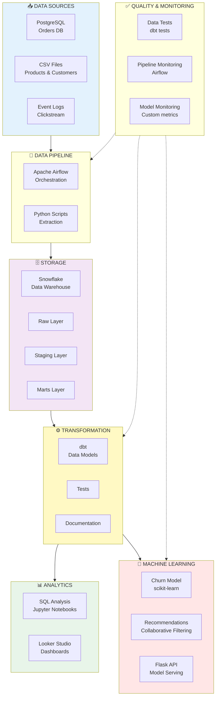

# The Project: BookStore Analytics

!!! tip "What You'll Build"
    A complete, end-to-end data analytics system for an online bookstore. You'll experience what it's like to work in **all 20 data roles** by building each component yourself.

---

## Project Overview

Imagine you've just been hired at **BookStore**, an online retailer selling books. The company has been collecting data for years but hasn't built a proper data platform. Your mission: **build the entire data infrastructure from scratch**.

By the end of this project, you'll have created:

- 📊 A data pipeline that loads sales data daily
- 🔄 Clean, modelled data ready for analysis
- 📈 Interactive dashboards showing business metrics
- 🤖 Machine learning models for recommendations and churn prediction
- 🚀 Production APIs serving those models
- 📡 Monitoring and quality checks ensuring reliability

**And most importantly:** You'll have experienced what each of the 20 data roles actually does day-to-day.

---

## The Business Context

### About BookStore

**Business Model:** E-commerce platform selling physical and digital books

**:

- 50,000 customers
- 5,000 products in catalogue
- 10,000+ orders per month
- Growing 15% year-over-year

**:

- Data scattered across multiple systems
- Executives make decisions based on gut feel
- Customer service can't see purchase history
- Marketing campaigns aren't targeted
- No way to predict inventory needs

**Your Mission:**
Become the founding data team and build a data platform that enables data-driven decision making.

---

## What You'll Build

### Architecture Overview



---

## The Data

### Sample Datasets

We've created realistic sample data for you to work with:

=== "Orders (10,000 rows)"
    **File:** `raw_orders.csv`
    
    ```csv
    order_id,customer_id,order_date,product_id,quantity,unit_price,payment_method,status
    ORD_001,CUST_1523,2025-10-15,PROD_2891,1,29.99,credit_card,completed
    ORD_002,CUST_2847,2025-10-15,PROD_1203,2,15.50,paypal,completed
    ORD_003,CUST_1523,2025-10-16,PROD_4512,1,45.00,credit_card,completed
    ...
    ```
    
    **Intentional issues** (for learning):
    - Some duplicate order_ids
    - Missing shipping states
    - Mixed date formats
    - Negative prices (errors)

=== "Customers (5,000 rows)"
    **File:** `raw_customers.csv`
    
    ```csv
    customer_id,email,first_name,last_name,registration_date,city,state,lifetime_value
    CUST_1523,john.smith@email.com,John,Smith,2024-03-15,London,Greater London,456.78
    CUST_2847,sarah.j@email.com,Sarah,Johnson,2024-07-22,Manchester,Greater Manchester,234.50
    ...
    ```
    
    **What you'll calculate:**
    - Customer segments (high/medium/low value)
    - Churn risk scores
    - Days since last purchase

=== "Products (500 rows)"
    **File:** `raw_products.csv`
    
    ```csv
    product_id,title,author,category,subcategory,price,rating,stock
    PROD_2891,Python Crash Course,Eric Matthes,Technology,Programming,29.99,4.7,245
    PROD_1203,Atomic Habits,James Clear,Self-Help,Productivity,15.99,4.8,412
    ...
    ```
    
    **Categories include:**
    - Technology (Programming, Data Science, AI/ML)
    - Fiction (Literary, Mystery, Sci-Fi)
    - Business (Leadership, Entrepreneurship)
    - Self-Help, Biography, History, Science

=== "Clickstream Events (50,000 events)"
    **File:** `clickstream_events.jsonl`
    
    ```json
    {"event":"page_view","user_id":"user_8472","page":"/books","timestamp":"2025-11-15T14:22:45Z"}
    {"event":"search","user_id":"user_8472","query":"python programming","timestamp":"2025-11-15T14:23:02Z"}
    {"event":"product_view","user_id":"user_8472","product_id":"PROD_2891","timestamp":"2025-11-15T14:23:15Z"}
    {"event":"add_to_cart","user_id":"user_8472","product_id":"PROD_2891","timestamp":"2025-11-15T14:23:28Z"}
    ```
    
    **What you'll analyse:**
    - Conversion funnels
    - Popular search terms
    - Product view → purchase rates

---

## Project Phases

We'll build this system in **10 hands-on tutorials**, each focusing on a different part of the stack (and different roles).

### Phase 1: Foundation (Tutorials 1-3)

!!! example "Tutorial 1: Environment Setup"
    **Roles experienced:** Platform Engineer, DevOps Engineer
    
    **What you'll do:**
    - Install Python, VS Code, Git
    - Set up Snowflake free trial
    - Create PostgreSQL database locally
    - Load sample data
    
    **Time:** 1 hour
    
    **Skills learned:** Environment setup, database basics

!!! example "Tutorial 2: Backend API"
    **Roles experienced:** Backend Engineer
    
    **What you'll do:**
    - Build Flask API for order submission
    - Write to PostgreSQL
    - Add error handling
    - Test with Postman
    
    **Time:** 1.5 hours
    
    **Skills learned:** API development, database writes

!!! example "Tutorial 3: Database Setup"
    **Roles experienced:** Database Administrator
    
    **What you'll do:**
    - Design database schema
    - Create tables with proper data types
    - Add indexes for performance
    - Set up foreign key constraints
    
    **Time:** 1 hour
    
    **Skills learned:** Database design, SQL DDL

---

### Phase 2: Data Pipeline (Tutorials 4-5)

!!! example "Tutorial 4: Data Pipeline with Airflow"
    **Roles experienced:** Data Engineer, DataOps Engineer
    
    **What you'll do:**
    - Install Apache Airflow locally
    - Write your first DAG
    - Extract data from PostgreSQL and CSV
    - Load into Snowflake
    - Schedule daily runs
    - Add monitoring and alerts
    
    **Time:** 2 hours
    
    **Skills learned:** Pipeline orchestration, ETL, scheduling

!!! example "Tutorial 5: Transformation with dbt"
    **Roles experienced:** Analytics Engineer
    
    **What you'll do:**
    - Set up dbt Cloud (free)
    - Create staging models (clean raw data)
    - Build fact and dimension tables
    - Write data quality tests
    - Generate documentation
    - Deploy to production
    
    **Time:** 2 hours
    
    **Skills learned:** Data modelling, dbt, testing

---

### Phase 3: Analysis & Visualisation (Tutorials 6-7)

!!! example "Tutorial 6: SQL Analysis"
    **Roles experienced:** Data Analyst
    
    **What you'll do:**
    - Connect to Snowflake from Jupyter
    - Write queries answering business questions:
        - What are top-selling books?
        - Which customers haven't purchased in 90 days?
        - What's average order value by month?
        - Which marketing channels drive most revenue?
    - Create customer segments
    - Analyse trends
    
    **Time:** 1.5 hours
    
    **Skills learned:** SQL, pandas, analysis

!!! example "Tutorial 7: Dashboard with Looker Studio"
    **Roles experienced:** BI Engineer
    
    **What you'll do:**
    - Connect Looker Studio to Snowflake
    - Build sales KPI dashboard
    - Create interactive filters
    - Add drill-down capabilities
    - Share with stakeholders
    
    **Time:** 1.5 hours
    
    **Skills learned:** BI tools, visualisation design

---

### Phase 4: Machine Learning (Tutorials 8-9)

!!! example "Tutorial 8: ML Models"
    **Roles experienced:** Data Scientist, ML Scientist
    
    **What you'll do:**
    - Load data into Jupyter notebook
    - **Model 1: Customer Segmentation**
        - K-means clustering
        - Identify high/medium/low value segments
    - **Model 2: Churn Prediction**
        - Random Forest classifier
        - Predict which customers will churn
        - Feature importance analysis
    - **Model 3: Book Recommendations**
        - Collaborative filtering
        - "Customers who bought X also bought Y"
    - Evaluate model performance
    
    **Time:** 2.5 hours
    
    **Skills learned:** scikit-learn, model training, evaluation

!!! example "Tutorial 9: Model Deployment"
    **Roles experienced:** ML Engineer, AI Engineer, MLOps Engineer
    
    **What you'll do:**
    - Wrap models in Flask API
    - Create `/predict/churn` endpoint
    - Create `/recommend` endpoint
    - Add input validation
    - Containerise with Docker
    - Deploy to free hosting (Railway/Render)
    - Add basic monitoring
    - Track prediction accuracy
    
    **Time:** 2 hours
    
    **Skills learned:** API development, Docker, deployment

---

### Phase 5: Quality & Monitoring (Tutorial 10)

!!! example "Tutorial 10: Quality & Monitoring"
    **Roles experienced:** QA Engineer, Data Governance, Frontend Engineer
    
    **What you'll do:**
    - **Data Quality:**
        - Add comprehensive dbt tests
        - Set up Great Expectations
        - Create data quality dashboard
    - **Governance:**
        - Document data lineage
        - Create data dictionary
        - Set up access controls
        - Implement data masking
    - **Monitoring:**
        - Set up Airflow alerts
        - Monitor pipeline failures
        - Track model drift
        - Create monitoring dashboard
    - **Frontend:**
        - Build simple React app
        - Display recommendations
        - Show churn scores
    
    **Time:** 2.5 hours
    
    **Skills learned:** Testing, governance, monitoring, basic React

---

## Key Business Questions You'll Answer

By the end of this project, you'll be able to answer questions like:

### Sales & Revenue
- ✅ What's our daily/weekly/monthly revenue?
- ✅ Which products are bestsellers?
- ✅ What's our average order value?
- ✅ Which categories generate most revenue?

### Customers
- ✅ How many active customers do we have?
- ✅ What's our customer lifetime value?
- ✅ Which customers are at risk of churning?
- ✅ What segments exist in our customer base?

### Marketing
- ✅ Which marketing channels work best?
- ✅ What's our conversion rate?
- ✅ Which search terms are most popular?
- ✅ What's the funnel from view → purchase?

### Operations
- ✅ Which products are running low on stock?
- ✅ What's our order fulfilment time?
- ✅ Where are most of our customers located?
- ✅ When are our peak ordering times?

### Predictions
- ✅ Which customers will churn next month?
- ✅ What books should we recommend to each customer?
- ✅ How much inventory do we need next quarter?

---

## The Roles You'll Experience

Throughout this project, you'll work as:

| Tutorial | Roles Experienced |
|----------|-------------------|
| 1. Environment Setup | Platform Engineer, DevOps Engineer |
| 2. Backend API | Backend Engineer |
| 3. Database Setup | Database Administrator |
| 4. Data Pipeline | Data Engineer, DataOps Engineer |
| 5. dbt Transformation | Analytics Engineer |
| 6. SQL Analysis | Data Analyst |
| 7. Dashboard | BI Engineer |
| 8. ML Models | Data Scientist, ML Scientist |
| 9. Model Deployment | ML Engineer, AI Engineer, MLOps Engineer |
| 10. Quality & Monitoring | QA Engineer, Data Governance, Frontend Engineer |

**Strategic roles** (Data Architect, Data Product Manager, Engineering Manager) are experienced through:
- Design decisions you make
- Trade-offs you evaluate
- Documentation you write
- Prioritisation you do

---

## What You'll Have at the End

### A Complete Portfolio Project

```
bookstore-analytics/
├── README.md                   # Project overview
├── architecture.png            # System diagram
├── backend/                    # Flask API
│   ├── app.py
│   └── requirements.txt
├── database/                   # PostgreSQL setup
│   └── schema.sql
├── airflow/                    # Data pipelines
│   └── dags/
│       └── daily_pipeline.py
├── dbt/                        # Transformations
│   ├── models/
│   ├── tests/
│   └── docs/
├── notebooks/                  # Analysis & ML
│   ├── exploratory_analysis.ipynb
│   ├── customer_segmentation.ipynb
│   ├── churn_prediction.ipynb
│   └── recommendations.ipynb
├── ml-api/                     # Model serving
│   ├── app.py
│   ├── models/
│   └── Dockerfile
├── dashboards/                 # BI dashboards
│   └── sales_dashboard.pdf
└── monitoring/                 # Quality & monitoring
    └── data_quality_tests.py
```

### Skills You Can Put on Your CV

- ✅ Built end-to-end data pipeline with Apache Airflow
- ✅ Designed and implemented data warehouse in Snowflake
- ✅ Created dbt models with comprehensive testing
- ✅ Developed SQL queries for business analytics
- ✅ Built interactive dashboards in Looker Studio
- ✅ Trained and deployed ML models (scikit-learn, Flask)
- ✅ Implemented data quality checks and monitoring
- ✅ Containerised applications with Docker

### A Live System

- 🌐 Dashboard accessible via URL
- 🚀 ML API accepting requests
- 📊 Pipeline running daily
- 📈 All code in GitHub

---

## Prerequisites

### Required
- 💻 Computer (Windows, Mac, or Linux)
- 🌐 Internet connection
- ⏰ ~15 hours to complete all tutorials
- 🧠 Curiosity and patience!

### Not Required
- ❌ Prior coding experience
- ❌ Statistics or maths background
- ❌ Expensive software or hardware
- ❌ Cloud computing knowledge

We'll teach you everything you need as we go!

---

## Tools You'll Use (All Free)

| Tool | What For | Cost |
|------|----------|------|
| **Python** | Programming language | Free |
| **PostgreSQL** | Operational database | Free |
| **Snowflake** | Data warehouse | Free trial (30 days) |
| **dbt Cloud** | Transformations | Free tier |
| **Apache Airflow** | Orchestration | Free (open-source) |
| **Looker Studio** | Dashboards | Free |
| **Jupyter** | Notebooks | Free |
| **scikit-learn** | Machine learning | Free (open-source) |
| **Flask** | API framework | Free (open-source) |
| **Docker** | Containerisation | Free |
| **Git/GitHub** | Version control | Free |

**Total cost: £0** (all free tiers and open-source tools)

---

## Ready to Start?

Let's begin by setting up your development environment:

[Tutorial 1: Environment Setup →](../hands-on/01-setup-environment.md){ .md-button .md-button--primary }

Or explore the roles first:

[Browse the 20 Roles →](../roles/index.md){ .md-button }

---

## Questions?

- 💬 [Ask in GitHub Discussions](https://github.com/glsdown/data-roles-guide/discussions)
- 🐛 [Report Issues](https://github.com/glsdown/data-roles-guide/issues)
- 📧 [Email Support](mailto:your.email@example.com)

---

!!! success "You've Got This!"
    This project might seem intimidating, but remember: you'll build it step-by-step, with clear instructions and complete code examples. Thousands of people have learned data skills this way. You can too! 🚀