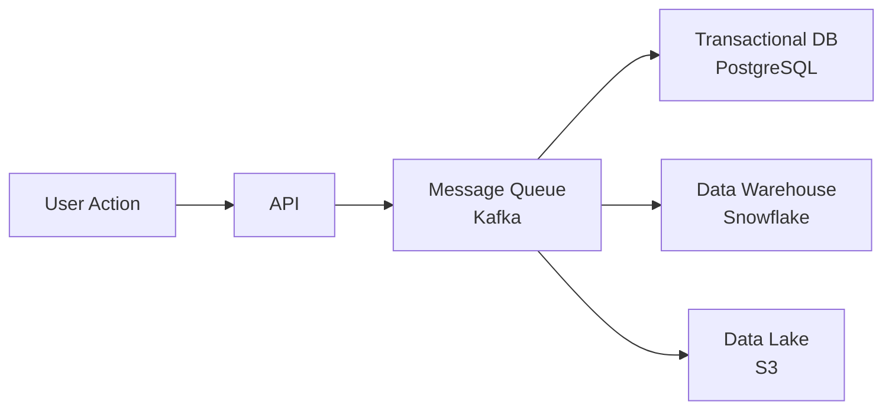

# What is Data in Tech?

!!! tip "Learning Objectives"
    By the end of this lesson, you'll be able to:
    
    - Trace how a single user action generates data across systems
    - Identify the 7 stages of the data lifecycle
    - Recognize which roles work at each stage

## The 30-Second Book Purchase

Let's follow a simple online book purchase and see what happens behind the scenes.

### User Experience
```
14:32:15 - Search "Python programming"
14:32:18 - Click on "Python Crash Course"
14:32:25 - Add to cart
14:32:40 - Enter payment info
14:32:45 - Complete purchase
14:32:46 - Order confirmed
```

Simple, right? But behind those 30 seconds, **hundreds of data processes** happened.

---

## Stage 1: Data Generation

The millisecond you typed "Python programming," data was generated:
```json
{
  "event": "search",
  "user_id": "user_12345",
  "session_id": "sess_abc789",
  "search_term": "Python programming",
  "timestamp": "2024-11-07T14:32:15.234Z",
  "device": "Chrome/MacOS",
  "page_url": "/books"
}
```

!!! info "Who Does This?"
    **Backend Engineers** build the APIs that capture every user action.

### Why It Matters

Without accurate data capture, everything downstream fails. This is the foundation of all data work.

---

## Stage 2: Data Collection & Storage

Now we have events. Where do they go?


=== "Transactional Database"
    **Purpose:** Live application data
    
    - Fast reads/writes
    - ACID compliant
    - Powers the app
    
    **Who manages:** Database Administrators, Backend Engineers

=== "Data Warehouse"
    **Purpose:** Historical analysis
    
    - P for queries
    - Stores years of data
    - Analytics-friendly
    
    **Who manages:** Data Engineers, Analytics Engineers

=== "Data Lake"
    **Purpose:** Raw, unstructured data
    
    - Images, logs, clickstreams
    - Cheap storage
    - Flexible format
    
    **Who manages:** Data Engineers, Platform Engineers

---

## Stage 3: Data Transformation

Raw data is messy. Here's what we need to fix:

??? bug "Common Data Quality Issues"
    - Duplicate records
    - Missing values
    - Inconsistent formats
    - Different time zones
    - Typos and errors

### The Solution: dbt
```sql
-- models/staging/stg_orders.sql
with source as (
    select * from {{ source('raw', 'orders') }}
),

cleaned as (
    select
        order_id,
        customer_id,
        -- Standardize date format
        cast(order_date as date) as order_date,
        -- Convert to USD
        unit_price * exchange_rate as price_usd,
        -- Clean up nulls
        coalesce(shipping_state, 'UNKNOWN') as shipping_state
    from source
    where order_id is not null  -- Remove invalid records
)

select * from cleaned
```

!!! success "Role: Analytics Engineer"
    Analytics Engineers own the transformation layer, turning messy raw data into clean, analysis-ready tables.

---

## Try It Yourself

!!! example "Hands-On Exercise"
    
    **Challenge:** Identify data quality issues in this sample:
```csv
    order_id,customer,price,date
    001,John Smith,25.99,2024-11-07
    002,John Smith,$26,11/07/2024
    003,,,-10
    003,J. Smith,30,2024-11-07
```
    
    ??? success "Solution"
        Issues found:
        
        1. Row 2: Inconsistent customer name (same person?)
        2. Row 2: Price has $ symbol (should be numeric)
        3. Row 2: Date format differs (MM/DD/YYYY vs YYYY-MM-DD)
        4. Row 3: Missing customer and price
        5. Row 3: Negative price (invalid)
        6. Row 3 & 4: Duplicate order_id
        
        An Analytics Engineer would write transformations to handle all of these!

---

## What's Next?

Now that you understand how data is generated and processed, let's explore the complete [Data Lifecycle](data-lifecycle.md) →

---

## Additional Resources

- [📺 Video: Data Generation in Action](https://youtube.com/watch?v=example)
- [📄 Reading: Event-Driven Architecture](https://example.com)
- [💻 GitHub: Sample Event Data](https://github.com/yourrepo/data)