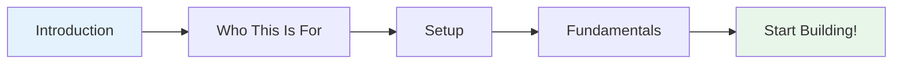

# Getting Started

Welcome to Understanding Data Roles in Tech! This section will help you get oriented and set you up for success.

---

## What to Expect

This guide is designed to help you explore 20 different data career paths through hands-on experience. Whether you're considering a career change, choosing a specialisation, or just curious about how data works in tech, you're in the right place.

---

## Quick Navigation

-   :material-hand-wave:{ .lg .middle } __Introduction__

    ---

    Learn what makes this guide different and how to use it effectively.
    
    [:octicons-arrow-right-24: Read Introduction](introduction.md)

-   :material-account-check:{ .lg .middle } __Who This Is For__

    ---

    Find out if this guide matches your goals and what you'll need to get started.
    
    [:octicons-arrow-right-24: Check If This Is For You](who-this-is-for.md)

-   :material-cog:{ .lg .middle } __Setup Guide__

    ---

    Install the tools you'll need and prepare your development environment.
    
    [:octicons-arrow-right-24: Set Up Your Environment](setup.md)

---

## Your Journey

**Time to complete:** 30-60 minutes (mostly setup time)

---

## What You'll Learn

By the end of this section, you'll:

- ✅ Understand how this guide works
- ✅ Know if it's right for your goals
- ✅ Have your development environment ready
- ✅ Be prepared to start learning

---

## Ready to Begin?

Let's start with an introduction to the guide:

[Introduction →](introduction.md){ .md-button .md-button--primary }

Or if you're already convinced:

[Skip to Setup →](setup.md){ .md-button }