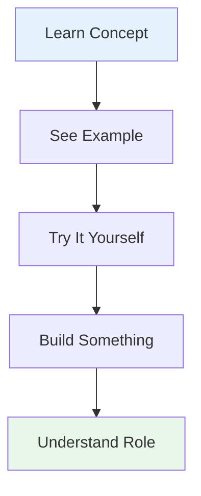

# Introduction

Welcome! If you're here, you're probably asking one of these questions:

- "Which data role is right for me?"
- "What's the difference between a Data Engineer and a Data Scientist?"
- "What do these people actually do all day?"

You're not alone. The data industry has exploded over the past decade, creating dozens of new roles with overlapping responsibilities. Every company defines these roles differently. It's genuinely confusing.

**This guide solves that problem.**

---

## The Problem with Learning About Data Roles

Most resources about data careers fall into one of these categories:

### Option 1: Job Descriptions

!!! failure "The Issue"
    Job descriptions are vague, buzzword-filled, and often inaccurate. They tell you what companies want, not what the role actually entails day-to-day.
    
    Example: "Seeking a Data Scientist who is a self-starter with experience in Python, R, SQL, machine learning, deep learning, statistics, data visualisation, communication, and cloud platforms..."
    
    That's 5 different jobs rolled into one posting.

### Option 2: Blog Posts & Articles

!!! failure "The Issue"
    Articles give you high-level overviews but no real sense of what the work feels like. You read about tools and responsibilities, but you still don't know if you'd enjoy the actual work.
    
    "Data Engineers build pipelines."
    
    Okay... but what does building a pipeline feel like? Is it satisfying? Frustrating? Creative? Tedious?

### Option 3: Online Courses

!!! failure "The Issue"
    Courses teach you specific skills (Python, SQL, machine learning) but don't help you understand which role you're training for. You might learn Pandas without realising whether you want to be an Analyst or a Scientist.

---

## How This Guide Is Different

### You Learn by Doing

Instead of just reading about roles, you'll **experience them**. You'll build a complete data system from scratch, and at each stage, you'll do the work that different roles do.

Want to know what a Data Engineer does? You'll build a data pipeline.

Curious about Data Scientists? You'll train machine learning models.

Wondering about BI Engineers? You'll create dashboards.

### It's Comprehensive

We cover **20 different data roles**—not just the famous ones like Data Scientist, but also Analytics Engineers, MLOps Engineers, Data Governance Specialists, and more.

You'll understand how they all fit together and which ones align with your interests and skills.

### It's Practical

Every concept is illustrated with real code, real tools, and real examples. You won't just read about Airflow—you'll write an Airflow DAG. You won't just learn about SQL—you'll write queries that answer business questions.

### It's Free

All the tools we use have free tiers or are open-source. You don't need to spend money to learn.

---

## What You'll Build

Throughout this guide, you'll create **BookStore Analytics**—a complete e-commerce analytics platform.

You'll build:

- 📊 Data pipelines that load data automatically
- 🔄 Transformation layers that clean and model data
- 📈 SQL analyses answering business questions
- 📉 Interactive dashboards for stakeholders
- 🤖 Machine learning models for predictions
- 🚀 Production APIs serving those models
- 📡 Monitoring systems ensuring everything works

By the end, you'll have a portfolio-ready project showcasing skills across the entire data stack.

---

## How This Guide Works

### Structure

The guide is organised into sections:

**1. Getting Started** (you are here)

- Orientation and setup

**2. Fundamentals**

- Core concepts about data in tech

**3. The 20 Roles**

- Deep dives into what each role does

**4. Hands-On Projects**

- Step-by-step tutorials building the system

**5. Real-World Scenarios**

- See how roles collaborate on actual projects

**6. Career Paths**

- Self-assessment and personalised roadmaps

**7. Reference**

- Glossary, tools guide, skills matrix

### Learning Approach

We believe you learn best by:

1. Understanding the concept
2. Seeing it in action
3. Trying it yourself
4. Building something real
5. Reflecting on what you learned

### Time Commitment

- **Fundamentals:** 2-3 hours
- **Each role page:** 10-15 minutes
- **Each hands-on tutorial:** 1-3 hours
- **Complete project:** 15-20 hours total

You can go at your own pace. Skip sections that don't interest you. Focus on roles you're curious about.

---

## What Makes You Qualified to Teach This?

Fair question! My name is Gemma Down, and I've spent 12 years working across the data stack in various roles:

- **Data Analyst** - Writing SQL, building reports, answering business questions
- **Data Scientist** - Training models, running experiments, analysing results
- **Analytics Engineer** - Building dbt models, creating clean data layers
- **Data Engineer** - Constructing pipelines, moving data, optimising performance
- **Full Stack Engineer** - Building applications that generate and use data

I've also been on the hiring side, recruiting for:

- Data Analysts
- Data Engineers
- Analytics Engineers
- Engineering Managers

I've read thousands of CVs, interviewed hundreds of candidates, and hired dozens of people into data roles. I know what these roles really require—not just in theory, but from both sides of the hiring table.

I created this guide because I was frustrated seeing people waste months learning skills for roles they'd end up disliking, or choosing careers based on incomplete information. I wanted to create a way for people to **try everything first**, to experiment, to discover what excites them by actually doing the work.

---

## What This Guide Is NOT

Let's be clear about what you won't get here:

❌ **Not a comprehensive course on any single topic**

- This isn't "Learn Python in 30 Days" or "Master Machine Learning"
- We introduce tools and concepts, but you'll need to study further for depth

❌ **Not a guaranteed job placement program**

- We don't have partnerships with companies
- We can't promise you'll get hired
- But we can help you discover which role to pursue

❌ **Not the only resource you'll need**

- You'll want additional courses, books, and practice
- We provide recommendations throughout
- Think of this as your starting point and compass

❌ **Not perfect or complete**

- Data roles are constantly evolving
- New tools emerge regularly
- This guide is a living document that will be updated

---

## Who Am I Writing For?

I'm writing for people who:

- Are **curious** about data but overwhelmed by options
- Want to **try before committing** to a specific career path
- Learn best by **doing**, not just reading
- Appreciate **practical examples** over abstract theory
- Are willing to **invest time** in hands-on learning

If that sounds like you, you're in the right place.

---

## How to Use This Guide

### For Career Explorers

If you're exploring data careers:

1. Read through **Fundamentals** to understand the landscape
2. Browse **The 20 Roles** to see what interests you
3. Do the **Hands-On Projects** that align with those roles
4. Use the **Self-Assessment** to narrow down your choices
5. Follow the **Learning Roadmap** for your chosen role

### For Students & Graduates

If you're choosing a specialisation:

1. Start with **Fundamentals** for context
2. Read all **20 role pages** (2-3 hours)
3. Complete several **Hands-On Projects** (try different stages)
4. Notice which projects you enjoyed most
5. Use that insight to choose your path

### For Working Professionals

If you're considering a role change:

1. Skip to the specific **role pages** that interest you
2. Compare with your **current role** to see the differences
3. Try the **relevant tutorials** to test your interest
4. Read **Real-World Scenarios** to see collaboration patterns
5. Use **Career Paths** to understand the transition

### For Managers

If you're building a data team:

1. Read **Fundamentals** to understand the ecosystem
2. Study all **20 roles** to know what you need
3. Use the **Skills Matrix** to write accurate job descriptions
4. Review **Real-World Scenarios** to understand team dynamics
5. Share this guide with candidates and new hires

---

## What You Need

### Required

- ✅ A computer (Windows, Mac, or Linux)
- ✅ Internet connection
- ✅ ~15 hours for the full hands-on project
- ✅ Curiosity and patience
- ✅ Willingness to troubleshoot and learn from errors

### Not Required

- ❌ Coding experience (we teach from scratch)
- ❌ Statistics or mathematics background
- ❌ Expensive software or hardware
- ❌ Previous data experience
- ❌ Computer science degree

If you can use a computer and follow written instructions, you can do this.

---

## A Note on "Imposter Syndrome"

If you're feeling intimidated right now, that's normal. Many successful data professionals started exactly where you are—confused and uncertain.

Here's the truth:

!!! success "You Don't Need to Know Everything"
    - Data roles are **specialised**—no one knows everything
    - The best learning happens through **doing**, not studying
    - Making mistakes is **how you learn**
    - Every expert was once a beginner
    - The data community is generally **welcoming and helpful**

The fact that you're here, reading this, putting in the effort—that already sets you apart. You've got this.

---

## Community & Support

You're not alone in this journey:

- **GitHub Discussions:** Ask questions, share progress, help others
- **Issue Tracker:** Report problems, suggest improvements
- **Contributing:** This guide is open-source—you can improve it

We're building a community of people exploring data careers together.

---

## Ready to Continue?

Now that you know what this guide is about and how to use it, let's make sure it's right for you:

[Who This Is For →](who-this-is-for.md){ .md-button .md-button--primary }

Or if you're ready to jump straight to setup:

[Setup Guide →](setup.md){ .md-button }

---

## Questions Before You Start?

- 💬 [Ask in GitHub Discussions](https://github.com/glsdown/data-roles-guide/discussions)
- 📧 [Send an Email](mailto:your.email@example.com)

Let's get started! 🚀