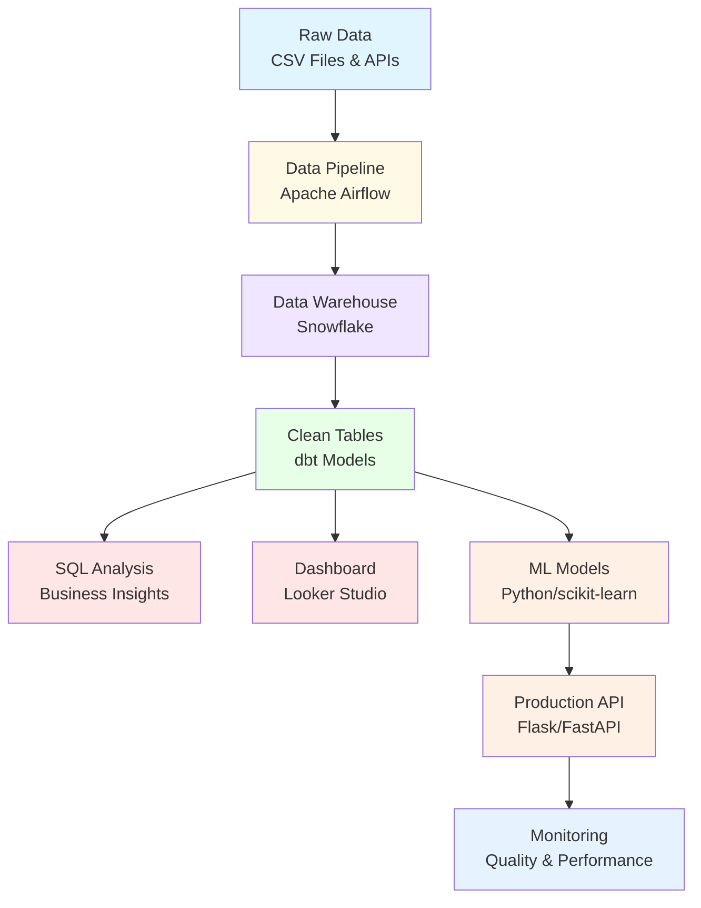

# Understanding Data Roles in Tech

## Learn by Doing: Experience 20 Data Career Paths Through Hands-On Projects

-   :material-rocket-launch:{ .lg .middle } __Get Started in 5 Minutes__

    ---

    Set up your development environment and start building your first data project

    [:octicons-arrow-right-24: Quick Start](getting-started/introduction.md)

-   :material-hammer-wrench:{ .lg .middle } __Build Real Projects__

    ---

    Create an end-to-end data system: pipelines, dashboards, ML models, and more

    [:octicons-arrow-right-24: View Projects](hands-on/project-overview.md)

-   :material-account-group:{ .lg .middle } __Explore 20 Roles__

    ---

    Deep dive into what Data Engineers, Data Scientists, ML Engineers, and 17 other roles actually do

    [:octicons-arrow-right-24: Browse Roles](roles/index.md)

-   :material-map-marker-path:{ .lg .middle } __Find Your Path__

    ---

    Discover which data career aligns with your interests through self-assessment

    [:octicons-arrow-right-24: Career Paths](career-paths/self-assessment.md)

---

## Why This Guide?

!!! question "Confused About Data Careers?"

    **"I want to work with data, but which role is right for me?"**
    
    **"What's the difference between a Data Engineer and Data Scientist?"**
    
    **"What do these people actually DO all day?"**

If you've asked these questions, you're not alone. The data industry has exploded with new roles, and the boundaries between them are blurry. Every company defines these roles differently.

**This guide solves that problem.**

---

## How This Guide Works

### :material-lightbulb: Learn the Fundamentals

Start by understanding what data really means in tech. We'll trace a simple book purchase through an entire data system, showing you the 7 stages of the data lifecycle and the undercurrents that make everything work.

[Start Learning →](fundamentals/what-is-data.md){ .md-button .md-button--primary }

### :material-code-braces: Build Real Projects

Don't just read about data roles—**experience them**. You'll build a complete e-commerce analytics platform called "BookStore Analytics":

- **Data pipelines** in Apache Airflow (Data Engineer)
- **Clean data models** with dbt (Analytics Engineer)  
- **SQL analysis** answering business questions (Data Analyst)
- **Interactive dashboards** in Looker Studio (BI Engineer)
- **ML models** for recommendations and churn prediction (Data Scientist)
- **Production APIs** deploying models (ML Engineer)
- **Monitoring systems** ensuring quality (MLOps Engineer)

...and more across all 20 roles.

[View the Project →](hands-on/project-overview.md){ .md-button }

### :material-account-search: Discover Your Role

Through hands-on exercises, you'll discover which work resonates with you. Do you love transforming messy data? Building dashboards? Training ML models? You'll know by the end.

[Take the Assessment →](career-paths/self-assessment.md){ .md-button }

---

## What You'll Build

By the end of this guide, you'll have created:

A complete, portfolio-ready data system that demonstrates skills across the entire data lifecycle.

---

## The 20 Roles You'll Experience

### :material-server: Infrastructure & Platform (4 roles)
Build the foundation that data systems run on

- [Backend Engineer](roles/infrastructure/backend-engineer.md)
- [Database Administrator](roles/infrastructure/database-administrator.md)
- [Platform Engineer](roles/infrastructure/platform-engineer.md)
- [DevOps Engineer](roles/infrastructure/devops-engineer.md)

### :material-pipe: Data Pipeline (3 roles)
Move and transform data at scale

- [Data Engineer](roles/data-pipeline/data-engineer.md)
- [Analytics Engineer](roles/data-pipeline/analytics-engineer.md)
- [DataOps Engineer](roles/data-pipeline/dataops-engineer.md)

### :material-chart-line: Analysis & Intelligence (4 roles)
Extract insights and build predictions

- [Data Analyst](roles/analysis/data-analyst.md)
- [BI Engineer](roles/analysis/bi-engineer.md)
- [Data Scientist](roles/analysis/data-scientist.md)
- [ML Scientist/Researcher](roles/analysis/ml-scientist.md)

### :material-rocket-launch-outline: Production (3 roles)
Deploy and scale data products

- [ML Engineer](roles/production/ml-engineer.md)
- [AI Engineer](roles/production/ai-engineer.md)
- [MLOps Engineer](roles/production/mlops-engineer.md)

### :material-shield-check: Support & Quality (3 roles)
Ensure reliability and governance

- [QA Engineer](roles/support/qa-engineer.md)
- [Data Governance Specialist](roles/support/data-governance.md)
- [Frontend Engineer](roles/support/frontend-engineer.md)

### :material-strategy: Strategic (3 roles)
Design systems and lead teams

- [Data Architect](roles/strategic/data-architect.md)
- [Data Product Manager](roles/strategic/data-product-manager.md)
- [Engineering Manager](roles/strategic/engineering-manager.md)

---

## Who This Guide Is For

!!! success "Perfect If You're..."

    - **Career changer** exploring data roles
    - **Recent graduate** choosing a specialization
    - **Professional** wanting to understand adjacent roles
    - **Manager** building a data team
    - **Developer** transitioning into data
    - **Analyst** considering Data Engineering or Data Science

!!! info "Prerequisites"

    **None!** This guide assumes no prior coding experience. We'll teach you everything you need as we go.
    
    All you need is:
    
    - ✅ Curiosity about data
    - ✅ Willingness to try new things
    - ✅ ~10 hours to work through the content
    - ✅ A computer (Windows, Mac, or Linux)

---

## What Makes This Different

| Other Resources | This Guide |
|----------------|------------|
| Watch tutorials | **Build real projects** |
| Read about roles | **Experience the work** |
| Theory-heavy | **Hands-on focused** |
| Single role focus | **All 20 roles** |
| Unclear next steps | **Personalized roadmap** |

---

## Ready to Start?

-   :material-book-open-page-variant:{ .lg .middle } __New to Data?__

    ---

    Start with the fundamentals to understand what data means in tech

    [:octicons-arrow-right-24: Learn the Basics](fundamentals/what-is-data.md)

-   :material-hammer-screwdriver:{ .lg .middle } __Ready to Build?__

    ---

    Jump straight into hands-on projects

    [:octicons-arrow-right-24: Start Building](hands-on/01-setup-environment.md)

-   :material-compass:{ .lg .middle } __Know What You Want?__

    ---

    Browse specific roles you're interested in

    [:octicons-arrow-right-24: Explore Roles](roles/index.md)

---

## About the Author

**Gemma Down** has spent 12 years working across the data stack in roles including:

- Data Analyst
- Data Scientist
- Analytics Engineer
- Data Engineer
- Full Stack Engineer

She has also recruited for Data Analysts, Data Engineers, Analytics Engineers, and Engineering Managers, giving her insight into what these roles really require—from both sides of the hiring table.

This guide distills 12 years of experience into a practical resource for anyone exploring data careers.

[:fontawesome-brands-github: GitHub](https://github.com/glsdown){ .md-button }
[:fontawesome-brands-linkedin: LinkedIn](https://linkedin.com/in/gemmasayers){ .md-button }

---

## Contributing

This guide is open source! Found a typo? Have a suggestion? Want to add a role?

[:octicons-issue-opened-24: Open an Issue](https://github.com/glsdown/data-roles-guide/issues){ .md-button }
[:octicons-git-pull-request-24: Submit a PR](https://github.com/glsdown/data-roles-guide/pulls){ .md-button }

---

!!! tip "Stay Updated"
    This guide is actively maintained. Star the [GitHub repo](https://github.com/glsdown/data-roles-guide) to get notified of updates.