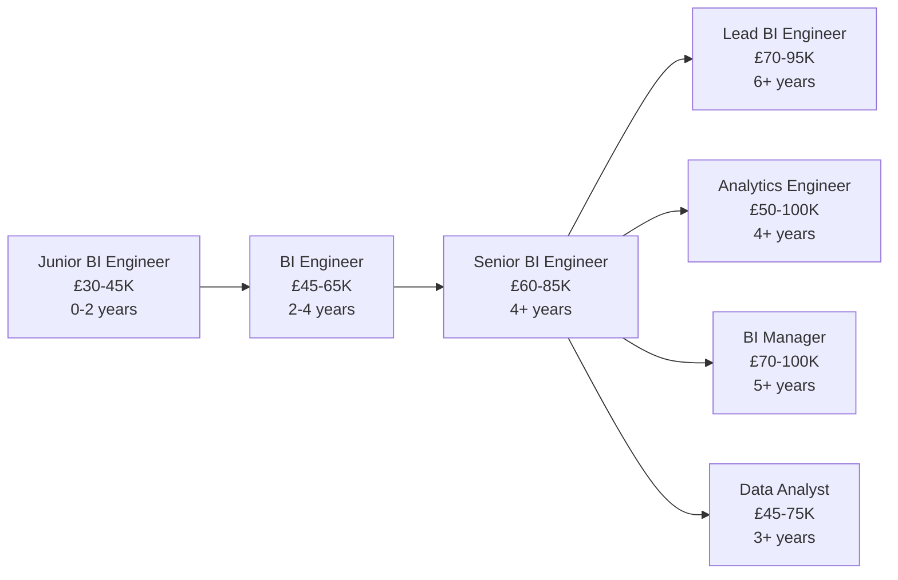

# BI Engineer

!!! quote "In Their Own Words"
    "I make data visible. Executives, managers, and teams rely on the dashboards I build to understand their business. When they ask 'how are we doing?', they're looking at my work."
    
    — *Senior BI Engineer, Retail Company*

---

## Role Overview

| | |
|---|---|
| **Also Known As** | Business Intelligence Developer, BI Analyst, Dashboard Developer |
| **Category** | Analysis & Intelligence |
| **Typical Experience** | 2-6 years |
| **Salary Range (UK)** | £45K - £85K |
| **Remote Friendly?** | ⭐⭐⭐⭐ Very (75%+ of jobs) |

---

## What Do BI Engineers Actually Do?

BI Engineers build **dashboards and reporting systems** that make data accessible to everyone in the organisation. They're the interface between data and decision-makers.

### The Core Responsibilities

=== "Build Dashboards"
    
    **Create interactive visualisations for stakeholders**
    
    Example: Executive Sales Dashboard
    
    **Components:**
    
    1. **KPI Cards** (top of dashboard)
        - Today's Revenue: £125,450 (+12% vs yesterday)
        - Orders: 342 (+8%)
        - Average Order Value: £28.50 (-3%)
        - Customer Satisfaction: 4.7/5 (stable)
    
    2. **Revenue Trend** (line chart)
        - Last 30 days of daily revenue
        - Comparison line showing previous period
        - Annotations for key events (campaigns, holidays)
    
    3. **Product Performance** (bar chart)
        - Top 10 products by revenue
        - Colour-coded by category
        - Drill-down to product details
    
    4. **Geographic Breakdown** (map)
        - Orders by region
        - Heat map showing concentration
        - Click region to filter other charts
    
    5. **Customer Segments** (pie/donut chart)
        - Revenue distribution across segments
        - Percentage of total
        - Segment health indicators
    
    **Tools:** Tableau, Looker, Power BI, Looker Studio

=== "Design Data Models"
    
    **Create semantic layers that make data intuitive**
    
    In Looker (LookML):
    
    ```lookml
    view: orders {
      sql_table_name: analytics.fct_orders ;;
      
      # Dimensions (attributes)
      dimension: order_id {
        primary_key: yes
        type: string
        sql: ${TABLE}.order_id ;;
      }
      
      dimension_group: order {
        type: time
        timeframes: [date, week, month, quarter, year]
        sql: ${TABLE}.order_date ;;
      }
      
      dimension: customer_segment {
        type: string
        sql: ${TABLE}.customer_segment ;;
      }
      
      dimension: product_category {
        type: string
        sql: ${TABLE}.product_category ;;
      }
      
      # Measures (aggregations)
      measure: total_orders {
        type: count_distinct
        sql: ${order_id} ;;
        drill_fields: [order_id, customer_name, order_date]
      }
      
      measure: total_revenue {
        type: sum
        sql: ${TABLE}.order_value_gbp ;;
        value_format_name: gbp
      }
      
      measure: average_order_value {
        type: average
        sql: ${TABLE}.order_value_gbp ;;
        value_format_name: gbp
      }
      
      # Calculated fields
      measure: revenue_per_customer {
        type: number
        sql: ${total_revenue} / NULLIF(${customer_count}, 0) ;;
        value_format_name: gbp
      }
    }
    
    explore: orders {
      join: customers {
        sql_on: ${orders.customer_id} = ${customers.customer_id} ;;
        relationship: many_to_one
      }
      
      join: products {
        sql_on: ${orders.product_id} = ${products.product_id} ;;
        relationship: many_to_one
      }
    }
    ```

=== "Optimise Performance"
    
    **Make dashboards load fast**
    
    **Problem:** Dashboard takes 45 seconds to load
    
    **Solutions:**
    
    1. **Aggregate tables**
    
        ```sql
        -- Create pre-aggregated daily summary
        CREATE TABLE analytics.daily_revenue_summary AS
        SELECT 
            order_date,
            customer_segment,
            product_category,
            COUNT(DISTINCT order_id) as total_orders,
            SUM(order_value_gbp) as total_revenue,
            COUNT(DISTINCT customer_id) as unique_customers
        FROM analytics.fct_orders
        GROUP BY 1, 2, 3;
        
        -- Dashboard now queries this instead of raw orders
        -- Load time: 45s → 2s
        ```
    
    2. **Materialized views**
        - Pre-compute expensive joins
        - Refresh incrementally
    
    3. **Query optimization**
        - Remove unnecessary fields
        - Add filters early
        - Use indexed columns
    
    4. **Caching**
        - Cache dashboard results
        - Refresh on schedule (not every view)

=== "Maintain Data Quality"
    
    **Ensure dashboards show accurate data**
    
    ```sql
    -- Daily data quality checks
    
    -- Check 1: Data freshness
    SELECT 
        MAX(order_date) as last_order_date,
        DATEDIFF(day, MAX(order_date), CURRENT_DATE) as days_stale
    FROM analytics.fct_orders;
    -- Alert if > 1 day old
    
    -- Check 2: Revenue reconciliation
    SELECT 
        SUM(order_value_gbp) as dashboard_revenue
    FROM analytics.fct_orders
    WHERE order_date = CURRENT_DATE - 1;
    
    -- Compare with finance system
    -- Alert if difference > 1%
    
    -- Check 3: Row count anomalies
    WITH daily_counts AS (
        SELECT 
            order_date,
            COUNT(*) as order_count
        FROM analytics.fct_orders
        WHERE order_date >= CURRENT_DATE - 30
        GROUP BY order_date
    )
    SELECT 
        order_date,
        order_count,
        AVG(order_count) OVER (
            ORDER BY order_date 
            ROWS BETWEEN 7 PRECEDING AND 1 PRECEDING
        ) as avg_previous_week
    FROM daily_counts
    WHERE order_count < avg_previous_week * 0.5;
    -- Alert if today's count is <50% of weekly average
    ```

=== "Support Users"
    
    **Help stakeholders use dashboards effectively**
    
    **Common requests:**
    
    - "Can you add a filter for region?"
    - "Why don't these numbers match the finance report?"
    - "How do I export this data?"
    - "Can I see last year's data for comparison?"
    
    **Documentation you create:**
    
    - Dashboard user guides
    - Metric definitions ("What does 'active customer' mean?")
    - How-to videos (screen recordings)
    - FAQ pages
    - Office hours for questions

---

## A Day in the Life

### Morning (9:00 AM - 12:00 PM)

```text
09:00 - Check dashboard monitoring
        Sales dashboard load time: 8 seconds (good)
        Marketing dashboard: 45 seconds (investigate)
        Find: Unoptimised query, add aggregate table

09:30 - Slack message from Marketing Director
        "Can you add campaign source to the dashboard?"
        Quick change: Add dimension to model
        Deploy in 10 minutes

10:00 - Weekly stakeholder meeting
        Demo new customer retention dashboard
        Walk through key metrics
        Answer questions about calculations
        Gather feedback for improvements

11:00 - Work on new dashboard: Product analytics
        Connect to data warehouse
        Build base metrics in Looker
        Create draft visualisations
        Test with sample users
```

### Afternoon (1:00 PM - 5:00 PM)

```text
13:00 - Investigate data discrepancy
        Finance reports £100K revenue
        Dashboard shows £98K
        Find issue: Missing cancelled orders refund logic
        Fix calculation, document change

15:00 - Performance optimisation
        Quarterly report dashboard timing out
        Profile queries to find bottleneck
        Create aggregate table for YoY comparisons
        Load time: 2 minutes → 15 seconds

16:00 - User training session
        New joiners orientation
        Show main dashboards
        Explain how to filter and drill down
        Answer questions about metrics

16:45 - Documentation update
        Update metric definitions
        Add screenshots to user guide
        Publish to internal wiki
```

---

## Key Skills

### Must-Have Skills

| Skill | Why It Matters | Proficiency Needed |
|-------|----------------|-------------------|
| **SQL** | Query data for dashboards | ⭐⭐⭐⭐ Advanced |
| **BI Tool** | Tableau, Looker, or Power BI | ⭐⭐⭐⭐ Advanced |
| **Data Visualisation** | Choose right charts, design principles | ⭐⭐⭐⭐⭐ Expert |
| **Communication** | Understand stakeholder needs | ⭐⭐⭐⭐ Advanced |
| **Data Modelling** | Structure data for reporting | ⭐⭐⭐ Intermediate |

### Important Skills

| Skill | Why It Matters | Proficiency Needed |
|-------|----------------|-------------------|
| **Performance Tuning** | Fast dashboards | ⭐⭐⭐ Intermediate |
| **User Experience** | Intuitive interfaces | ⭐⭐⭐⭐ Advanced |
| **Data Quality** | Accurate reporting | ⭐⭐⭐ Intermediate |
| **Business Acumen** | Understand metrics that matter | ⭐⭐⭐⭐ Advanced |
| **Documentation** | User guides and training | ⭐⭐⭐ Intermediate |

### Nice-to-Have Skills

- Python for automation
- HTML/CSS for custom styling
- JavaScript for advanced interactions
- Git for version control
- Statistical methods

---

## Tools You'll Use Daily

### BI Platforms

<div class="grid cards" markdown>

-   **Tableau**
    
    ---
    
    Industry leader, powerful
    
    Drag-and-drop interface, strong visualisations

-   **Looker (Google)**
    
    ---
    
    Code-based, scalable
    
    LookML for semantic layer

-   **Power BI (Microsoft)**
    
    ---
    
    Microsoft ecosystem
    
    DAX for calculations, lower cost

-   **Looker Studio**
    
    ---
    
    Free, easy to use
    
    Good for smaller teams

</div>

### Supporting Tools

- **SQL IDEs** - Write and test queries
- **Git** - Version control for code
- **Figma/Sketch** - Design mockups
- **Loom** - Record tutorial videos

---

## Hands-On Project

!!! example "Build BookStore Analytics Dashboard"
    
    **Objective:** Create interactive executive dashboard
    
    **What you'll build:**
    
    1. Connect Looker Studio to Snowflake
    2. Create KPI cards:
        - Revenue, orders, average order value
        - Week-over-week changes
    3. Build visualisations:
        - Revenue trend (line chart)
        - Top products (bar chart)
        - Geographic breakdown (map)
        - Customer segments (pie chart)
    4. Add interactivity:
        - Date range selector
        - Category filters
        - Drill-down capabilities
    5. Share with stakeholders
    
    **Time estimate:** 1.5-2 hours
    
    [Start Tutorial →](../../hands-on/07-dashboard.md){ .md-button .md-button--primary }

---

## Career Path

### Entry Points

=== "From Data Analyst"
    
    **Most common path:** 60% of BI Engineers
    
    **You have:**
    
    - SQL skills
    - Understanding of business metrics
    - Stakeholder communication
    
    **Add:**
    
    - BI tool expertise (Tableau, Looker, Power BI)
    - Data visualisation principles
    - Dashboard design patterns
    
    **Timeline:** 3-6 months

=== "From Analyst Roles"
    
    **Business Analyst, Financial Analyst, etc.**
    
    **You have:**
    
    - Excel/spreadsheet skills
    - Business domain knowledge
    - Report creation experience
    
    **Add:**
    
    - SQL (most important!)
    - BI tool training
    - Data warehouse concepts
    
    **Timeline:** 4-6 months

=== "Self-Taught"
    
    **Focus on:**
    
    1. SQL (essential)
    2. Choose one BI tool (Looker Studio is free to start)
    3. Data visualisation theory
    4. Build portfolio projects
    5. Understand common business metrics
    
    **Timeline:** 6-9 months

### Progression



---

## When This Role Fits You

!!! success "You'll Love This Role If..."
    
    - ✅ You enjoy **visual design** and making data beautiful
    - ✅ You like **immediate feedback** (see dashboard come to life)
    - ✅ You appreciate **helping people** make decisions
    - ✅ You're good at **understanding user needs**
    - ✅ You like **both technical and creative work**
    - ✅ You enjoy **iterating based on feedback**
    - ✅ You want **visible impact** (everyone sees your dashboards)

!!! warning "This Might Not Be For You If..."
    
    - ❌ You want to focus on **deep analysis** (that's Data Analyst/Scientist)
    - ❌ You prefer **building data pipelines** (that's Data Engineer)
    - ❌ You dislike **stakeholder management**
    - ❌ You want **low visibility** (your work is very public)
    - ❌ You prefer **backend systems** to user interfaces
    - ❌ You dislike **design and aesthetics**

---

## Common Interview Questions

??? question "Design a dashboard for [scenario]"
    
    **Example:** "Design a dashboard for an e-commerce operations team"
    
    **Good answer structure:**
    
    1. **Clarify audience**
        - Who will use it? (warehouse managers, logistics team)
        - What decisions do they make?
        - How often will they check it?
    
    2. **Define key metrics**
        - Orders to fulfill (real-time)
        - Fulfillment rate (daily)
        - Average processing time
        - Inventory levels by product
        - Shipping delays
    
    3. **Sketch layout**
        ```
        ┌─────────────────────────────────┐
        │  KPIs (top)                     │
        │  ┌──────┐ ┌──────┐ ┌──────┐   │
        │  │Orders│ │Fulfil│ │Delays│   │
        │  └──────┘ └──────┘ └──────┘   │
        │                                 │
        │  Main Chart (middle)            │
        │  ┌─────────────────────────┐   │
        │  │ Orders by Hour (today)  │   │
        │  └─────────────────────────┘   │
        │                                 │
        │  Detail Tables (bottom)         │
        │  ┌──────────┐  ┌──────────┐   │
        │  │Low Stock │  │Late Orders│   │
        │  └──────────┘  └──────────┘   │
        └─────────────────────────────────┘
        ```
    
    4. **Add interactivity**
        - Date filter
        - Warehouse location filter
        - Click order to see details
        - Alerts for critical items
    
    5. **Consider refresh frequency**
        - Real-time for urgent metrics
        - Hourly for trends
        - Daily for reports

??? question "How would you optimise a slow dashboard?"
    
    **Good answer:**
    
    1. **Diagnose the problem**
        - Use profiling tools to find slow queries
        - Check if issue is query or rendering
        - Measure baseline: "45 seconds to load"
    
    2. **Query optimization**
        - Remove unnecessary columns
        - Add WHERE clauses early
        - Use aggregate tables for common calculations
        - Ensure proper indexing
    
    3. **Data modeling**
        - Pre-join frequently used tables
        - Create materialized views
        - Implement incremental refresh
    
    4. **Dashboard design**
        - Lazy load charts (load on demand)
        - Limit default date range
        - Use summary data for overview, detail on drill-down
    
    5. **Caching**
        - Cache query results
        - Set appropriate refresh schedules
        - Use dashboard snapshots for static periods
    
    6. **Monitor and iterate**
        - Set up performance tracking
        - Get user feedback
        - Continuously optimise

??? question "SQL: Write a query for a rolling 7-day average"
    
    ```sql
    -- Rolling 7-day average revenue
    SELECT 
        order_date,
        SUM(order_value_gbp) as daily_revenue,
        AVG(SUM(order_value_gbp)) OVER (
            ORDER BY order_date
            ROWS BETWEEN 6 PRECEDING AND CURRENT ROW
        ) as rolling_7day_avg
    FROM orders
    WHERE order_date >= CURRENT_DATE - 30
    GROUP BY order_date
    ORDER BY order_date;
    ```

---

## Learning Resources

### Courses

- [:fontawesome-solid-graduation-cap: **Tableau Desktop Specialist**](https://www.tableau.com/learn/certification) - Official certification
- [:fontawesome-solid-graduation-cap: **Looker Developer**](https://cloud.google.com/learn/certification/looker-business-analyst) - Google Cloud certification
- [:fontawesome-solid-graduation-cap: **Power BI Data Analyst**](https://learn.microsoft.com/en-us/certifications/power-bi-data-analyst-associate/) - Microsoft certification

### Books

- 📚 **"Storytelling with Data"** by Cole Nussbaumer Knaflic - Visualisation best practices
- 📚 **"The Big Book of Dashboards"** by Wexler et al. - Dashboard examples and patterns
- 📚 **"Information Dashboard Design"** by Stephen Few - Design principles

### Practice

- [Our Dashboard Tutorial](../../hands-on/07-dashboard.md) - BookStore project
- [Tableau Public Gallery](https://public.tableau.com/gallery/) - Inspiration
- [Power BI Community](https://community.powerbi.com/) - Examples and help

### Communities

- [:fontawesome-brands-reddit: r/tableau](https://reddit.com/r/tableau) - Tableau community
- [:fontawesome-brands-reddit: r/PowerBI](https://reddit.com/r/PowerBI) - Power BI community
- [:fontawesome-brands-linkedin: BI Professional Groups](https://linkedin.com) - Networking

---

## Related Roles

| Role | Overlap | Key Difference |
|------|---------|----------------|
| [Data Analyst](data-analyst.md) | 70% | Analysts focus more on ad-hoc analysis, less on dashboards |
| [Analytics Engineer](../data-pipeline/analytics-engineer.md) | 50% | Analytics Engineers build data models, BI Engineers consume them |
| [Frontend Engineer](../support/frontend-engineer.md) | 30% | Frontend Engineers build applications, BI Engineers build reports |
| [Data Scientist](data-scientist.md) | 30% | Scientists build models, BI Engineers visualise results |

---

## Why This Role Matters

BI Engineers democratise data access. Without dashboards:

- Executives rely on gut feel
- Teams request ad-hoc reports constantly
- Analysts spend time on repetitive queries
- Decisions are slow and uninformed

With good dashboards:

- Self-service analytics (fewer requests)
- Faster decision-making
- Data-driven culture
- Consistent metrics across organisation

---

## Next Steps

Ready to try BI Engineering?

[Dashboard Tutorial →](../../hands-on/07-dashboard.md){ .md-button .md-button--primary }

Want to explore more roles?

[Back to All Roles →](../index.md){ .md-button }