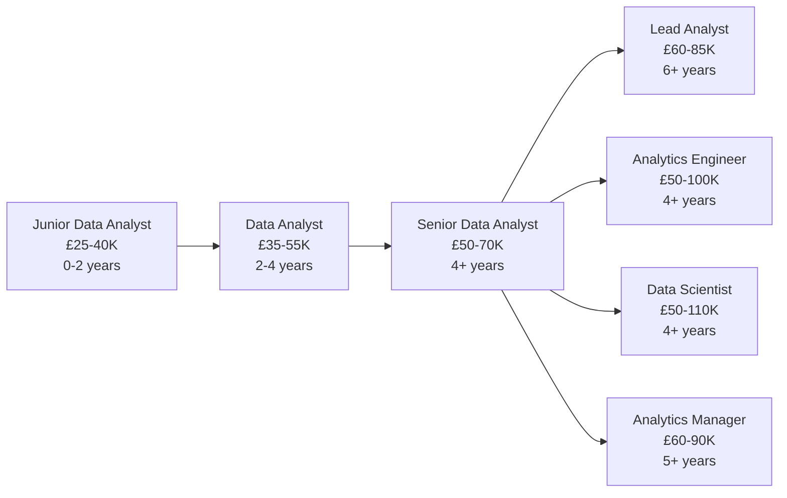

# Data Analyst

!!! quote "In Their Own Words"
    "I'm the bridge between data and decisions. I take messy business questions, translate them into SQL queries, and deliver clear answers that help the company move forward. I love the detective work of finding insights hidden in the data."
    
    — *Senior Data Analyst, E-commerce Company*

---

## Role Overview

| | |
|---|---|
| **Also Known As** | Business Analyst, Analytics Analyst, Insights Analyst |
| **Category** | Analysis & Intelligence |
| **Typical Experience** | 0-6 years |
| **Salary Range (UK)** | £35K - £70K |
| **Remote Friendly?** | ⭐⭐⭐⭐ Very (80%+ of jobs) |

---

## What Do Data Analysts Actually Do?

Data Analysts are the **storytellers** of the data world. While Engineers build systems and Scientists build models, Analysts answer the business questions that drive day-to-day decisions.

### The Core Responsibilities

=== "Answer Business Questions"
    
    **Turn vague questions into concrete answers**
    
    **Question:** "Why did revenue drop last month?"
    
    ```sql
    -- Break down by segments to find the cause
    SELECT 
        customer_segment,
        product_category,
        DATE_TRUNC('week', order_date) as week,
        COUNT(DISTINCT order_id) as orders,
        SUM(revenue) as total_revenue,
        AVG(revenue) as avg_order_value
    FROM orders
    WHERE order_date >= '2025-10-01'
      AND order_date < '2025-11-01'
    GROUP BY 1, 2, 3
    ORDER BY week, total_revenue DESC;
    ```
    
    **Answer:** "Enterprise customers in the 'Technology' category reduced purchases by 40% in the third week due to a price increase we implemented."

=== "Create Reports"
    
    **Regular reporting for stakeholders**
    
    ```sql
    -- Weekly executive report
    WITH weekly_metrics AS (
        SELECT 
            DATE_TRUNC('week', order_date) as week,
            COUNT(DISTINCT customer_id) as active_customers,
            COUNT(DISTINCT order_id) as total_orders,
            SUM(revenue) as revenue,
            AVG(revenue) as avg_order_value
        FROM orders
        WHERE order_date >= CURRENT_DATE - INTERVAL '8 weeks'
        GROUP BY 1
    )
    
    SELECT 
        week,
        active_customers,
        total_orders,
        revenue,
        avg_order_value,
        -- Week-over-week changes
        revenue - LAG(revenue) OVER (ORDER BY week) as revenue_change,
        ROUND(
            (revenue - LAG(revenue) OVER (ORDER BY week)) 
            / LAG(revenue) OVER (ORDER BY week) * 100, 
            2
        ) as revenue_change_pct
    FROM weekly_metrics
    ORDER BY week DESC;
    ```

=== "Identify Trends"
    
    **Spot patterns and anomalies**
    
    ```sql
    -- Customer behaviour analysis
    SELECT 
        customer_segment,
        -- Recency
        AVG(DATEDIFF(day, last_order_date, CURRENT_DATE)) as avg_days_since_order,
        -- Frequency
        AVG(total_orders) as avg_lifetime_orders,
        -- Monetary
        AVG(lifetime_value) as avg_lifetime_value,
        COUNT(*) as customer_count
    FROM customer_metrics
    GROUP BY customer_segment
    ORDER BY avg_lifetime_value DESC;
    ```
    
    **Insight:** "Our 'VIP' segment has 3x higher lifetime value but represents only 5% of customers. Worth targeting with retention campaigns."

=== "Support Decision-Making"
    
    **Provide data for strategic choices**
    
    Example scenario: "Should we expand into Scotland?"
    
    ```sql
    -- Market analysis for expansion
    SELECT 
        region,
        COUNT(DISTINCT customer_id) as customers,
        SUM(revenue) as total_revenue,
        AVG(order_value) as avg_order,
        COUNT(DISTINCT order_id) / 
            COUNT(DISTINCT customer_id) as orders_per_customer,
        -- Calculate market size estimate
        COUNT(DISTINCT customer_id) * 
            (population_scotland / population_current_regions) 
            as estimated_scotland_customers
    FROM regional_analysis
    WHERE region != 'Scotland'
    GROUP BY region;
    ```
    
    **Recommendation:** "Based on similar demographic regions, Scotland could generate £2.5M annually. Recommend pilot launch."

=== "Build Dashboards"
    
    **Create self-service analytics**
    
    While BI Engineers own complex dashboards, Analysts often create simpler ones:
    
    - Weekly sales dashboard
    - Marketing campaign performance
    - Customer health metrics
    - Product performance tracking
    
    **Tools:** Looker Studio, Tableau, Power BI, Metabase

---

## A Day in the Life

### Morning (9:00 AM - 12:00 PM)

```text
09:00 - Check Slack: Marketing team asks about campaign performance
        Pull up last week's data, write quick SQL query
        Share results showing 15% increase in conversions

09:30 - Weekly stakeholder meeting
        Present findings on customer churn analysis
        Recommend 3 retention strategies based on data
        Answer questions about methodology

10:30 - Deep dive: Why did sign-ups drop yesterday?
        Query user acquisition funnel
        Compare with previous weeks
        Find bug in registration flow
        Alert engineering team

11:30 - Update executive dashboard
        Refresh weekly KPIs
        Add commentary on notable changes
        Schedule automated email for Monday morning
```

### Afternoon (1:00 PM - 5:00 PM)

```text
13:00 - Exploratory analysis: Product team wants to know
        which features drive retention
        Join user events with subscription data
        Calculate correlation between feature usage and renewal
        Create visualisations

15:00 - Ad-hoc request: "How many customers use mobile app?"
        Quick query, 5 minutes
        "42% of monthly active users primarily use mobile"

15:30 - Work on monthly report
        Combine data from multiple sources
        Write narrative explaining trends
        Create charts and tables
        Draft recommendations

16:30 - Document analysis process
        Update internal wiki with new query patterns
        Help junior analyst understand a complex query

17:00 - Plan tomorrow's priorities
```

### Weekly Responsibilities

- **Mondays:** Team standup, prioritise week's requests
- **Tuesdays:** 1:1 with manager, stakeholder check-ins
- **Wednesdays:** Deep work time, complex analyses
- **Thursdays:** Present findings to teams
- **Fridays:** Documentation, cleanup, learning time

---

## Key Skills

### Must-Have Skills

| Skill | Why It Matters | Proficiency Needed |
|-------|----------------|-------------------|
| **SQL** | Your primary tool for data access | ⭐⭐⭐⭐⭐ Expert |
| **Statistics** | Understanding averages, distributions, significance | ⭐⭐⭐ Intermediate |
| **Excel/Google Sheets** | Quick analysis, stakeholder reports | ⭐⭐⭐⭐ Advanced |
| **Data Visualisation** | Charts that communicate clearly | ⭐⭐⭐⭐ Advanced |
| **Communication** | Explain findings to non-technical people | ⭐⭐⭐⭐⭐ Expert |

### Important Skills

| Skill | Why It Matters | Proficiency Needed |
|-------|----------------|-------------------|
| **Python/R** | Automate analysis, statistical tests | ⭐⭐⭐ Intermediate |
| **BI Tools** | Tableau, Looker, Power BI | ⭐⭐⭐ Intermediate |
| **Business Acumen** | Understand company operations | ⭐⭐⭐⭐ Advanced |
| **Problem Solving** | Break down ambiguous questions | ⭐⭐⭐⭐ Advanced |
| **Critical Thinking** | Question assumptions, validate data | ⭐⭐⭐⭐ Advanced |

### Nice-to-Have Skills

- Basic understanding of data warehouses
- Git for version control
- dbt for reading transformation logic
- A/B testing frameworks
- Domain expertise (e-commerce, finance, etc.)

---

## Tools You'll Use Daily

### Query & Analysis

<div class="grid cards" markdown>

-   **SQL**
    
    ---
    
    Your bread and butter
    
    ```sql
    SELECT 
        product_name,
        SUM(revenue) as total_revenue
    FROM sales
    GROUP BY product_name
    ORDER BY total_revenue DESC
    LIMIT 10;
    ```

-   **Python (pandas)**
    
    ---
    
    For complex analysis
    
    ```python
    import pandas as pd
    
    df = pd.read_sql(query, conn)
    df.groupby('category')['revenue'].sum()
    ```

-   **Excel/Sheets**
    
    ---
    
    Quick pivots and charts
    
    Quick calculations, sharing with non-technical stakeholders

</div>

### Visualisation

<div class="grid cards" markdown>

-   **Looker Studio**
    
    ---
    
    Free, easy dashboards

-   **Tableau**
    
    ---
    
    Powerful, industry standard

-   **Power BI**
    
    ---
    
    Microsoft ecosystem

-   **matplotlib/seaborn**
    
    ---
    
    Python visualisation

</div>

### Databases

- **Snowflake** - Cloud data warehouse
- **BigQuery** - Google's warehouse
- **PostgreSQL** - Open-source database
- **Redshift** - AWS warehouse

---

## Hands-On Project

!!! example "Analyse BookStore Sales Data"
    
    **Objective:** Answer business questions using SQL
    
    **What you'll do:**
    
    1. Connect to Snowflake warehouse
    2. Explore available tables
    3. Answer 10 business questions:
        - What are top-selling books?
        - Which customers are churning?
        - What's average order value by segment?
        - Which marketing channels work best?
        - And more...
    4. Create visualisations of findings
    5. Write an executive summary
    
    **Time estimate:** 1.5-2 hours
    
    [Start Tutorial →](../../hands-on/06-sql-analysis.md){ .md-button .md-button--primary }

---

## Career Path

### Entry Points

=== "From University"
    
    **Common background:** Any degree, especially:
    
    - Business/Economics
    - Mathematics/Statistics
    - Psychology (research skills transfer!)
    - Any STEM field
    
    **How to break in:**
    
    1. Learn SQL (most important!)
    2. Learn Excel/Sheets advanced features
    3. Complete online courses (DataCamp, Coursera)
    4. Build portfolio projects
    5. Apply for junior/graduate roles
    
    **Timeline:** 3-6 months of focused learning

=== "From Business Roles"
    
    **Common transition:** Business Analyst, Operations, Marketing
    
    **What to learn:**
    
    1. SQL (focus here - 80% of the job)
    2. Basic statistics
    3. One visualisation tool (Tableau or similar)
    4. Your domain knowledge is valuable!
    
    **Timeline:** 3-6 months while working

=== "From Other Analyst Roles"
    
    **Common transition:** Financial Analyst, Research Analyst
    
    **You already have:**
    
    - Analytical thinking
    - Stakeholder communication
    - Report writing
    
    **Add:**
    
    - SQL proficiency
    - BI tool skills
    - Data warehouse concepts
    
    **Timeline:** 2-4 months

### Progression



---

## When This Role Fits You

!!! success "You'll Love This Role If..."
    
    - ✅ You enjoy **solving puzzles** and finding answers
    - ✅ You like **helping people make decisions**
    - ✅ You're good at **explaining complex things simply**
    - ✅ You appreciate **immediate impact** (answers questions this week)
    - ✅ You like **variety** (different questions every day)
    - ✅ You're **curious** about how businesses work
    - ✅ You enjoy **working with people** (not just computers)

!!! warning "This Might Not Be For You If..."
    
    - ❌ You want to focus on **building systems** (that's Data Engineer)
    - ❌ You prefer **deep technical work** over communication
    - ❌ You don't enjoy **repeating similar analyses**
    - ❌ You want to **build ML models** (that's Data Scientist)
    - ❌ You dislike **ambiguous requirements** ("just tell me what to build")
    - ❌ You prefer **solo work** (this role is very collaborative)

---

## Common Interview Questions

??? question "SQL: Find customers who haven't purchased in 90 days"
    
    ```sql
    SELECT 
        customer_id,
        customer_name,
        last_order_date,
        DATEDIFF(day, last_order_date, CURRENT_DATE) as days_since_order,
        total_lifetime_orders,
        total_lifetime_value
    FROM (
        SELECT 
            c.customer_id,
            c.customer_name,
            MAX(o.order_date) as last_order_date,
            COUNT(DISTINCT o.order_id) as total_lifetime_orders,
            SUM(o.order_value) as total_lifetime_value
        FROM customers c
        LEFT JOIN orders o ON c.customer_id = o.customer_id
        GROUP BY c.customer_id, c.customer_name
    )
    WHERE DATEDIFF(day, last_order_date, CURRENT_DATE) > 90
    ORDER BY total_lifetime_value DESC;
    ```

??? question "Case Study: Revenue dropped 20% - how would you investigate?"
    
    **Good answer structure:**
    
    1. **Clarify the question**
        - Which timeframe?
        - Which region/product/segment?
        - Compared to what baseline?
    
    2. **Form hypotheses**
        - Seasonality?
        - Lost major customer?
        - Price change?
        - Product mix shift?
        - Technical issue (tracking)?
    
    3. **Outline analysis approach**
        - Break down by segment, product, channel
        - Compare to previous periods
        - Check data quality first
        - Look for anomalies
    
    4. **Explain how you'd communicate findings**
        - Clear visualisations
        - Executive summary
        - Recommended actions

??? question "Explain A/B testing to a non-technical stakeholder"
    
    **Good answer:**
    
    "Imagine you're not sure whether a red or blue button will get more clicks on our website. Instead of guessing, we show the red button to half our visitors and the blue button to the other half—randomly. After a week, we count which button got more clicks.
    
    If blue gets 15% more clicks and we're confident that's not just random luck (we use statistics to check), we keep the blue button for everyone.
    
    It's like a scientific experiment, but for business decisions. We let the data tell us what works instead of relying on opinions."

---

## Learning Resources

### Courses

- [:fontawesome-solid-graduation-cap: **Mode Analytics SQL Tutorial**](https://mode.com/sql-tutorial/) - Free, interactive, excellent
- [:fontawesome-solid-graduation-cap: **DataCamp: Data Analyst Track**](https://datacamp.com) - Comprehensive, hands-on
- [:fontawesome-solid-graduation-cap: **Google Data Analytics Certificate**](https://grow.google/certificates/data-analytics/) - Beginner-friendly

### Books

- 📚 **"Storytelling with Data"** by Cole Nussbaumer Knaflic - Visualisation best practices
- 📚 **"Data Science for Business"** by Provost & Fawcett - Understanding business context
- 📚 **"SQL Cookbook"** by Anthony Molinaro - SQL techniques

### Practice

- [Our SQL Analysis Tutorial](../../hands-on/06-sql-analysis.md) - BookStore project
- [SQLZoo](https://sqlzoo.net/) - Interactive SQL practice
- [HackerRank SQL](https://www.hackerrank.com/domains/sql) - Practice problems

### Communities

- [:fontawesome-brands-slack: Locally Optimistic](https://locallyoptimistic.com/community/) - Analytics professionals
- [:fontawesome-brands-reddit: r/datascience](https://reddit.com/r/datascience) - General data community
- [:fontawesome-brands-linkedin: Data Analyst LinkedIn Groups](https://linkedin.com) - Networking and jobs

---

## Related Roles

| Role | Overlap | Key Difference |
|------|---------|----------------|
| [BI Engineer](bi-engineer.md) | 70% | BI Engineers focus more on dashboards and tools |
| [Data Scientist](data-scientist.md) | 50% | Scientists build predictive models, Analysts describe past |
| [Analytics Engineer](../data-pipeline/analytics-engineer.md) | 60% | Analytics Engineers own data transformation layer |
| [Business Analyst](../infrastructure/backend-engineer.md) | 40% | Business Analysts focus on requirements, not data |

---

## Why This Role Matters

Data Analysts are often the **most impactful** role in terms of immediate business value:

- **Fast feedback loop:** Answer questions this week that influence decisions next week
- **Wide influence:** Every team needs analysis (marketing, product, operations, finance)
- **Business understanding:** Learn how companies actually operate
- **Career flexibility:** Can transition to many other data roles

Many senior data leaders started as Analysts because the role teaches:

- How businesses use data
- What questions matter
- How to communicate with non-technical people
- The full data landscape

---

## Next Steps

Ready to try Data Analysis?

[SQL Analysis Tutorial →](../../hands-on/06-sql-analysis.md){ .md-button .md-button--primary }

Want to explore more roles?

[Back to All Roles →](../index.md){ .md-button }