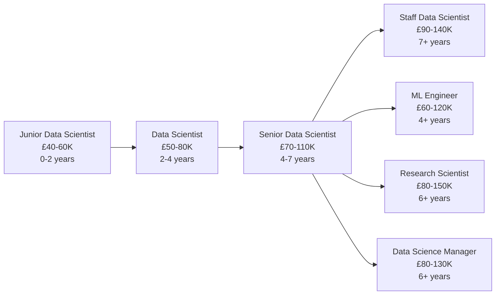

# Data Scientist

!!! quote "In Their Own Words"
    "I turn questions about the future into models that predict outcomes. Where analysts tell you what happened, I tell you what's likely to happen next—and help the business prepare for it."
    
    — *Senior Data Scientist, Fintech Company*

---

## Role Overview

| | |
|---|---|
| **Also Known As** | ML Scientist (though slightly different), Research Scientist |
| **Category** | Analysis & Intelligence |
| **Typical Experience** | 2-8 years |
| **Salary Range (UK)** | £50K - £110K |
| **Remote Friendly?** | ⭐⭐⭐⭐⭐ Very (85%+ of jobs) |

---

## What Do Data Scientists Actually Do?

Data Scientists build **predictive models** and run **experiments** to help organisations make better decisions. They apply statistical methods and machine learning to data problems.

### The Core Responsibilities

=== "Build Predictive Models"
    
    **Train models that forecast future outcomes**
    
    ```python
    import pandas as pd
    from sklearn.ensemble import RandomForestClassifier
    from sklearn.model_selection import train_test_split
    from sklearn.metrics import accuracy_score, roc_auc_score
    
    # Load customer data
    customers = pd.read_sql("""
        SELECT 
            customer_id,
            days_since_last_order,
            total_orders,
            avg_order_value,
            lifetime_value,
            email_open_rate,
            support_tickets,
            -- Target: Did they churn?
            CASE 
                WHEN last_order_date < CURRENT_DATE - 90 
                THEN 1 ELSE 0 
            END as churned
        FROM customer_metrics
    """, conn)
    
    # Prepare features and target
    features = [
        'days_since_last_order',
        'total_orders', 
        'avg_order_value',
        'lifetime_value',
        'email_open_rate',
        'support_tickets'
    ]
    
    X = customers[features]
    y = customers['churned']
    
    # Split data
    X_train, X_test, y_train, y_test = train_test_split(
        X, y, test_size=0.2, random_state=42
    )
    
    # Train model
    model = RandomForestClassifier(
        n_estimators=100,
        max_depth=10,
        random_state=42
    )
    model.fit(X_train, y_train)
    
    # Evaluate
    y_pred = model.predict(X_test)
    y_pred_proba = model.predict_proba(X_test)[:, 1]
    
    print(f"Accuracy: {accuracy_score(y_test, y_pred):.2%}")
    print(f"ROC-AUC: {roc_auc_score(y_test, y_pred_proba):.2%}")
    
    # Feature importance
    feature_importance = pd.DataFrame({
        'feature': features,
        'importance': model.feature_importances_
    }).sort_values('importance', ascending=False)
    
    print("\nTop Features:")
    print(feature_importance.head())
    ```

=== "Run Experiments"
    
    **Design and analyse A/B tests**
    
    ```python
    import scipy.stats as stats
    import numpy as np
    
    # A/B Test: Does new checkout flow increase conversion?
    
    # Control group (old flow)
    control_visitors = 10000
    control_conversions = 450
    control_rate = control_conversions / control_visitors  # 4.5%
    
    # Treatment group (new flow)
    treatment_visitors = 10000
    treatment_conversions = 520
    treatment_rate = treatment_conversions / treatment_visitors  # 5.2%
    
    # Statistical test
    z_stat, p_value = stats.proportions_ztest(
        [control_conversions, treatment_conversions],
        [control_visitors, treatment_visitors]
    )
    
    print(f"Control conversion rate: {control_rate:.2%}")
    print(f"Treatment conversion rate: {treatment_rate:.2%}")
    print(f"Lift: {(treatment_rate - control_rate) / control_rate:.2%}")
    print(f"P-value: {p_value:.4f}")
    
    if p_value < 0.05:
        print("\n✓ Result is statistically significant!")
        print("Recommend deploying new checkout flow.")
    else:
        print("\n✗ Not statistically significant.")
        print("Need more data or result is due to chance.")
    
    # Calculate confidence interval
    se_diff = np.sqrt(
        control_rate * (1 - control_rate) / control_visitors +
        treatment_rate * (1 - treatment_rate) / treatment_visitors
    )
    ci_lower = (treatment_rate - control_rate) - 1.96 * se_diff
    ci_upper = (treatment_rate - control_rate) + 1.96 * se_diff
    
    print(f"\n95% CI for lift: [{ci_lower:.2%}, {ci_upper:.2%}]")
    ```

=== "Feature Engineering"
    
    **Create features that improve model performance**
    
    ```python
    import pandas as pd
    from datetime import datetime
    
    def engineer_features(df):
        """Create features for customer churn model"""
        
        # Temporal features
        df['days_since_registration'] = (
            datetime.now() - df['registration_date']
        ).dt.days
        
        df['days_since_last_order'] = (
            datetime.now() - df['last_order_date']
        ).dt.days
        
        # Behavioural features
        df['orders_per_month'] = (
            df['total_orders'] / 
            (df['days_since_registration'] / 30)
        )
        
        df['avg_days_between_orders'] = (
            df['days_since_registration'] / 
            df['total_orders']
        )
        
        # Engagement features
        df['email_engagement_score'] = (
            df['emails_opened'] / df['emails_sent']
        ).fillna(0)
        
        # Value features
        df['ltv_per_order'] = (
            df['lifetime_value'] / df['total_orders']
        )
        
        # Trend features (comparing recent to historical)
        df['recent_order_value_change'] = (
            df['last_3_months_value'] / df['previous_3_months_value']
        ) - 1
        
        # Category preferences
        top_category = df.groupby('customer_id')['category'].agg(
            lambda x: x.mode()[0] if len(x) > 0 else 'Unknown'
        )
        df['preferred_category'] = df['customer_id'].map(top_category)
        
        # Risk signals
        df['high_support_contact'] = (
            df['support_tickets'] > df['support_tickets'].quantile(0.9)
        ).astype(int)
        
        return df
    ```

=== "Explore & Analyse Data"
    
    **Understand patterns and relationships**
    
    ```python
    import pandas as pd
    import matplotlib.pyplot as plt
    import seaborn as sns
    
    # Load data
    df = pd.read_sql("SELECT * FROM customer_metrics", conn)
    
    # Summary statistics
    print(df.describe())
    
    # Distribution of key metric
    plt.figure(figsize=(10, 6))
    df['lifetime_value'].hist(bins=50)
    plt.xlabel('Lifetime Value (£)')
    plt.ylabel('Frequency')
    plt.title('Customer Lifetime Value Distribution')
    plt.show()
    
    # Correlation analysis
    correlation_matrix = df[[
        'days_since_last_order',
        'total_orders',
        'lifetime_value',
        'churned'
    ]].corr()
    
    plt.figure(figsize=(8, 6))
    sns.heatmap(correlation_matrix, annot=True, cmap='coolwarm')
    plt.title('Feature Correlations')
    plt.show()
    
    # Segment comparison
    churned_stats = df.groupby('churned').agg({
        'days_since_last_order': 'mean',
        'total_orders': 'mean',
        'lifetime_value': 'mean'
    })
    print("\nChurned vs Active Customers:")
    print(churned_stats)
    ```

=== "Communicate Findings"
    
    **Present insights to stakeholders**
    
    **Example: Churn Model Presentation**
    
    **Slide 1: Problem**
    - 15% of customers churn annually
    - Costs £500 to acquire a customer
    - Lost £2.5M in revenue last year
    
    **Slide 2: Solution**
    - Built model predicting churn 30 days in advance
    - 82% accuracy
    - Can identify 70% of churners before they leave
    
    **Slide 3: Key Drivers**
    - Days since last order (strongest predictor)
    - Declining order frequency
    - Low email engagement
    - Support tickets
    
    **Slide 4: Business Impact**
    - Intervene with top 20% high-risk customers
    - Estimated 30% reduction in churn
    - Saves £750K annually
    - ROI: 15:1
    
    **Slide 5: Recommendation**
    - Deploy model to production
    - Automated weekly at-risk list
    - Retention campaigns for high-risk segments

---

## A Day in the Life

### Morning (9:00 AM - 12:00 PM)

```text
09:00 - Check model monitoring dashboard
        Churn model accuracy: 81% (slight drop from 82%)
        Investigate: recent data distribution shift
        Retrain model with latest data

09:45 - Standup with data team
        "Finished recommendation model v2"
        "Testing new features for churn model"
        "Meeting with product team about pricing experiment"

10:15 - Exploratory analysis: Product team asks
        "Do customers who buy X also buy Y?"
        Load transaction data
        Market basket analysis in Python
        Find strong association: X→Y (30% of time)
        Share findings in Slack

11:30 - Code review: Another scientist's model
        Check for data leakage
        Suggest cross-validation improvements
        Approve with minor comments
```

### Afternoon (1:00 PM - 5:00 PM)

```text
13:00 - Deep work: Build recommendation model
        Try collaborative filtering approach
        Implement matrix factorisation
        Evaluate with offline metrics
        Compare to baseline (content-based)
        New approach: +12% improvement

15:00 - Meeting: Review A/B test results
        New pricing strategy experiment
        P-value: 0.03 (significant!)
        Revenue up 8%, conversions down 3%
        Net positive impact
        Recommend: Deploy to 50%, monitor for 2 weeks

16:00 - Write documentation
        Document model assumptions
        Update Jupyter notebook with findings
        Push to Git repository
        Share with ML Engineer for deployment

16:45 - Learning time: Read paper on new technique
        Could improve our models by 5-10%
        Prototype over next few weeks
```

---

## Key Skills

### Must-Have Skills

| Skill | Why It Matters | Proficiency Needed |
|-------|----------------|-------------------|
| **Python** | Primary language for ML | ⭐⭐⭐⭐ Advanced |
| **Statistics** | Foundation of data science | ⭐⭐⭐⭐ Advanced |
| **Machine Learning** | Core skill set | ⭐⭐⭐⭐ Advanced |
| **SQL** | Access data for modelling | ⭐⭐⭐ Intermediate |
| **Communication** | Explain complex concepts | ⭐⭐⭐⭐ Advanced |

### Important Skills

| Skill | Why It Matters | Proficiency Needed |
|-------|----------------|-------------------|
| **Feature Engineering** | Better features = better models | ⭐⭐⭐⭐ Advanced |
| **Experimentation** | A/B testing, causal inference | ⭐⭐⭐⭐ Advanced |
| **Data Visualisation** | Communicate findings | ⭐⭐⭐ Intermediate |
| **Pandas/NumPy** | Data manipulation | ⭐⭐⭐⭐ Advanced |
| **Model Evaluation** | Know when models are good | ⭐⭐⭐⭐ Advanced |

### Nice-to-Have Skills

- Deep learning (TensorFlow, PyTorch)
- Spark for big data
- Causal inference methods
- Bayesian statistics
- Domain expertise

---

## Tools You'll Use Daily

### Core ML Stack

<div class="grid cards" markdown>

-   **scikit-learn**
    
    ---
    
    Classical ML algorithms
    
    ```python
    from sklearn.ensemble import RandomForestClassifier
    from sklearn.linear_model import LogisticRegression
    from sklearn.svm import SVC
    ```

-   **pandas**
    
    ---
    
    Data manipulation
    
    ```python
    import pandas as pd
    
    df = pd.read_sql(query, conn)
    df.groupby('segment')['value'].mean()
    ```

-   **Jupyter**
    
    ---
    
    Interactive development
    
    Notebooks for exploration and prototyping

-   **matplotlib/seaborn**
    
    ---
    
    Visualisation
    
    ```python
    import seaborn as sns
    
    sns.scatterplot(data=df, x='age', y='value')
    ```

</div>

### Deep Learning (if needed)

- **TensorFlow** - Google's framework
- **PyTorch** - Facebook's framework (increasingly popular)
- **Keras** - High-level API (now part of TensorFlow)

### Experiment Platforms

- **Optimizely** - A/B testing
- **LaunchDarkly** - Feature flags
- **Custom frameworks** - Company-specific

---

## Hands-On Project

!!! example "Build ML Models for BookStore"
    
    **Objective:** Train predictive models
    
    **What you'll build:**
    
    1. **Customer Segmentation**
        - K-means clustering
        - Identify high/medium/low value segments
    
    2. **Churn Prediction**
        - Random Forest classifier
        - Predict which customers will stop buying
        - Feature importance analysis
    
    3. **Book Recommendations**
        - Collaborative filtering
        - "Customers who bought X also bought Y"
    
    **Time estimate:** 2.5-3 hours
    
    [Start Tutorial →](../../hands-on/08-ml-models.md){ .md-button .md-button--primary }

---

## Career Path

### Entry Points

=== "From University"
    
    **Common backgrounds:**
    
    - Computer Science + Statistics
    - Mathematics
    - Physics (strong quantitative skills)
    - Economics (if quantitative focus)
    
    **What helps:**
    
    - Master's or PhD (increasingly expected)
    - Research experience
    - Strong portfolio of projects
    - Kaggle competitions
    
    **Timeline:** 4-6 years (including degree)

=== "From Data Analyst"
    
    **Common transition:** 30% of Data Scientists
    
    **You have:**
    
    - SQL and business understanding
    - Data intuition
    - Stakeholder communication
    
    **Add:**
    
    - Python programming
    - Machine learning algorithms
    - Statistics (beyond descriptive)
    - Feature engineering
    
    **Timeline:** 6-12 months intensive learning

=== "From Software Engineering"
    
    **You have:**
    
    - Programming skills
    - Software engineering practices
    - Problem-solving approach
    
    **Add:**
    
    - Statistics and probability
    - Machine learning theory
    - Experimentation methods
    - Business/domain knowledge
    
    **Timeline:** 6-9 months

### Progression



---

## When This Role Fits You

!!! success "You'll Love This Role If..."
    
    - ✅ You enjoy **solving complex problems** with data
    - ✅ You like **building things that predict the future**
    - ✅ You're comfortable with **statistics and maths**
    - ✅ You appreciate **experimentation** and scientific method
    - ✅ You like **seeing business impact** from your models
    - ✅ You enjoy **both coding and analysis**
    - ✅ You're curious about **how things work**

!!! warning "This Might Not Be For You If..."
    
    - ❌ You dislike **maths and statistics**
    - ❌ You prefer **building infrastructure** (that's Data Engineer)
    - ❌ You want **immediate answers** (models take time to build)
    - ❌ You dislike **ambiguity** (problems are often ill-defined)
    - ❌ You prefer **deterministic systems** (ML has uncertainty)
    - ❌ You want to focus on **descriptive analysis** (that's Data Analyst)

---

## Common Interview Questions

??? question "Explain bias-variance tradeoff to a non-technical person"
    
    **Good answer:**
    
    "Imagine you're teaching an archery student. You have two problems to avoid:
    
    **Bias** is like consistently aiming too far left. Your arrows are precise (grouped together) but missing the target. The student has learned the wrong technique.
    
    **Variance** is like your arrows scattered all over - sometimes left, sometimes right, up and down. The student is inconsistent.
    
    In machine learning:
    
    - **High bias** = model is too simple, misses patterns (underfitting)
    - **High variance** = model memorised training data, fails on new data (overfitting)
    
    We want **low bias and low variance** - consistently hitting the target. We achieve this through:
    
    - Choosing right model complexity
    - Using enough (but not too much) training data
    - Cross-validation to test on unseen data"

??? question "Walk me through building a churn prediction model"
    
    **Good answer structure:**
    
    1. **Define the problem**
        - What constitutes churn? (e.g., no order in 90 days)
        - What's the business impact?
        - What accuracy is "good enough"?
    
    2. **Gather and explore data**
        - Customer demographics
        - Purchase history
        - Engagement metrics
        - Check data quality
        - Understand distributions
    
    3. **Feature engineering**
        - Recency, frequency, monetary (RFM)
        - Trend features (increasing/decreasing)
        - Engagement scores
        - Handle missing values
    
    4. **Train models**
        - Start simple (logistic regression)
        - Try ensemble methods (Random Forest, XGBoost)
        - Compare performance
    
    5. **Evaluate**
        - Use appropriate metrics (ROC-AUC, precision/recall)
        - Cross-validation
        - Feature importance
        - Check for bias
    
    6. **Deploy and monitor**
        - Work with ML Engineer
        - Set up monitoring
        - Plan for retraining
    
    7. **Measure business impact**
        - How many churners identified?
        - Retention campaign effectiveness
        - ROI calculation

??? question "Code: Calculate precision and recall manually"
    
    ```python
    def calculate_metrics(y_true, y_pred):
        """
        Calculate precision, recall, F1 from predictions
        
        Args:
            y_true: True labels (0 or 1)
            y_pred: Predicted labels (0 or 1)
        """
        # True Positives: Predicted 1, Actually 1
        tp = sum((y_true == 1) & (y_pred == 1))
        
        # False Positives: Predicted 1, Actually 0
        fp = sum((y_true == 0) & (y_pred == 1))
        
        # False Negatives: Predicted 0, Actually 1
        fn = sum((y_true == 1) & (y_pred == 0))
        
        # True Negatives: Predicted 0, Actually 0
        tn = sum((y_true == 0) & (y_pred == 0))
        
        # Metrics
        precision = tp / (tp + fp) if (tp + fp) > 0 else 0
        recall = tp / (tp + fn) if (tp + fn) > 0 else 0
        f1 = 2 * (precision * recall) / (precision + recall) \
             if (precision + recall) > 0 else 0
        accuracy = (tp + tn) / len(y_true)
        
        return {
            'precision': precision,
            'recall': recall,
            'f1_score': f1,
            'accuracy': accuracy,
            'tp': tp, 'fp': fp, 'fn': fn, 'tn': tn
        }
    
    # Example
    import numpy as np
    y_true = np.array([1, 0, 1, 1, 0, 1, 0, 0])
    y_pred = np.array([1, 0, 1, 0, 0, 1, 1, 0])
    
    metrics = calculate_metrics(y_true, y_pred)
    print(f"Precision: {metrics['precision']:.2%}")
    print(f"Recall: {metrics['recall']:.2%}")
    print(f"F1 Score: {metrics['f1_score']:.2%}")
    ```

---

## Learning Resources

### Courses

- [:fontawesome-solid-graduation-cap: **Fast.ai**](https://fast.ai) - Free, practical deep learning
- [:fontawesome-solid-graduation-cap: **Andrew Ng's ML Course**](https://coursera.org/learn/machine-learning) - Classic, comprehensive
- [:fontawesome-solid-graduation-cap: **DataCamp: Data Scientist Track**](https://datacamp.com) - Hands-on, interactive

### Books

- 📚 **"Hands-On Machine Learning"** by Aurélien Géron - Practical, code-first
- 📚 **"The Elements of Statistical Learning"** by Hastie et al. - Mathematical depth
- 📚 **"Designing Data-Intensive Applications"** by Martin Kleppmann - Systems context

### Practice

- [Our ML Tutorial](../../hands-on/08-ml-models.md) - BookStore project
- [Kaggle](https://kaggle.com) - Competitions and datasets
- [UCI ML Repository](https://archive.ics.uci.edu/ml/) - Classic datasets

### Communities

- [:fontawesome-brands-reddit: r/datascience](https://reddit.com/r/datascience) - Very active community
- [:fontawesome-brands-reddit: r/MachineLearning](https://reddit.com/r/MachineLearning) - Research-focused
- [:fontawesome-brands-linkedin: Data Science LinkedIn Groups](https://linkedin.com) - Professional networking

---

## Related Roles

| Role | Overlap | Key Difference |
|------|---------|----------------|
| [ML Engineer](../production/ml-engineer.md) | 60% | ML Engineers deploy models, Scientists build them |
| [Data Analyst](data-analyst.md) | 50% | Analysts describe past, Scientists predict future |
| [ML Scientist](ml-scientist.md) | 80% | ML Scientists more research-focused, publish papers |
| [Analytics Engineer](../data-pipeline/analytics-engineer.md) | 30% | Analytics Engineers transform data, Scientists model it |

---

## Next Steps

Ready to try Data Science?

[ML Models Tutorial →](../../hands-on/08-ml-models.md){ .md-button .md-button--primary }

Want to explore more roles?

[Back to All Roles →](../index.md){ .md-button }