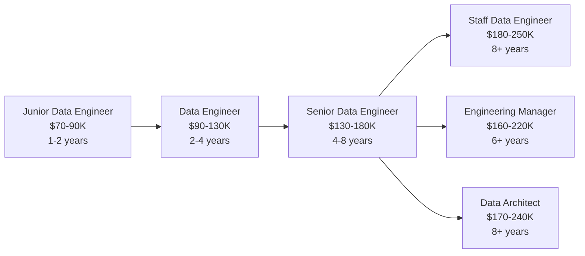

# Data Engineer

!!! quote "In Their Own Words"
    "I build the highways that data travels on. Without reliable pipelines, analysts can't analyse, scientists can't train models, and dashboards show stale data. I make sure data gets from A to B—on time, every time, at scale."
    
    — *Senior Data Engineer, Tech Company*

---

## Role Overview

| | |
|---|---|
| **Also Known As** | Data Platform Engineer, ETL Developer, Pipeline Engineer |
| **Category** | Data Pipeline |
| **Typical Experience** | 2-8 years |
| **Salary Range (US)** | $90K - $180K |
| **Remote Friendly?** | ⭐⭐⭐⭐⭐ Very (95%+ of jobs) |

---

## What Do Data Engineers Actually Do?

Data Engineers are the **builders** of the data world. While Data Analysts answer questions and Data Scientists build models, Data Engineers make sure the data is there to work with—clean, reliable, and up-to-date.

### The Core Responsibilities

=== "Build Data Pipelines"
    
    **Design and implement systems that move data** from sources (databases, APIs, files) to destinations (warehouses, lakes) and transform it along the way.
    
    ```python title="Example: Airflow DAG"
    from airflow import DAG
    from airflow.operators.python import PythonOperator
    from datetime import datetime, timedelta
    
    # Define the pipeline
    dag = DAG(
        'daily_orders_pipeline',
        start_date=datetime(2024, 1, 1),
        schedule_interval='@daily',  # Run every day at midnight
        catchup=False
    )
    
    def extract_orders():
        """Extract orders from PostgreSQL"""
        orders = read_from_postgres('orders_table')
        return orders
    
    def transform_orders(orders):
        """Clean and enrich order data"""
        # Remove duplicates
        # Handle missing values
        # Add calculated fields
        return cleaned_orders
    
    def load_to_warehouse(orders):
        """Load into Snowflake"""
        write_to_snowflake('analytics.orders', orders)
    
    # Chain the tasks
    extract = PythonOperator(task_id='extract', python_callable=extract_orders)
    transform = PythonOperator(task_id='transform', python_callable=transform_orders)
    load = PythonOperator(task_id='load', python_callable=load_to_warehouse)
    
    extract >> transform >> load
    ```

=== "Design Data Architecture"
    
    **Decide how data should be structured and stored** for optimal performance and usability.
    
    ```mermaid
    graph LR
        A[Source Systems] --> B[Staging Layer<br/>Raw Data]
        B --> C[Integration Layer<br/>Combined Data]
        C --> D[Presentation Layer<br/>Analytics-Ready]
        
        A1[PostgreSQL] --> B
        A2[Salesforce API] --> B
        A3[CSV Files] --> B
        
        D --> E1[Analysts]
        D --> E2[Dashboards]
        D --> E3[ML Models]
    ```

=== "Optimise Performance"
    
    **Make queries faster** through partitioning, indexing, and efficient data structures.
    
    ```sql title="Before: Slow query (45 seconds)"
    -- Scanning entire table (10B rows)
    SELECT *
    FROM orders
    WHERE order_date = '2024-11-07';
    ```
    
    ```sql title="After: Fast query (0.3 seconds)"
    -- Partitioned by date, only scans 1 day's data
    CREATE TABLE orders (
        order_id VARCHAR,
        order_date DATE,
        amount DECIMAL
    )
    PARTITION BY DATE_TRUNC('day', order_date);
    
    -- Now this is fast!
    SELECT *
    FROM orders
    WHERE order_date = '2024-11-07';
    ```

=== "Monitor & Debug"
    
    **Ensure pipelines run reliably** and fix them when they break (and they will break).
    
    ```python title="Monitoring pipeline health"
    def check_pipeline_health():
        """Alert if pipeline failed or data is stale"""
        
        # Check last run time
        last_run = get_last_successful_run('daily_orders_pipeline')
        if datetime.now() - last_run > timedelta(hours=25):
            alert_team("Pipeline hasn't run in 25 hours!")
        
        # Check data freshness
        latest_date = query("SELECT MAX(order_date) FROM analytics.orders")
        if latest_date < datetime.now().date() - timedelta(days=1):
            alert_team(f"Orders data is stale! Latest: {latest_date}")
        
        # Check row counts
        today_orders = query("SELECT COUNT(*) FROM orders WHERE date = CURRENT_DATE")
        avg_orders = query("SELECT AVG(daily_count) FROM order_stats")
        if today_orders < avg_orders * 0.5:  # Less than 50% of average
            alert_team(f"Orders unusually low today: {today_orders} vs avg {avg_orders}")
    ```

=== "Collaborate"
    
    **Work with everyone**—Analysts need data accessible, Scientists need features ready, BI Engineers need dashboards fed.
    
    **Daily interactions:**
    
    - 🔵 **Data Analysts:** "Can you add customer segments to the orders table?"
    - 🟢 **Data Scientists:** "I need purchase history for the last 2 years in a feature store"
    - 🟣 **BI Engineers:** "The dashboard is slow—can you Optimise this query?"
    - 🔴 **Backend Engineers:** "We're launching a new API—can you ingest that data?"
    - 🟡 **Product Managers:** "How long would it take to add TikTok marketing data?"

---

## A Day in the Life

### Morning (9:00 AM - 12:00 PM)

```text
09:00 - Check Slack: Pipeline failure alert from last night ⚠️
        Investigate logs, find API rate limit hit
        Implement exponential backoff retry logic
        Redeploy and backfill missing data

10:30 - Standup with data team
        "Working on fixing last night's pipeline failure"
        "Will work on new Stripe data integration this afternoon"

11:00 - Code review: Analytics Engineer wrote new dbt models
        Check SQL efficiency, suggest adding indexes
        Approve PR

11:30 - Design session: Planning new customer 360 data model
        Whiteboard how to combine CRM, support tickets, product usage
```

### Afternoon (1:00 PM - 5:00 PM)

```text
13:00 - Build new pipeline: Ingest Stripe payment data
        Write Airflow DAG
        Set up incremental loading (only new records)
        Add data quality tests
        Deploy to dev environment

15:00 - Performance optimization request from BI team
        Their dashboard query times out
        Add partitioning by date
        Create aggregate tables for common queries
        Query now runs in 2 seconds instead of 60

16:00 - Documentation: Update data catalog
        Document new Stripe tables
        Add data lineage diagrams
        Write usage examples

16:30 - Check pipeline monitoring dashboard
        Everything green ✓
        Write up notes for tomorrow's work
```

### Weekly Responsibilities

- **Monday:** Sprint planning, prioritize pipeline work
- **Tuesday:** 1:1 with manager, career development discussion
- **Wednesday:** Architecture review meeting, discuss scaling strategy
- **Thursday:** Quarterly planning, evaluate new tools (dbt vs custom scripts)
- **Friday:** Learning time, try new Apache Spark features

---

## Key Skills

### Must-Have Skills

| Skill | Why It Matters | Proficiency Needed |
|-------|----------------|-------------------|
| **SQL** | Query, transform, and analyse data | ⭐⭐⭐⭐⭐ Expert |
| **Python** | Write pipeline logic, data processing | ⭐⭐⭐⭐ Advanced |
| **Data Modeling** | Design efficient schemas | ⭐⭐⭐⭐ Advanced |
| **ETL/ELT Concepts** | Understand data movement patterns | ⭐⭐⭐⭐ Advanced |
| **Version Control (Git)** | Manage code changes | ⭐⭐⭐⭐ Advanced |

### Important Skills

| Skill | Why It Matters | Proficiency Needed |
|-------|----------------|-------------------|
| **Airflow/Orchestration** | Schedule and monitor pipelines | ⭐⭐⭐⭐ Advanced |
| **Cloud Platforms (AWS/GCP/Azure)** | Deploy infrastructure | ⭐⭐⭐ Intermediate |
| **Data Warehouses (Snowflake, BigQuery)** | Target destination for pipelines | ⭐⭐⭐ Intermediate |
| **Spark/Distributed Computing** | Process large-scale data | ⭐⭐⭐ Intermediate |
| **Linux/Command Line** | Troubleshoot and automate | ⭐⭐⭐ Intermediate |

### Nice-to-Have Skills

- Docker/Kubernetes (containerization)
- Terraform (infrastructure as code)
- Kafka/Streaming technologies
- dbt (transformation tool)
- Monitoring tools (Datadog, Grafana)

---

## Tools You'll Use Daily

### Orchestration

<div class="grid cards" markdown>

-   **Apache Airflow**

    ---
    
    Most popular pipeline orchestration tool
    
    ```python
    # Schedule and monitor DAGs
    dag = DAG('my_pipeline', schedule_interval='@daily')
    ```

-   **Prefect / Dagster**

    ---
    
    Modern alternatives to Airflow
    
    More Pythonic, better testing

</div>

### Data Warehouses

<div class="grid cards" markdown>

-   **Snowflake**

    ---
    
    Cloud data warehouse
    
    Separate storage and compute

-   **Google BigQuery**

    ---
    
    Serverless data warehouse
    
    Pay per query

-   **Amazon Redshift**

    ---
    
    AWS data warehouse
    
    PostgreSQL-compatible

</div>

### Processing Frameworks

<div class="grid cards" markdown>

-   **Apache Spark**

    ---
    
    Distributed data processing
    
    ```python
    df = spark.read.parquet('s3://data')
    df.filter(df.amount > 100).write.parquet('output')
    ```

-   **Pandas**

    ---
    
    Python data manipulation
    
    Great for smaller datasets

-   **dbt**

    ---
    
    Transform data in warehouse
    
    SQL-based, version controlled

</div>

### Cloud Platforms

=== "AWS"
    - **S3:** Object storage (data lake)
    - **RDS:** Managed databases
    - **Lambda:** Serverless functions
    - **Glue:** ETL service

=== "Google Cloud"
    - **Cloud Storage:** Object storage
    - **Cloud SQL:** Managed databases
    - **Cloud Functions:** Serverless
    - **Dataflow:** Stream/batch processing

=== "Azure"
    - **Blob Storage:** Object storage
    - **Azure SQL:** Managed databases
    - **Azure Functions:** Serverless
    - **Data Factory:** ETL service

---

## Hands-On Project

!!! example "Build Your First Data Pipeline"
    
    **Objective:** Create an Airflow pipeline that loads bookstore orders daily
    
    **What you'll build:**
    
    1. Extract orders from CSV files
    2. Transform: Clean data, handle duplicates
    3. Load into Snowflake data warehouse
    4. Add data quality tests
    5. Set up monitoring and alerts
    
    **Time estimate:** 2-3 hours
    
    [Start Building →](../../hands-on/04-data-pipeline.md){ .md-button .md-button--primary }

---

## Career Path

### Entry Points

=== "From Analyst"
    
    **Common path:** Many Data Engineers start as Data Analysts
    
    **Transition steps:**
    
    1. Learn Python (beyond just pandas)
    2. Automate your SQL queries with scripts
    3. Learn Git for version control
    4. Start building small pipelines
    5. Study Airflow basics
    
    **Timeline:** 6-12 months

=== "From Software Engineering"
    
    **Common path:** Backend engineers transition to data
    
    **What to learn:**
    
    1. SQL (you likely know basic, learn advanced)
    2. Data modeling concepts
    3. Data warehouses (Snowflake, BigQuery)
    4. Airflow or similar orchestration
    5. Analytics mindset (understand business questions)
    
    **Timeline:** 3-6 months

=== "Bootcamp/Self-Taught"
    
    **Focus on:**
    
    1. SQL (most important!)
    2. Python fundamentals
    3. Build portfolio projects
    4. Learn Airflow, dbt, Snowflake
    5. Contribute to open source data projects
    
    **Timeline:** 6-12 months of focused learning

### Progression



---

## When This Role Fits You

!!! success "You'll Love This Role If..."
    
    - ✅ You enjoy **building systems** that run reliably
    - ✅ You like **solving technical puzzles** (Why did this pipeline fail?)
    - ✅ You appreciate **seeing direct impact** (Analysts can now answer questions they couldn't before)
    - ✅ You're comfortable with **ambiguity** (Requirements aren't always clear)
    - ✅ You like **variety** (Different problems every day)
    - ✅ You're **detail-oriented** (One bug can corrupt all downstream data)

!!! warning "This Might Not Be For You If..."
    
    - ❌ You want to focus on **analysis** or **insights** (that's Data Analyst)
    - ❌ You want to build **customer-facing products** (that's Software Engineering)
    - ❌ You prefer **research** over **production systems** (that's ML Scientist)
    - ❌ You don't like **being on-call** (pipelines break at 3am sometimes)
    - ❌ You prefer working **solo** (Data Engineering is very collaborative)

---

## Common Interview Questions

??? question "Technical: How would you design a pipeline to process 10TB of data daily?"
    
    **What they're testing:** System design, scalability, understanding of distributed computing
    
    **Good answer covers:**
    
    - Partitioning strategy (by date, by customer segment)
    - Incremental vs full refresh
    - Parallelization (process chunks simultaneously)
    - Error handling and retry logic
    - Monitoring and alerting
    - Data quality checks
    
    **Example answer:**
    
    "I'd partition the data by date and process each day in parallel using Spark. I'd use incremental loading to only process new/changed records. I'd implement checkpointing so if a partition fails, we can retry just that partition. I'd add data quality tests (row counts, null checks, schema validation) and set up alerts if any fail. I'd use a columnar format like Parquet for efficient storage and querying."

??? question "Behavioral: Tell me about a time a pipeline broke in production"
    
    **What they're testing:** Incident response, communication, learning from mistakes
    
    **STAR method:**
    
    **Situation:** "Our daily orders pipeline failed at 2am on Black Friday—our busiest day"
    
    **Task:** "I needed to get it working ASAP because BI dashboards showed stale data and executives were checking hourly"
    
    **Action:** "I checked logs, found API rate limiting was the issue. I implemented exponential backoff and increased our API tier. I backfilled missing data and added better error handling. I also set up better monitoring to catch this earlier next time"
    
    **Result:** "Pipeline recovered by 6am. I documented the incident and presented learnings to the team. We now have rate limit monitoring and automatic retry logic"

??? question "SQL: Write a query to find duplicate orders"
    
    ```sql
    -- Find orders that appear more than once
    SELECT 
        order_id,
        COUNT(*) as duplicate_count
    FROM orders
    GROUP BY order_id
    HAVING COUNT(*) > 1
    ORDER BY duplicate_count DESC;
    
    -- Or get the full duplicate records
    WITH duplicates AS (
        SELECT 
            order_id,
            ROW_NUMBER() OVER (PARTITION BY order_id ORDER BY created_at DESC) as rn
        FROM orders
    )
    SELECT *
    FROM orders
    WHERE order_id IN (
        SELECT order_id FROM duplicates WHERE rn > 1
    );
    ```

---

## Learning Resources

### Courses

- [:fontawesome-solid-graduation-cap: **DataCamp: Data Engineering Track**](https://datacamp.com) - Comprehensive, hands-on
- [:fontawesome-solid-graduation-cap: **Udacity: Data Engineering Nanodegree**](https://udacity.com) - Project-based
- [:fontawesome-brands-youtube: **Seattle Data Guy YouTube**](https://youtube.com/@SeattleDataGuy) - Free, practical

### Books

- 📚 **"Fundamentals of Data Engineering"** by Joe Reis & Matt Housley - Modern best practices
- 📚 **"Designing Data-Intensive Applications"** by Martin Kleppmann - Deep technical foundations
- 📚 **"The Data Warehouse Toolkit"** by Ralph Kimball - Data modeling classic

### Hands-On Practice

- [Our BookStore Project](../../hands-on/project-overview.md) - Build a complete pipeline
- [Apache Airflow Tutorial](https://airflow.apache.org/docs/apache-airflow/stable/tutorial.html) - Official docs
- [dbt Learn](https://courses.getdbt.com/) - Free transformation course

### Communities

- [:fontawesome-brands-slack: dbt Community Slack](https://getdbt.com/community) - 50K+ data practitioners
- [:fontawesome-brands-reddit: r/dataengineering](https://reddit.com/r/dataengineering) - Active discussions
- [:fontawesome-brands-linkedin: Data Engineering LinkedIn Groups](https://linkedin.com) - Job postings and networking

---

## Related Roles

| Role | Overlap | Key Difference |
|------|---------|----------------|
| [Analytics Engineer](analytics-engineer.md) | 70% | Focus on transformation layer (dbt), less on extraction |
| [Data Architect](../strategic/data-architect.md) | 50% | Design systems, less hands-on implementation |
| [Backend Engineer](../infrastructure/backend-engineer.md) | 40% | Focus on application logic, not data pipelines |
| [DataOps Engineer](dataops-engineer.md) | 60% | Focus on monitoring and reliability, less on building new pipelines |

---

## Next Steps

Ready to try Data Engineering?

[Build Your First Pipeline →](../../hands-on/04-data-pipeline.md){ .md-button .md-button--primary }

Want to explore more roles?

[Back to All Roles →](../index.md){ .md-button }