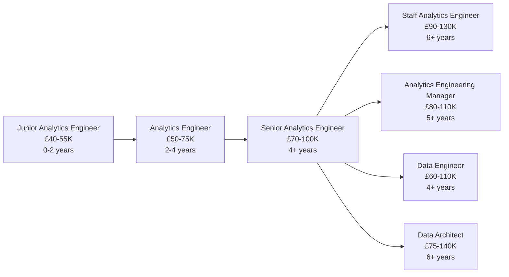

# Analytics Engineer

!!! quote "In Their Own Words"
    "I'm the bridge between raw data and insights. I take messy source data and transform it into clean, tested, documented tables that the entire company relies on. I write code like an engineer but think about business problems like an analyst."
    
    — *Analytics Engineer, SaaS Company*

---

## Role Overview

| | |
|---|---|
| **Also Known As** | Data Transformation Engineer, dbt Developer |
| **Category** | Data Pipeline |
| **Typical Experience** | 2-6 years |
| **Salary Range (UK)** | £50K - £100K |
| **Remote Friendly?** | ⭐⭐⭐⭐⭐ Very (90%+ of jobs) |

---

## What Do Analytics Engineers Actually Do?

Analytics Engineers are a **relatively new role** (emerged around 2016) that sits between Data Engineers and Data Analysts. They own the **transformation layer**—turning raw data into clean, analysis-ready tables.

### The Core Responsibilities

=== "Build Data Models"
    
    **Transform raw data into clean, structured tables**
    
    ```sql title="models/staging/stg_orders.sql"
    -- Staging: Clean raw data
    with source as (
        select * from {{ source('raw', 'orders') }}
    ),
    
    cleaned as (
        select
            order_id,
            customer_id,
            product_id,
            
            -- Standardise dates
            cast(order_date as date) as order_date,
            
            -- Handle nulls
            coalesce(shipping_state, 'UNKNOWN') as shipping_state,
            
            -- Clean currency
            cast(
                regexp_replace(order_value, '[£$,]', '') 
                as decimal(10,2)
            ) as order_value_gbp,
            
            -- Standardise status
            lower(trim(order_status)) as order_status,
            
            created_at,
            updated_at
        from source
        where order_id is not null
          and order_value_gbp > 0
    ),
    
    deduped as (
        select * from cleaned
        qualify row_number() over (
            partition by order_id 
            order by updated_at desc
        ) = 1
    )
    
    select * from deduped
    ```
    
    ```sql title="models/marts/fct_orders.sql"
    -- Marts: Create business-friendly fact table
    select
        o.order_id,
        o.order_date,
        
        -- Join dimensions
        c.customer_id,
        c.customer_name,
        c.customer_segment,
        
        p.product_id,
        p.product_name,
        p.product_category,
        
        -- Metrics
        o.order_value_gbp,
        o.order_status,
        
        -- Calculated fields
        case 
            when o.order_value_gbp < 50 then 'Small'
            when o.order_value_gbp < 200 then 'Medium'
            else 'Large'
        end as order_size,
        
        datediff(day, o.order_date, current_date) as days_since_order
        
    from {{ ref('stg_orders') }} o
    left join {{ ref('dim_customers') }} c 
        on o.customer_id = c.customer_id
    left join {{ ref('dim_products') }} p 
        on o.product_id = p.product_id
    ```

=== "Write Data Tests"
    
    **Ensure data quality with automated tests**
    
    ```yaml title="models/staging/stg_orders.yml"
    version: 2
    
    models:
      - name: stg_orders
        description: "Cleaned and standardised order data"
        columns:
          - name: order_id
            description: "Unique order identifier"
            tests:
              - unique
              - not_null
          
          - name: order_date
            description: "Date order was placed"
            tests:
              - not_null
              - dbt_utils.accepted_range:
                  min_value: "'2020-01-01'"
                  max_value: "current_date"
          
          - name: order_value_gbp
            description: "Order value in GBP"
            tests:
              - not_null
              - dbt_expectations.expect_column_values_to_be_between:
                  min_value: 0
                  max_value: 10000
          
          - name: customer_id
            description: "Foreign key to customers"
            tests:
              - not_null
              - relationships:
                  to: ref('stg_customers')
                  field: customer_id
    ```
    
    Tests run automatically and alert when they fail.

=== "Document Data"
    
    **Create living documentation for data assets**
    
    ```yaml title="models/marts/fct_orders.yml"
    version: 2
    
    models:
      - name: fct_orders
        description: |
          ### Overview
          Core fact table containing all completed orders.
          
          ### Grain
          One row per order
          
          ### Refresh
          Updated daily at 6 AM UTC
          
          ### Usage
          - Executive dashboards
          - Revenue reporting
          - Customer analytics
          - Product performance
          
          ### Key Metrics
          - Total orders
          - Revenue (GBP)
          - Average order value
          
        columns:
          - name: order_id
            description: "Primary key - unique order identifier"
            
          - name: order_date
            description: "Date order was placed (UTC)"
            
          - name: customer_segment
            description: |
              Customer segment based on lifetime value:
              - VIP: > £1000
              - Regular: £200-£1000
              - Casual: < £200
    ```
    
    This generates browsable documentation website.

=== "Optimise Performance"
    
    **Make queries fast through materialisation and indexing**
    
    ```sql title="models/marts/fct_orders.sql"
    {{
        config(
            materialized='incremental',
            unique_key='order_id',
            cluster_by=['order_date'],
            partition_by={
                'field': 'order_date',
                'data_type': 'date',
                'granularity': 'day'
            }
        )
    }}
    
    select
        order_id,
        order_date,
        customer_id,
        order_value_gbp
    from {{ ref('stg_orders') }}
    
    
        -- Only process new/updated orders
        where order_date > (
            select max(order_date) from {{ this }}
        )
    
    ```
    
    This makes a large table update in seconds instead of hours.

=== "Design Data Architecture"
    
    **Structure data for optimal use**
    
    ```mermaid
    graph TB
        subgraph "Staging Layer"
            S1[stg_orders]
            S2[stg_customers]
            S3[stg_products]
        end
        
        subgraph "Intermediate Layer"
            I1[int_customer_orders]
            I2[int_product_stats]
        end
        
        subgraph "Marts Layer"
            M1[fct_orders]
            M2[fct_sessions]
            M3[dim_customers]
            M4[dim_products]
        end
        
        S1 --> I1
        S2 --> I1
        I1 --> M1
        I1 --> M3
        S3 --> I2
        I2 --> M4
        
        style S1 fill:#e3f2fd
        style S2 fill:#e3f2fd
        style S3 fill:#e3f2fd
        style M1 fill:#e8f5e9
        style M3 fill:#e8f5e9
        style M4 fill:#e8f5e9
    ```

---

## A Day in the Life

### Morning (9:00 AM - 12:00 PM)

```text
09:00 - Check dbt Cloud: All models ran successfully overnight ✓
        Review test failures from staging environment
        Fix data quality issue: negative prices in raw data
        Add validation to staging model

09:45 - Standup with data team
        "Finished customer segmentation model"
        "Working on incremental orders table today"
        "Blocked on schema change from backend team"

10:15 - Code review: Junior analytics engineer's PR
        Suggest better model naming
        Add missing tests
        Recommend partitioning strategy
        Approve after changes

11:00 - Design session: New marketing attribution model
        Sketch out required transformations
        Identify source data dependencies
        Estimate build time: 3 days
        Create tickets in Jira
```

### Afternoon (1:00 PM - 5:00 PM)

```text
13:00 - Build new incremental model for orders
        Configure partitioning by date
        Add unique key constraints
        Write comprehensive tests
        Test locally with sample data

15:00 - Data Analyst asks: "Why is revenue different in this table?"
        Investigate: Found upstream data issue
        Explain transformation logic
        Update documentation with clearer business rules

16:00 - Update documentation
        Add descriptions for new models
        Create lineage diagram showing dependencies
        Write usage examples for common queries
        Publish updated docs site

16:45 - Learning time: Read about new dbt features
        Watch community presentation
        Experiment with new macro patterns
```

### Weekly Responsibilities

- **Mondays:** Planning, prioritise new model requests
- **Tuesdays:** Code reviews, pair programming
- **Wednesdays:** Deep work on complex transformations
- **Thursdays:** Collaborate with Analysts on business logic
- **Fridays:** Documentation, tests, technical debt cleanup

---

## Key Skills

### Must-Have Skills

| Skill | Why It Matters | Proficiency Needed |
|-------|----------------|-------------------|
| **SQL** | Your primary language | ⭐⭐⭐⭐⭐ Expert |
| **dbt** | The standard tool for transformation | ⭐⭐⭐⭐⭐ Expert |
| **Data Modelling** | Design clean, usable structures | ⭐⭐⭐⭐ Advanced |
| **Git** | Version control for code | ⭐⭐⭐⭐ Advanced |
| **Testing** | Data quality mindset | ⭐⭐⭐⭐ Advanced |

### Important Skills

| Skill | Why It Matters | Proficiency Needed |
|-------|----------------|-------------------|
| **Python** | Occasional scripting, dbt packages | ⭐⭐⭐ Intermediate |
| **Data Warehouses** | Snowflake, BigQuery internals | ⭐⭐⭐ Intermediate |
| **Business Logic** | Understand company metrics | ⭐⭐⭐⭐ Advanced |
| **Documentation** | Clear, helpful docs | ⭐⭐⭐⭐ Advanced |
| **Performance Tuning** | Optimise slow queries | ⭐⭐⭐ Intermediate |

### Nice-to-Have Skills

- CI/CD systems (GitHub Actions)
- Orchestration tools (Airflow)
- BI tools (Looker, Tableau)
- Jinja templating
- Statistical methods

---

## Tools You'll Use Daily

### Core Stack

<div class="grid cards" markdown>

-   **dbt (data build tool)**
    
    ---
    
    THE tool for analytics engineering
    
    ```bash
    # Build all models
    dbt run
    
    # Test data quality
    dbt test
    
    # Generate docs
    dbt docs generate
    dbt docs serve
    ```

-   **SQL**
    
    ---
    
    Write transformations
    
    Dialect varies by warehouse (Snowflake, BigQuery, etc.)

-   **Git/GitHub**
    
    ---
    
    Version control for models
    
    ```bash
    git checkout -b feature/customer-segments
    git commit -m "Add customer segmentation"
    git push origin feature/customer-segments
    ```

-   **dbt Cloud / Core**
    
    ---
    
    Development environment
    
    Cloud: Hosted IDE, scheduling
    Core: Local CLI tool

</div>

### Data Warehouses

- **Snowflake** - Most common
- **BigQuery** - Google ecosystem
- **Redshift** - AWS shops
- **Databricks** - Spark-based

### Supporting Tools

- **Looker** - Integrated with dbt, LookML models
- **Slack** - Team communication
- **Jira/Linear** - Project management
- **VS Code** - Local development

---

## Hands-On Project

!!! example "Build dbt Transformation Layer"
    
    **Objective:** Transform raw BookStore data into analytics-ready tables
    
    **What you'll do:**
    
    1. Set up dbt Cloud project
    2. Connect to Snowflake warehouse
    3. Create staging models (clean raw data)
    4. Build fact and dimension tables
    5. Write data quality tests
    6. Add documentation
    7. Generate docs site
    8. Deploy to production
    
    **Time estimate:** 2-2.5 hours
    
    [Start Tutorial →](../../hands-on/05-dbt-transformation.md){ .md-button .md-button--primary }

---

## Career Path

### Entry Points

=== "From Data Analyst"
    
    **Most common path:** 70% of Analytics Engineers start as Analysts
    
    **You already have:**
    
    - SQL proficiency
    - Business understanding
    - Data modelling basics
    
    **What to add:**
    
    1. Learn dbt (most important!)
    2. Git/version control
    3. Software engineering practices (testing, documentation)
    4. More advanced SQL (window functions, CTEs)
    
    **Timeline:** 3-6 months

=== "From Data Engineer"
    
    **Common transition:** 20% of Analytics Engineers
    
    **You already have:**
    
    - SQL and Python
    - Data warehouse knowledge
    - Engineering best practices
    
    **What to add:**
    
    1. dbt framework
    2. Business logic and metrics
    3. Stakeholder communication
    4. Less focus on infrastructure, more on transformation
    
    **Timeline:** 2-4 months

=== "Self-Taught"
    
    **Emerging path:** 10% of Analytics Engineers
    
    **Focus on:**
    
    1. SQL mastery (most important)
    2. dbt certification course (free)
    3. Build portfolio projects with dbt
    4. Contribute to dbt community
    5. Learn Snowflake or BigQuery
    
    **Timeline:** 6-9 months of focused learning

### Progression



---

## When This Role Fits You

!!! success "You'll Love This Role If..."
    
    - ✅ You enjoy **writing clean, well-tested code**
    - ✅ You like **solving data quality problems**
    - ✅ You appreciate **seeing immediate impact** (Analysts use your models daily)
    - ✅ You value **collaboration** (work with Analysts, Scientists, Engineers)
    - ✅ You like **both technical and business challenges**
    - ✅ You want **engineering practices** (testing, CI/CD, version control)
    - ✅ You prefer **SQL over Python** for most tasks

!!! warning "This Might Not Be For You If..."
    
    - ❌ You want to focus on **data extraction/loading** (that's Data Engineer)
    - ❌ You prefer **answering business questions** over building infrastructure (that's Data Analyst)
    - ❌ You want to **build ML models** (that's Data Scientist)
    - ❌ You dislike **repetitive transformation logic**
    - ❌ You prefer **working alone** (this role is highly collaborative)
    - ❌ You want to work in **multiple languages** (95% SQL, 5% Python)

---

## Common Interview Questions

??? question "dbt: How would you handle slowly changing dimensions (SCD Type 2)?"
    
    ```sql
    {{
        config(
            materialized='incremental',
            unique_key='customer_key'
        )
    }}
    
    with source as (
        select * from {{ ref('stg_customers') }}
    ),
    
    
    
    changes as (
        select 
            s.*,
            case 
                when t.customer_id is null then 'new'
                when s.customer_name != t.customer_name 
                  or s.customer_email != t.customer_email 
                    then 'changed'
                else 'unchanged'
            end as change_type
        from source s
        left join {{ this }} t 
            on s.customer_id = t.customer_id
            and t.is_current = true
    ),
    
    -- Expire old records
    expired_records as (
        select 
            *,
            false as is_current,
            current_timestamp as valid_to
        from {{ this }}
        where customer_id in (
            select customer_id from changes where change_type = 'changed'
        )
        and is_current = true
    ),
    
    -- Insert new records
    new_records as (
        select
            {{ dbt_utils.surrogate_key(['customer_id', 'current_timestamp']) }} as customer_key,
            customer_id,
            customer_name,
            customer_email,
            current_timestamp as valid_from,
            null as valid_to,
            true as is_current
        from changes
        where change_type in ('new', 'changed')
    )
    
    select * from expired_records
    union all
    select * from new_records
    
    
    
    select
        {{ dbt_utils.surrogate_key(['customer_id', 'current_timestamp']) }} as customer_key,
        customer_id,
        customer_name,
        customer_email,
        current_timestamp as valid_from,
        null as valid_to,
        true as is_current
    from source
    
    
    ```

??? question "How would you debug a failing dbt model?"
    
    **Good answer structure:**
    
    1. **Check the error message**
        - Read the full error in dbt logs
        - Identify which model failed
    
    2. **Look at recent changes**
        - Check Git history: `git log models/path/to/model.sql`
        - Was schema changed upstream?
    
    3. **Isolate the problem**
        - Run just that model: `dbt run --select model_name`
        - Check compiled SQL: `target/compiled/project/models/model.sql`
        - Run compiled SQL directly in warehouse
    
    4. **Check dependencies**
        - Run upstream models: `dbt run --select +model_name`
        - Verify source data exists
    
    5. **Add logging**
        - Use `{{ log() }}` macro for debugging
        - Check row counts at each CTE
    
    6. **Test systematically**
        - Comment out sections to find issue
        - Test with small sample of data first

??? question "Design question: How would you model customer lifetime value?"
    
    **Good answer:**
    
    ```sql
    -- Staged approach with clear business logic
    
    -- Step 1: Customer order history
    with customer_orders as (
        select
            customer_id,
            count(distinct order_id) as total_orders,
            sum(order_value) as total_spent,
            min(order_date) as first_order_date,
            max(order_date) as last_order_date,
            avg(order_value) as avg_order_value,
            datediff(day, first_order_date, last_order_date) as customer_age_days
        from {{ ref('fct_orders') }}
        where order_status = 'completed'
        group by customer_id
    ),
    
    -- Step 2: Calculate metrics
    customer_metrics as (
        select
            customer_id,
            total_orders,
            total_spent as historical_ltv,
            avg_order_value,
            customer_age_days,
            
            -- Predicted future value (simple linear projection)
            case 
                when customer_age_days > 0 then
                    (total_spent / customer_age_days) * 365 * 3  -- 3-year projection
                else total_spent
            end as predicted_ltv_3yr,
            
            -- Recency factor
            datediff(day, last_order_date, current_date) as days_since_last_order,
            
            -- Customer health score
            case
                when days_since_last_order > 180 then 'At Risk'
                when days_since_last_order > 90 then 'Declining'
                else 'Healthy'
            end as customer_health
            
        from customer_orders
    )
    
    select * from customer_metrics
    ```
    
    **Key points in answer:**
    
    - Clear business logic
    - Staged transformation (CTEs)
    - Documented assumptions
    - Consideration of customer lifecycle

---

## Learning Resources

### Courses

- [:fontawesome-solid-graduation-cap: **dbt Learn**](https://courses.getdbt.com/) - Official, free, excellent
- [:fontawesome-solid-graduation-cap: **Analytics Engineering with dbt**](https://www.datacamp.com/courses/analytics-engineering-with-dbt) - DataCamp
- [:fontawesome-solid-graduation-cap: **dbt Fundamentals Certification**](https://www.getdbt.com/certifications/) - Free certification

### Books

- 📚 **"The dbt Handbook"** - Community-maintained guide
- 📚 **"Data Warehouse Toolkit"** by Ralph Kimball - Dimensional modelling classic
- 📚 **"Analytics Engineering: What, Why and How"** - dbt Labs blog series

### Practice

- [Our dbt Tutorial](../../hands-on/05-dbt-transformation.md) - BookStore project
- [dbt Learn Projects](https://courses.getdbt.com/) - Official practice projects
- [Jaffle Shop](https://github.com/dbt-labs/jaffle_shop) - dbt's demo project

### Communities

- [:fontawesome-brands-slack: dbt Slack Community](https://getdbt.com/community) - 50K+ members, very active
- [:fontawesome-brands-discourse: dbt Discourse](https://discourse.getdbt.com/) - Forum for longer discussions
- [:fontawesome-brands-linkedin: Analytics Engineers LinkedIn](https://linkedin.com) - Networking

---

## Related Roles

| Role | Overlap | Key Difference |
|------|---------|----------------|
| [Data Engineer](data-engineer.md) | 60% | Data Engineers focus on extraction/loading, less on transformation |
| [Data Analyst](../analysis/data-analyst.md) | 70% | Analysts use the tables you build, focus on insights not infrastructure |
| [BI Engineer](../analysis/bi-engineer.md) | 50% | BI Engineers focus on dashboards, you focus on the data feeding them |
| [Data Architect](../strategic/data-architect.md) | 40% | Architects design strategy, you implement transformations |

---

## Why This Role Exists

Analytics Engineering emerged because organisations needed someone who could:

1. **Write production-quality code** (like Data Engineers)
2. **Understand business logic** (like Data Analysts)
3. **Own data quality** (testing, documentation)
4. **Bridge technical and business teams**

Before Analytics Engineers, this work was split between:

- Data Engineers (who didn't understand business context)
- Data Analysts (who weren't trained in software engineering)

The role formalised the **transformation layer** as a distinct specialty.

---

## The Impact You'll Have

As an Analytics Engineer, you'll:

- **Enable self-service analytics** - Analysts can answer their own questions
- **Improve data quality** - Tests catch issues before they affect decisions
- **Reduce technical debt** - Clean, documented, maintainable code
- **Speed up analysis** - Pre-modelled data means faster insights
- **Build trust in data** - Reliable, tested, well-understood tables

---

## Next Steps

Ready to try Analytics Engineering?

[dbt Transformation Tutorial →](../../hands-on/05-dbt-transformation.md){ .md-button .md-button--primary }

Want to explore more roles?

[Back to All Roles →](../index.md){ .md-button }