# The 20 Data Roles

Understanding the landscape of data roles is crucial for finding the right career path. This section provides deep dives into 20 different data positions, showing you what each role actually does day-to-day.

---

## How to Use This Section

### If You're Exploring

Read through all 20 roles (takes about 3-4 hours). Notice which ones spark your interest. You'll likely find 2-3 that sound exciting—those are worth exploring further in the hands-on tutorials.

### If You're Deciding

Compare the roles you're considering. Look at:

- Daily responsibilities
- Required skills
- Tools used
- Career progression
- "When This Fits You" sections

### If You're Transitioning

Focus on roles adjacent to your current position. Understanding the differences helps you:

- Identify skill gaps
- Plan your learning path
- Speak knowledgeably in interviews

---

## The 20 Roles Organized by Category

```mermaid
graph TB
    subgraph Infrastructure["🏗️ Infrastructure & Platform"]
        I1[Backend Engineer]
        I2[Database Administrator]
        I3[Platform Engineer]
        I4[DevOps Engineer]
    end
    
    subgraph Pipeline["🔄 Data Pipeline"]
        P1[Data Engineer]
        P2[Analytics Engineer]
        P3[DataOps Engineer]
    end
    
    subgraph Analysis["📊 Analysis & Intelligence"]
        A1[Data Analyst]
        A2[BI Engineer]
        A3[Data Scientist]
        A4[ML Scientist]
    end
    
    subgraph Production["🚀 Production"]
        PR1[ML Engineer]
        PR2[AI Engineer]
        PR3[MLOps Engineer]
    end
    
    subgraph Support["✅ Support & Quality"]
        S1[QA Engineer]
        S2[Data Governance]
        S3[Frontend Engineer]
    end
    
    subgraph Strategic["🎯 Strategic"]
        ST1[Data Architect]
        ST2[Data Product Manager]
        ST3[Engineering Manager]
    end
    
    style Infrastructure fill:#e3f2fd
    style Pipeline fill:#fff9c4
    style Analysis fill:#f3e5f5
    style Production fill:#ffe6e6
    style Support fill:#e8f5e9
    style Strategic fill:#fce4ec
```

---

## Infrastructure & Platform (4 roles)

These roles build and maintain the foundational systems that everything else runs on.

-   :material-application-brackets:{ .lg .middle } __Backend Engineer__

    ---

    Builds the APIs and services that generate and consume data. Creates the applications that data flows through.
    
    **Key Skills:** Python/Java, REST APIs, databases, microservices
    
    [:octicons-arrow-right-24: Learn More](infrastructure/backend-engineer.md)

-   :material-database-cog:{ .lg .middle } __Database Administrator__

    ---

    Manages databases, ensures performance, handles backups, and maintains data integrity.
    
    **Key Skills:** SQL, database tuning, backup/recovery, security
    
    [:octicons-arrow-right-24: Learn More](infrastructure/database-administrator.md)

-   :material-server:{ .lg .middle } __Platform Engineer__

    ---

    Builds internal platforms and infrastructure that data teams use. Provisions cloud resources.
    
    **Key Skills:** Kubernetes, Terraform, cloud platforms, automation
    
    [:octicons-arrow-right-24: Learn More](infrastructure/platform-engineer.md)

-   :material-cog-sync:{ .lg .middle } __DevOps Engineer__

    ---

    Automates deployments, manages CI/CD pipelines, and keeps systems running reliably.
    
    **Key Skills:** CI/CD, Docker, monitoring, scripting, cloud
    
    [:octicons-arrow-right-24: Learn More](infrastructure/devops-engineer.md)

---

## Data Pipeline (3 roles)

These roles move and transform data at scale, building the pipelines that power analytics.

-   :material-pipe:{ .lg .middle } __Data Engineer__

    ---

    Builds pipelines that extract, load, and transform data. The plumbers of the data world.
    
    **Key Skills:** Python, SQL, Airflow, Spark, cloud data warehouses
    
    [:octicons-arrow-right-24: Learn More](data-pipeline/data-engineer.md)

-   :material-database-sync:{ .lg .middle } __Analytics Engineer__

    ---

    Transforms raw data into clean, analysis-ready tables. Owns the transformation layer with dbt.
    
    **Key Skills:** SQL, dbt, data modelling, testing, documentation
    
    [:octicons-arrow-right-24: Learn More](data-pipeline/analytics-engineer.md)

-   :material-database-check:{ .lg .middle } __DataOps Engineer__

    ---

    Ensures data pipelines are reliable, monitored, and high-quality. DevOps for data.
    
    **Key Skills:** Monitoring, data quality, orchestration, incident response
    
    [:octicons-arrow-right-24: Learn More](data-pipeline/dataops-engineer.md)

---

## Analysis & Intelligence (4 roles)

These roles extract insights from data and build predictive models.

-   :material-chart-line:{ .lg .middle } __Data Analyst__

    ---

    Answers business questions using SQL and statistics. Creates reports and insights for stakeholders.
    
    **Key Skills:** SQL, Excel, statistics, data visualisation, communication
    
    [:octicons-arrow-right-24: Learn More](analysis/data-analyst.md)

-   :material-chart-bar:{ .lg .middle } __BI Engineer__

    ---

    Builds dashboards and reporting tools. Makes data accessible to non-technical users.
    
    **Key Skills:** Tableau/Looker/Power BI, SQL, data visualisation design
    
    [:octicons-arrow-right-24: Learn More](analysis/bi-engineer.md)

-   :material-flask:{ .lg .middle } __Data Scientist__

    ---

    Builds predictive models, runs experiments, and applies statistical methods to data problems.
    
    **Key Skills:** Python/R, statistics, machine learning, experimentation
    
    [:octicons-arrow-right-24: Learn More](analysis/data-scientist.md)

-   :material-atom:{ .lg .middle } __ML Scientist / Researcher__

    ---

    Develops new machine learning algorithms and techniques. More research-focused than applied.
    
    **Key Skills:** Advanced ML, mathematics, research methods, publications
    
    [:octicons-arrow-right-24: Learn More](analysis/ml-scientist.md)

---

## Production (3 roles)

These roles deploy and scale data products and ML models in production.

-   :material-robot:{ .lg .middle } __ML Engineer__

    ---

    Deploys machine learning models to production. Bridges data science and software engineering.
    
    **Key Skills:** Python, MLOps, APIs, Docker, model serving
    
    [:octicons-arrow-right-24: Learn More](production/ml-engineer.md)

-   :material-brain:{ .lg .middle } __AI Engineer__

    ---

    Builds AI-powered applications using LLMs and modern AI tools. Newest role on this list.
    
    **Key Skills:** LLMs, prompt engineering, RAG, vector databases, APIs
    
    [:octicons-arrow-right-24: Learn More](production/ai-engineer.md)

-   :material-server-network:{ .lg .middle } __MLOps Engineer__

    ---

    Monitors and maintains ML models in production. Ensures models stay accurate and performant.
    
    **Key Skills:** Monitoring, model versioning, CI/CD for ML, incident response
    
    [:octicons-arrow-right-24: Learn More](production/mlops-engineer.md)

---

## Support & Quality (3 roles)

These roles ensure data quality, governance, and user experience.

-   :material-test-tube:{ .lg .middle } __QA Engineer__

    ---

    Tests data systems and ensures quality. Writes automated tests for data pipelines.
    
    **Key Skills:** Testing frameworks, SQL, Python, data validation
    
    [:octicons-arrow-right-24: Learn More](support/qa-engineer.md)

-   :material-shield-check:{ .lg .middle } __Data Governance Specialist__

    ---

    Ensures data security, privacy, and compliance. Manages data policies and access controls.
    
    **Key Skills:** GDPR/CCPA, data cataloguing, access control, documentation
    
    [:octicons-arrow-right-24: Learn More](support/data-governance.md)

-   :material-monitor-dashboard:{ .lg .middle } __Frontend Engineer__

    ---

    Builds user interfaces for data applications. Displays data to end users.
    
    **Key Skills:** React/Vue, JavaScript, UI/UX design, APIs
    
    [:octicons-arrow-right-24: Learn More](support/frontend-engineer.md)

---

## Strategic (3 roles)

These roles design systems, manage products, and lead teams.

-   :material-floor-plan:{ .lg .middle } __Data Architect__

    ---

    Designs the overall data infrastructure and strategy. Makes high-level architectural decisions.
    
    **Key Skills:** System design, data modelling, architectural patterns, leadership
    
    [:octicons-arrow-right-24: Learn More](strategic/data-architect.md)

-   :material-clipboard-check:{ .lg .middle } __Data Product Manager__

    ---

    Defines what data products to build. Bridges business needs and technical implementation.
    
    **Key Skills:** Product management, stakeholder management, roadmapping, SQL
    
    [:octicons-arrow-right-24: Learn More](strategic/data-product-manager.md)

-   :material-account-group:{ .lg .middle } __Engineering Manager__

    ---

    Leads and grows data teams. Manages people, processes, and projects.
    
    **Key Skills:** Leadership, hiring, mentoring, strategy, technical background
    
    [:octicons-arrow-right-24: Learn More](strategic/engineering-manager.md)

---

## Role Comparison Matrix

Quick comparison of key attributes:

| Role | Technical Depth | Business Focus | Coding % | SQL % | Salary Range (UK) |
|------|----------------|----------------|----------|-------|-------------------|
| **Backend Engineer** | Very High | Low | 90% | 20% | £50-90K |
| **Database Administrator** | High | Low | 30% | 80% | £45-85K |
| **Platform Engineer** | Very High | Low | 80% | 10% | £60-100K |
| **DevOps Engineer** | High | Low | 70% | 5% | £50-95K |
| **Data Engineer** | High | Medium | 80% | 60% | £55-110K |
| **Analytics Engineer** | High | Medium | 40% | 90% | £50-100K |
| **DataOps Engineer** | High | Medium | 60% | 40% | £55-95K |
| **Data Analyst** | Medium | Very High | 20% | 80% | £35-70K |
| **BI Engineer** | Medium | High | 30% | 70% | £45-85K |
| **Data Scientist** | Very High | High | 70% | 50% | £50-110K |
| **ML Scientist** | Very High | Medium | 80% | 30% | £60-130K |
| **ML Engineer** | Very High | Low | 90% | 30% | £60-120K |
| **AI Engineer** | Very High | Medium | 85% | 20% | £70-140K |
| **MLOps Engineer** | High | Low | 70% | 20% | £60-110K |
| **QA Engineer** | Medium | Low | 60% | 50% | £40-75K |
| **Data Governance** | Low | Very High | 10% | 40% | £50-90K |
| **Frontend Engineer** | High | Medium | 90% | 5% | £45-85K |
| **Data Architect** | Very High | High | 30% | 50% | £75-140K |
| **Data Product Manager** | Low | Very High | 5% | 30% | £60-120K |
| **Engineering Manager** | High | Very High | 20% | 20% | £70-150K |

!!! note "About Salaries"
    Ranges shown are typical for UK markets (2025). Actual salaries vary by:
    
    - Location (London vs. regions)
    - Company size and funding
    - Industry sector
    - Experience level
    - Specific skills

---

## Common Questions

### "How do I choose between similar roles?"

**Data Analyst vs. Data Scientist:**

- Analyst focuses on answering "what happened?" with SQL
- Scientist focuses on "what will happen?" with ML models

**Data Engineer vs. Analytics Engineer:**

- Data Engineer builds extraction and loading pipelines
- Analytics Engineer focuses on transformation (dbt)

**ML Engineer vs. MLOps Engineer:**

- ML Engineer deploys models
- MLOps Engineer monitors and maintains deployed models

### "Can I transition between roles?"

**Absolutely!** Common transitions:

- Analyst → Analytics Engineer → Data Engineer
- Data Scientist → ML Engineer → MLOps Engineer
- Backend Engineer → Data Engineer → Data Architect
- BI Engineer → Analytics Engineer → Data Engineer

### "Which role is best for beginners?"

**Most accessible:**

- Data Analyst (least technical, highest business focus)
- BI Engineer (visual, clear outcomes)
- QA Engineer (structured, clear success criteria)

**Less accessible for beginners:**

- ML Scientist (requires advanced maths)
- Data Architect (requires years of experience)
- Engineering Manager (requires technical background + leadership)

### "Which roles are in highest demand?"

**Currently very hot (2025):**

- Data Engineer (highest demand)
- Analytics Engineer (growing fast)
- ML Engineer (high demand, fewer candidates)
- AI Engineer (emerging, very hot)

**Always needed:**

- Data Analyst
- BI Engineer
- Data Scientist

**More specialised:**

- MLOps Engineer
- DataOps Engineer
- Data Governance

---

## How Roles Collaborate

Understanding how roles work together is crucial:

---

## Your Next Steps

### Option 1: Read All Roles

Browse through all 20 roles to get a comprehensive view. Takes 3-4 hours but gives you complete context.

[Start with Infrastructure →](infrastructure/backend-engineer.md){ .md-button }

### Option 2: Focus on a Category

Pick a category that interests you and dive deep into those roles.

-   [Infrastructure](infrastructure/backend-engineer.md)
-   [Data Pipeline](data-pipeline/data-engineer.md)
-   [Analysis](analysis/data-analyst.md)
-   [Production](production/ml-engineer.md)
-   [Support](support/qa-engineer.md)
-   [Strategic](strategic/data-architect.md)

### Option 3: Start Building

Jump into hands-on tutorials and experience roles through practice.

[Start Building →](../hands-on/project-overview.md){ .md-button .md-button--primary }

---

## Need Help Choosing?

Try our self-assessment tool to identify which roles match your interests and skills:

[Take Self-Assessment →](../career-paths/self-assessment.md){ .md-button }