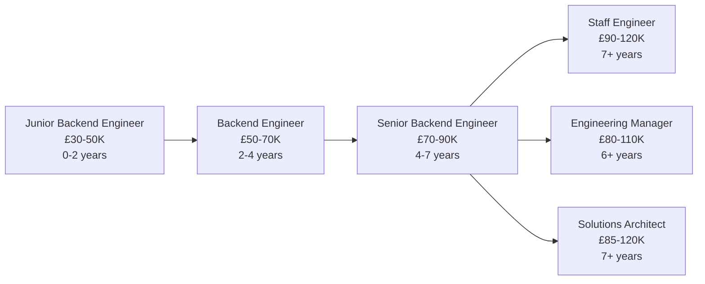

# Backend Engineer

!!! quote "In Their Own Words"
    "I build the APIs and services that power the application. When users click a button, my code handles what happens behind the scenes—saving data, processing payments, sending emails. I make the magic happen."
    
    — *Backend Engineer, E-commerce Company*

---

## Role Overview

| | |
|---|---|
| **Also Known As** | Backend Developer, Server-Side Engineer, API Developer |
| **Category** | Infrastructure & Platform |
| **Typical Experience** | 1-8 years |
| **Salary Range (UK)** | £50K - £90K |
| **Remote Friendly?** | ⭐⭐⭐⭐⭐ Very (85%+ of jobs) |

---

## What Do Backend Engineers Actually Do?

Backend Engineers build the **server-side** of applications—the APIs, databases, business logic, and services that power what users see on their screens.

### The Core Responsibilities

=== "Build APIs"
    
    **Create endpoints that handle requests**
    
    ```python title="app/api/orders.py - Flask API"
    from flask import Blueprint, request, jsonify
    from app.models import Order, Customer, Product
    from app.database import db
    from datetime import datetime
    import logging
    
    orders_bp = Blueprint('orders', __name__)
    logger = logging.getLogger(__name__)
    
    @orders_bp.route('/orders', methods=['POST'])
    def create_order():
        """
        Create a new order
        
        Request body:
        {
            "customer_id": "CUST_123",
            "items": [
                {"product_id": "PROD_456", "quantity": 2},
                {"product_id": "PROD_789", "quantity": 1}
            ],
            "payment_method": "credit_card"
        }
        """
        try:
            data = request.get_json()
            
            # Validate input
            if not data.get('customer_id'):
                return jsonify({'error': 'customer_id required'}), 400
            
            if not data.get('items') or len(data['items']) == 0:
                return jsonify({'error': 'items required'}), 400
            
            # Check customer exists
            customer = Customer.query.get(data['customer_id'])
            if not customer:
                return jsonify({'error': 'Customer not found'}), 404
            
            # Calculate total and validate products
            total_amount = 0
            order_items = []
            
            for item in data['items']:
                product = Product.query.get(item['product_id'])
                if not product:
                    return jsonify({
                        'error': f"Product {item['product_id']} not found"
                    }), 404
                
                if product.stock < item['quantity']:
                    return jsonify({
                        'error': f"Insufficient stock for {product.name}"
                    }), 400
                
                item_total = product.price * item['quantity']
                total_amount += item_total
                
                order_items.append({
                    'product': product,
                    'quantity': item['quantity'],
                    'unit_price': product.price,
                    'total': item_total
                })
            
            # Create order
            order = Order(
                customer_id=data['customer_id'],
                order_date=datetime.utcnow(),
                total_amount=total_amount,
                payment_method=data.get('payment_method', 'credit_card'),
                status='pending'
            )
            
            db.session.add(order)
            
            # Update product stock
            for item in order_items:
                item['product'].stock -= item['quantity']
            
            # Commit transaction
            db.session.commit()
            
            # Log order created
            logger.info(
                f"Order {order.order_id} created for customer "
                f"{customer.customer_id}, total: £{total_amount:.2f}"
            )
            
            # Return response
            return jsonify({
                'order_id': order.order_id,
                'customer_id': customer.customer_id,
                'total_amount': float(total_amount),
                'status': order.status,
                'created_at': order.created_at.isoformat()
            }), 201
            
        except Exception as e:
            db.session.rollback()
            logger.error(f"Error creating order: {e}")
            return jsonify({'error': 'Failed to create order'}), 500
    
    @orders_bp.route('/orders/<order_id>', methods=['GET'])
    def get_order(order_id):
        """Get order details"""
        order = Order.query.get(order_id)
        
        if not order:
            return jsonify({'error': 'Order not found'}), 404
        
        return jsonify({
            'order_id': order.order_id,
            'customer_id': order.customer_id,
            'total_amount': float(order.total_amount),
            'status': order.status,
            'created_at': order.created_at.isoformat(),
            'items': [
                {
                    'product_id': item.product_id,
                    'product_name': item.product.name,
                    'quantity': item.quantity,
                    'unit_price': float(item.unit_price)
                }
                for item in order.items
            ]
        }), 200
    
    @orders_bp.route('/orders/<order_id>/status', methods=['PATCH'])
    def update_order_status(order_id):
        """Update order status"""
        data = request.get_json()
        new_status = data.get('status')
        
        valid_statuses = ['pending', 'processing', 'shipped', 'delivered', 'cancelled']
        if new_status not in valid_statuses:
            return jsonify({'error': f'Invalid status. Must be one of {valid_statuses}'}), 400
        
        order = Order.query.get(order_id)
        if not order:
            return jsonify({'error': 'Order not found'}), 404
        
        order.status = new_status
        order.updated_at = datetime.utcnow()
        
        db.session.commit()
        
        logger.info(f"Order {order_id} status updated to {new_status}")
        
        return jsonify({
            'order_id': order.order_id,
            'status': order.status,
            'updated_at': order.updated_at.isoformat()
        }), 200
    ```

=== "Design Database Schema"
    
    **Structure data for applications**
    
    ```python title="app/models.py - SQLAlchemy Models"
    from app.database import db
    from datetime import datetime
    import uuid
    
    def generate_id(prefix):
        """Generate unique ID with prefix"""
        return f"{prefix}_{uuid.uuid4().hex[:8]}"
    
    class Customer(db.Model):
        __tablename__ = 'customers'
        
        customer_id = db.Column(
            db.String(50), 
            primary_key=True,
            default=lambda: generate_id('CUST')
        )
        email = db.Column(db.String(255), unique=True, nullable=False)
        first_name = db.Column(db.String(100), nullable=False)
        last_name = db.Column(db.String(100), nullable=False)
        registration_date = db.Column(db.DateTime, default=datetime.utcnow)
        
        # Relationships
        orders = db.relationship('Order', backref='customer', lazy='dynamic')
        
        def __repr__(self):
            return f'<Customer {self.email}>'
    
    class Product(db.Model):
        __tablename__ = 'products'
        
        product_id = db.Column(
            db.String(50),
            primary_key=True,
            default=lambda: generate_id('PROD')
        )
        name = db.Column(db.String(255), nullable=False)
        description = db.Column(db.Text)
        price = db.Column(db.Numeric(10, 2), nullable=False)
        stock = db.Column(db.Integer, default=0)
        category = db.Column(db.String(100))
        
        def __repr__(self):
            return f'<Product {self.name}>'
    
    class Order(db.Model):
        __tablename__ = 'orders'
        
        order_id = db.Column(
            db.String(50),
            primary_key=True,
            default=lambda: generate_id('ORD')
        )
        customer_id = db.Column(
            db.String(50),
            db.ForeignKey('customers.customer_id'),
            nullable=False
        )
        order_date = db.Column(db.DateTime, default=datetime.utcnow)
        total_amount = db.Column(db.Numeric(10, 2), nullable=False)
        payment_method = db.Column(db.String(50))
        status = db.Column(
            db.String(20),
            default='pending',
            nullable=False
        )
        created_at = db.Column(db.DateTime, default=datetime.utcnow)
        updated_at = db.Column(
            db.DateTime,
            default=datetime.utcnow,
            onupdate=datetime.utcnow
        )
        
        # Relationships
        items = db.relationship('OrderItem', backref='order', lazy='joined')
        
        def __repr__(self):
            return f'<Order {self.order_id}>'
    
    class OrderItem(db.Model):
        __tablename__ = 'order_items'
        
        id = db.Column(db.Integer, primary_key=True)
        order_id = db.Column(
            db.String(50),
            db.ForeignKey('orders.order_id'),
            nullable=False
        )
        product_id = db.Column(
            db.String(50),
            db.ForeignKey('products.product_id'),
            nullable=False
        )
        quantity = db.Column(db.Integer, nullable=False)
        unit_price = db.Column(db.Numeric(10, 2), nullable=False)
        
        # Relationships
        product = db.relationship('Product')
        
        def __repr__(self):
            return f'<OrderItem {self.order_id}:{self.product_id}>'
    ```

=== "Implement Business Logic"
    
    **Handle complex workflows and rules**
    
    ```python title="app/services/order_service.py"
    from app.models import Order, Customer, Product
    from app.database import db
    from app.services.email_service import send_order_confirmation
    from app.services.inventory_service import reserve_stock
    from app.services.payment_service import process_payment
    import logging
    
    logger = logging.getLogger(__name__)
    
    class OrderService:
        """Business logic for order processing"""
        
        @staticmethod
        def create_order(customer_id, items, payment_method):
            """
            Create order with complete workflow:
            1. Validate customer and products
            2. Check inventory
            3. Calculate pricing (with discounts)
            4. Process payment
            5. Reserve stock
            6. Create order record
            7. Send confirmation email
            """
            
            # Validate customer
            customer = Customer.query.get(customer_id)
            if not customer:
                raise ValueError("Customer not found")
            
            # Validate products and calculate total
            order_items = []
            subtotal = 0
            
            for item in items:
                product = Product.query.get(item['product_id'])
                if not product:
                    raise ValueError(f"Product {item['product_id']} not found")
                
                if product.stock < item['quantity']:
                    raise ValueError(f"Insufficient stock for {product.name}")
                
                item_total = product.price * item['quantity']
                subtotal += item_total
                
                order_items.append({
                    'product': product,
                    'quantity': item['quantity'],
                    'unit_price': product.price,
                    'total': item_total
                })
            
            # Apply discounts
            discount = OrderService._calculate_discount(
                customer, 
                subtotal
            )
            total = subtotal - discount
            
            # Process payment
            try:
                payment_result = process_payment(
                    customer_id=customer_id,
                    amount=total,
                    method=payment_method
                )
                
                if not payment_result['success']:
                    raise ValueError("Payment failed")
                    
            except Exception as e:
                logger.error(f"Payment failed: {e}")
                raise ValueError("Payment processing error")
            
            # Reserve stock
            try:
                for item in order_items:
                    reserve_stock(
                        product_id=item['product'].product_id,
                        quantity=item['quantity']
                    )
            except Exception as e:
                # Rollback payment
                logger.error(f"Stock reservation failed: {e}")
                # Refund logic here
                raise ValueError("Failed to reserve stock")
            
            # Create order
            order = Order(
                customer_id=customer_id,
                total_amount=total,
                payment_method=payment_method,
                status='confirmed'
            )
            
            db.session.add(order)
            
            for item in order_items:
                # Create order items
                # Update product stock
                pass
            
            db.session.commit()
            
            # Send confirmation email
            try:
                send_order_confirmation(
                    customer_email=customer.email,
                    order_id=order.order_id,
                    total=total
                )
            except Exception as e:
                logger.error(f"Failed to send email: {e}")
                # Don't fail order for email issues
            
            logger.info(
                f"Order {order.order_id} created successfully "
                f"for customer {customer_id}"
            )
            
            return order
        
        @staticmethod
        def _calculate_discount(customer, subtotal):
            """Calculate customer-specific discounts"""
            discount = 0
            
            # VIP customers get 10% off
            if customer.is_vip:
                discount += subtotal * 0.10
            
            # Orders over £100 get 5% off
            if subtotal > 100:
                discount += subtotal * 0.05
            
            # First order discount
            if customer.order_count == 0:
                discount += 10  # £10 off first order
            
            return min(discount, subtotal * 0.3)  # Max 30% discount
    ```

=== "Integrate External Services"
    
    **Connect to third-party APIs**
    
    ```python title="app/services/payment_service.py"
    import stripe
    import logging
    from app.config import STRIPE_SECRET_KEY
    
    stripe.api_key = STRIPE_SECRET_KEY
    logger = logging.getLogger(__name__)
    
    def process_payment(customer_id, amount, method='card'):
        """
        Process payment via Stripe
        
        Args:
            customer_id: Internal customer ID
            amount: Amount in GBP
            method: Payment method
        
        Returns:
            dict: Payment result
        """
        try:
            # Create payment intent
            intent = stripe.PaymentIntent.create(
                amount=int(amount * 100),  # Convert to pence
                currency='gbp',
                payment_method_types=[method],
                metadata={
                    'customer_id': customer_id
                }
            )
            
            logger.info(
                f"Payment intent created: {intent.id} "
                f"for customer {customer_id}, amount: £{amount}"
            )
            
            return {
                'success': True,
                'payment_id': intent.id,
                'status': intent.status
            }
            
        except stripe.error.CardError as e:
            # Card was declined
            logger.warning(f"Card declined for customer {customer_id}: {e}")
            return {
                'success': False,
                'error': 'Card declined',
                'message': str(e)
            }
            
        except stripe.error.StripeError as e:
            # General Stripe error
            logger.error(f"Stripe error: {e}")
            return {
                'success': False,
                'error': 'Payment processing error',
                'message': str(e)
            }
            
        except Exception as e:
            # Unexpected error
            logger.error(f"Unexpected payment error: {e}")
            return {
                'success': False,
                'error': 'System error',
                'message': 'Please try again later'
            }
    ```

=== "Write Tests"
    
    **Ensure code quality and reliability**
    
    ```python title="tests/test_orders.py"
    import pytest
    from app import create_app
    from app.database import db
    from app.models import Customer, Product, Order
    
    @pytest.fixture
    def app():
        """Create test application"""
        app = create_app('testing')
        
        with app.app_context():
            db.create_all()
            yield app
            db.session.remove()
            db.drop_all()
    
    @pytest.fixture
    def client(app):
        """Create test client"""
        return app.test_client()
    
    @pytest.fixture
    def sample_customer(app):
        """Create sample customer"""
        customer = Customer(
            customer_id='CUST_TEST',
            email='test@example.com',
            first_name='Test',
            last_name='User'
        )
        db.session.add(customer)
        db.session.commit()
        return customer
    
    @pytest.fixture
    def sample_product(app):
        """Create sample product"""
        product = Product(
            product_id='PROD_TEST',
            name='Test Book',
            price=29.99,
            stock=10
        )
        db.session.add(product)
        db.session.commit()
        return product
    
    def test_create_order_success(client, sample_customer, sample_product):
        """Test successful order creation"""
        response = client.post('/api/orders', json={
            'customer_id': sample_customer.customer_id,
            'items': [
                {
                    'product_id': sample_product.product_id,
                    'quantity': 2
                }
            ],
            'payment_method': 'credit_card'
        })
        
        assert response.status_code == 201
        data = response.get_json()
        assert 'order_id' in data
        assert data['total_amount'] == 59.98  # 2 × 29.99
        assert data['status'] == 'pending'
    
    def test_create_order_insufficient_stock(client, sample_customer, sample_product):
        """Test order creation with insufficient stock"""
        response = client.post('/api/orders', json={
            'customer_id': sample_customer.customer_id,
            'items': [
                {
                    'product_id': sample_product.product_id,
                    'quantity': 20  # More than available stock
                }
            ]
        })
        
        assert response.status_code == 400
        data = response.get_json()
        assert 'error' in data
        assert 'Insufficient stock' in data['error']
    
    def test_create_order_invalid_customer(client, sample_product):
        """Test order creation with invalid customer"""
        response = client.post('/api/orders', json={
            'customer_id': 'CUST_INVALID',
            'items': [
                {
                    'product_id': sample_product.product_id,
                    'quantity': 1
                }
            ]
        })
        
        assert response.status_code == 404
        data = response.get_json()
        assert 'Customer not found' in data['error']
    
    def test_get_order(client, sample_customer, sample_product):
        """Test retrieving order details"""
        # First create an order
        create_response = client.post('/api/orders', json={
            'customer_id': sample_customer.customer_id,
            'items': [
                {
                    'product_id': sample_product.product_id,
                    'quantity': 1
                }
            ]
        })
        order_id = create_response.get_json()['order_id']
        
        # Then retrieve it
        response = client.get(f'/api/orders/{order_id}')
        
        assert response.status_code == 200
        data = response.get_json()
        assert data['order_id'] == order_id
        assert len(data['items']) == 1
    ```

---

## A Day in the Life

### Morning (9:00 AM - 12:00 PM)

```text
09:00 - Check production monitoring
        API response times: Normal
        Error rate: 0.1% (acceptable)
        One slow endpoint identified: /api/products/search

09:30 - Standup with engineering team
        "Fixed bug in order cancellation yesterday"
        "Working on search optimization today"
        "Need database index from DBA team"

10:00 - Optimize slow search endpoint
        Profile query execution
        Add database index on product.name
        Implement caching for popular searches
        Response time: 2s → 200ms

11:30 - Code review
        Review teammate's PR for new payment method
        Check for security issues
        Suggest error handling improvements
        Approve after changes
```

### Afternoon (1:00 PM - 5:00 PM)

```text
13:00 - Build new feature: Wishlist API
        Design database schema
        Create API endpoints:
        - POST /api/wishlist/items (add item)
        - GET /api/wishlist (get items)
        - DELETE /api/wishlist/items/:id (remove)
        Write tests
        Document in API docs

15:00 - Debug production issue
        Customer reports payment not processing
        Check logs: Stripe API timeout
        Implement retry logic with exponential backoff
        Deploy fix

16:00 - Team meeting: System design
        Discuss architecture for new recommendation feature
        Sketch out services needed
        Plan database changes
        Estimate effort: 2 weeks

16:45 - Update documentation
        Document new wishlist API
        Add code examples
        Update Postman collection
```

---

## Key Skills

### Must-Have Skills

| Skill | Why It Matters | Proficiency Needed |
|-------|----------------|-------------------|
| **Programming** | Python, Java, Node.js, or Go | ⭐⭐⭐⭐⭐ Expert |
| **APIs** | REST, GraphQL design | ⭐⭐⭐⭐ Advanced |
| **Databases** | SQL, data modelling | ⭐⭐⭐⭐ Advanced |
| **Testing** | Unit, integration tests | ⭐⭐⭐ Intermediate |
| **Version Control** | Git workflows | ⭐⭐⭐⭐ Advanced |

### Important Skills

| Skill | Why It Matters | Proficiency Needed |
|-------|----------------|-------------------|
| **System Design** | Architecture patterns | ⭐⭐⭐ Intermediate |
| **Security** | Authentication, authorisation | ⭐⭐⭐ Intermediate |
| **Performance** | Optimization, caching | ⭐⭐⭐ Intermediate |
| **Docker** | Containerization | ⭐⭐⭐ Intermediate |
| **Cloud Platforms** | AWS, GCP, Azure | ⭐⭐ Basic |

### Nice-to-Have Skills

- Message queues (RabbitMQ, Kafka)
- Microservices architecture
- NoSQL databases (MongoDB, Redis)
- CI/CD pipelines
- Multiple programming languages

---

## Tools You'll Use Daily

### Languages & Frameworks

<div class="grid cards" markdown>

-   **Python + Flask/FastAPI**
    
    ---
    
    Popular for APIs
    
    Fast development

-   **Node.js + Express**
    
    ---
    
    JavaScript backend
    
    Good for real-time

-   **Java + Spring Boot**
    
    ---
    
    Enterprise standard
    
    Strong typing

-   **Go**
    
    ---
    
    High performance
    
    Good for microservices

</div>

### Databases

- **PostgreSQL** - Reliable, feature-rich
- **MySQL** - Popular, widely used
- **MongoDB** - NoSQL, flexible schema
- **Redis** - Caching, sessions

---

## Hands-On Project

!!! example "Build BookStore Backend API"
    
    **Objective:** Create REST API for bookstore
    
    **What you'll build:**
    
    1. Flask application structure
    2. Database models (SQLAlchemy)
    3. API endpoints:
        - Create order
        - Get order
        - List products
        - Customer registration
    4. Input validation
    5. Error handling
    6. Unit tests
    7. API documentation
    
    **Time estimate:** 1.5-2 hours
    
    [Start Tutorial →](../../hands-on/02-backend-api.md){ .md-button .md-button--primary }

---

## Career Path

### Entry Points

=== "From Bootcamp/Self-Taught"
    
    **Most accessible tech role**
    
    **Focus on:**
    
    1. One language deeply (Python or JavaScript)
    2. Build portfolio projects
    3. Learn SQL and databases
    4. Understand HTTP and APIs
    5. Practice on LeetCode/HackerRank
    
    **Timeline:** 6-12 months intensive learning

=== "From University"
    
    **Computer Science degree**
    
    **You have:**
    
    - Programming fundamentals
    - Data structures and algorithms
    - Theory background
    
    **Add:**
    
    - Web frameworks
    - Databases (practical)
    - API design
    - Real-world projects
    
    **Timeline:** Final year + internships

=== "From Other Engineering"
    
    **Frontend or mobile developer**
    
    **You have:**
    
    - Programming skills
    - Understanding of applications
    
    **Add:**
    
    - Server-side frameworks
    - Database design
    - API development
    - System design basics
    
    **Timeline:** 3-6 months

### Progression



---

## When This Role Fits You

!!! success "You'll Love This Role If..."
    
    - ✅ You enjoy **building systems** that process requests
    - ✅ You like **problem-solving** with code
    - ✅ You appreciate **seeing your APIs in use**
    - ✅ You're comfortable with **databases and data**
    - ✅ You like **both technical and product challenges**
    - ✅ You enjoy **collaborating** with frontend/mobile teams
    - ✅ You value **clean, maintainable code**

!!! warning "This Might Not Be For You If..."
    
    - ❌ You want to focus on **visual design** (that's Frontend)
    - ❌ You prefer **data analysis** over building systems
    - ❌ You dislike **debugging** and troubleshooting
    - ❌ You want to avoid **on-call rotations**
    - ❌ You prefer **infrastructure** over application code
    - ❌ You dislike **changing requirements**

---

## Common Interview Questions

??? question "Design an API for a bookstore"
    
    **Good answer structure:**
    
    **1. Core entities:**
    - Books
    - Customers
    - Orders
    - Authors
    
    **2. Key endpoints:**
    ```
    # Books
    GET    /api/books              # List books
    GET    /api/books/:id          # Get book details
    POST   /api/books              # Create book (admin)
    PATCH  /api/books/:id          # Update book
    
    # Orders
    POST   /api/orders             # Create order
    GET    /api/orders/:id         # Get order
    GET    /api/customers/:id/orders  # Customer's orders
    
    # Search
    GET    /api/search?q=python    # Search books
    ```
    
    **3. Authentication:**
    - JWT tokens
    - OAuth for social login
    
    **4. Error handling:**
    - 400 Bad Request (invalid input)
    - 401 Unauthorized
    - 404 Not Found
    - 500 Internal Server Error

??? question "How would you optimise a slow API endpoint?"
    
    **Good answer:**
    
    "I'd follow this process:
    
    **1. Measure & Profile**
    - Add logging to measure time
    - Profile database queries
    - Check external API calls
    
    **2. Database Optimization**
    - Add indexes on queried columns
    - Optimize queries (reduce JOINs)
    - Use query EXPLAIN to understand plan
    
    **3. Caching**
    - Cache frequent queries (Redis)
    - Cache external API responses
    - Set appropriate TTLs
    
    **4. Code Optimization**
    - Remove N+1 queries
    - Batch database calls
    - Use async for I/O operations
    
    **5. Architecture**
    - Consider pagination for large results
    - Pre-compute expensive operations
    - Use background jobs for heavy tasks"

??? question "Explain how you'd handle payment processing"
    
    **Good answer:**
    
    "I'd use a payment provider like Stripe:
    
    **1. Never store card details** - Use provider's tokens
    
    **2. Implementation:**
    ```python
    def process_payment(order, card_token):
        try:
            # Create payment with Stripe
            payment = stripe.Charge.create(
                amount=int(order.total * 100),
                currency='gbp',
                source=card_token
            )
            
            # Record payment
            order.payment_id = payment.id
            order.status = 'paid'
            db.session.commit()
            
            return {'success': True}
            
        except stripe.error.CardError as e:
            # Card declined
            return {'success': False, 'error': str(e)}
    ```
    
    **3. Idempotency:**
    - Use idempotency keys to prevent duplicate charges
    
    **4. Webhooks:**
    - Handle async payment events
    - Update order status
    
    **5. Security:**
    - HTTPS only
    - Validate amounts server-side
    - Log all payment attempts"

---

## Learning Resources

### Courses

- [:fontawesome-solid-graduation-cap: **CS50's Web Programming**](https://cs50.harvard.edu/web/) - Harvard, free
- [:fontawesome-solid-graduation-cap: **Backend Development Bootcamp**](https://www.udemy.com/) - Udemy
- [:fontawesome-solid-graduation-cap: **REST API Design**](https://www.coursera.org/) - Coursera

### Books

- 📚 **"Designing Data-Intensive Applications"** by Martin Kleppmann - System design
- 📚 **"Clean Code"** by Robert Martin - Code quality
- 📚 **"RESTful Web APIs"** by Richardson & Ruby - API design

### Practice

- [Our Backend API Tutorial](../../hands-on/02-backend-api.md) - Build BookStore API
- [LeetCode](https://leetcode.com) - Algorithm practice
- [HackerRank](https://hackerrank.com) - Coding challenges

### Communities

- [:fontawesome-brands-reddit: r/backend](https://reddit.com/r/backend) - Backend discussions
- [:fontawesome-brands-stackoverflow: Stack Overflow](https://stackoverflow.com) - Q&A
- [:fontawesome-brands-linkedin: Backend Engineer Groups](https://linkedin.com) - Networking

---

## Related Roles

| Role | Overlap | Key Difference |
|------|---------|----------------|
| [Frontend Engineer](../support/frontend-engineer.md) | 30% | Frontend builds UI, Backend builds APIs |
| [DevOps Engineer](devops-engineer.md) | 40% | DevOps deploys and maintains, Backend builds |
| [Data Engineer](../data-pipeline/data-engineer.md) | 50% | Data Engineers focus on data pipelines, Backend on APIs |
| [Platform Engineer](platform-engineer.md) | 40% | Platform Engineers build internal tools, Backend builds user-facing APIs |

---

## Why This Role Matters

Backend Engineers are the **backbone** of applications:

- **APIs power everything** - Mobile apps, web apps, third-party integrations
- **Business logic lives here** - Payments, orders, user management
- **Data flows through backend** - Database writes, external service calls
- **Scale matters** - Backend must handle millions of requests

Without solid backend engineering:

- Features can't be built
- Data gets corrupted
- Applications crash
- Business processes fail

---

## Next Steps

Ready to try Backend Engineering?

[Build Backend API Tutorial →](../../hands-on/02-backend-api.md){ .md-button .md-button--primary }

Want to explore more roles?

[Back to All Roles →](../index.md){ .md-button }