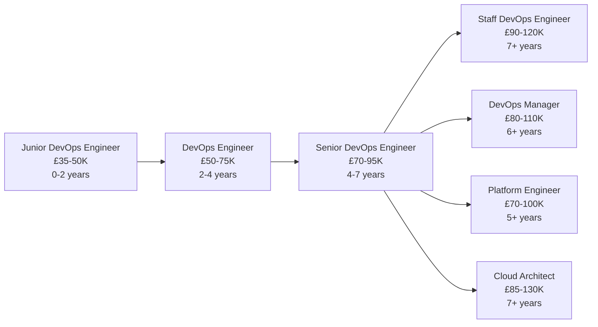

# DevOps Engineer

!!! quote "In Their Own Words"
    "I automate everything. Deployments, testing, monitoring, scaling—if humans are doing it manually, I'm building a pipeline to do it automatically. I keep the systems running so everyone else can focus on building features."
    
    — *DevOps Engineer, SaaS Company*

---

## Role Overview

| | |
|---|---|
| **Also Known As** | Site Reliability Engineer (SRE), Infrastructure Engineer |
| **Category** | Infrastructure & Platform |
| **Typical Experience** | 2-8 years |
| **Salary Range (UK)** | £50K - £95K |
| **Remote Friendly?** | ⭐⭐⭐⭐ Very (80%+ of jobs) |

---

## What Do DevOps Engineers Actually Do?

DevOps Engineers **automate** the software delivery process and **maintain** the infrastructure that applications run on. They bridge development and operations.

### The Core Responsibilities

=== "Build CI/CD Pipelines"
    
    **Automate testing and deployment**
    
    ```yaml title=".github/workflows/deploy.yml"
    name: Deploy to Production
    
    on:
      push:
        branches: [main]
    
    jobs:
      test:
        runs-on: ubuntu-latest
        steps:
          - uses: actions/checkout@v3
          
          - name: Set up Python
            uses: actions/setup-python@v4
            with:
              python-version: '3.11'
          
          - name: Install dependencies
            run: |
              pip install -r requirements.txt
              pip install pytest
          
          - name: Run tests
            run: pytest tests/
          
          - name: Lint code
            run: |
              pip install flake8
              flake8 . --count --select=E9,F63,F7,F82 --show-source --statistics
      
      build:
        needs: test
        runs-on: ubuntu-latest
        steps:
          - uses: actions/checkout@v3
          
          - name: Build Docker image
            run: |
              docker build -t myapp:${{ github.sha }} .
              docker tag myapp:${{ github.sha }} myapp:latest
          
          - name: Push to registry
            run: |
              echo ${{ secrets.DOCKER_PASSWORD }} | docker login -u ${{ secrets.DOCKER_USERNAME }} --password-stdin
              docker push myapp:${{ github.sha }}
              docker push myapp:latest
      
      deploy:
        needs: build
        runs-on: ubuntu-latest
        steps:
          - name: Deploy to Kubernetes
            run: |
              kubectl set image deployment/myapp myapp=myapp:${{ github.sha }}
              kubectl rollout status deployment/myapp
          
          - name: Notify team
            uses: 8398a7/action-slack@v3
            with:
              status: ${{ job.status }}
              text: 'Deployment to production completed'
              webhook_url: ${{ secrets.SLACK_WEBHOOK }}
    ```

=== "Manage Infrastructure"
    
    **Infrastructure as Code with Terraform**
    
    ```hcl title="main.tf"
    # Define AWS infrastructure
    
    provider "aws" {
      region = "eu-west-2"
    }
    
    # VPC
    resource "aws_vpc" "main" {
      cidr_block           = "10.0.0.0/16"
      enable_dns_hostnames = true
      
      tags = {
        Name        = "main-vpc"
        Environment = "production"
      }
    }
    
    # Subnets
    resource "aws_subnet" "public" {
      count             = 2
      vpc_id            = aws_vpc.main.id
      cidr_block        = "10.0.${count.index}.0/24"
      availability_zone = data.aws_availability_zones.available.names[count.index]
      
      tags = {
        Name = "public-subnet-${count.index + 1}"
      }
    }
    
    # EKS Cluster
    resource "aws_eks_cluster" "main" {
      name     = "production-cluster"
      role_arn = aws_iam_role.cluster.arn
      version  = "1.28"
      
      vpc_config {
        subnet_ids = aws_subnet.public[*].id
      }
      
      depends_on = [
        aws_iam_role_policy_attachment.cluster_policy
      ]
    }
    
    # RDS Database
    resource "aws_db_instance" "postgres" {
      identifier        = "production-db"
      engine            = "postgres"
      engine_version    = "15.3"
      instance_class    = "db.t3.medium"
      allocated_storage = 100
      
      db_name  = "myapp"
      username = var.db_username
      password = var.db_password
      
      vpc_security_group_ids = [aws_security_group.db.id]
      db_subnet_group_name   = aws_db_subnet_group.main.name
      
      backup_retention_period = 7
      skip_final_snapshot     = false
      
      tags = {
        Environment = "production"
      }
    }
    
    # Auto-scaling group
    resource "aws_autoscaling_group" "app" {
      name                = "app-asg"
      min_size            = 2
      max_size            = 10
      desired_capacity    = 3
      health_check_type   = "ELB"
      
      vpc_zone_identifier = aws_subnet.public[*].id
      
      tag {
        key                 = "Name"
        value               = "app-instance"
        propagate_at_launch = true
      }
    }
    ```

=== "Set Up Monitoring"
    
    **Observe system health and performance**
    
    ```yaml title="prometheus-config.yml"
    # Prometheus configuration
    global:
      scrape_interval: 15s
      evaluation_interval: 15s
    
    alerting:
      alertmanagers:
        - static_configs:
            - targets: ['alertmanager:9093']
    
    rule_files:
      - 'alerts.yml'
    
    scrape_configs:
      # Application metrics
      - job_name: 'application'
        static_configs:
          - targets: ['app:8080']
        metrics_path: '/metrics'
      
      # Node metrics
      - job_name: 'node'
        static_configs:
          - targets: ['node-exporter:9100']
      
      # Database metrics
      - job_name: 'postgresql'
        static_configs:
          - targets: ['postgres-exporter:9187']
    ```
    
    ```yaml title="alerts.yml"
    groups:
      - name: application_alerts
        rules:
          - alert: HighErrorRate
            expr: rate(http_requests_total{status=~"5.."}[5m]) > 0.05
            for: 5m
            labels:
              severity: critical
            annotations:
              summary: "High error rate detected"
              description: "Error rate is {{ $value }} per second"
          
          - alert: HighLatency
            expr: histogram_quantile(0.95, rate(http_request_duration_seconds_bucket[5m])) > 1
            for: 10m
            labels:
              severity: warning
            annotations:
              summary: "High latency detected"
              description: "95th percentile latency is {{ $value }}s"
          
          - alert: LowDiskSpace
            expr: (node_filesystem_avail_bytes / node_filesystem_size_bytes) < 0.1
            for: 5m
            labels:
              severity: warning
            annotations:
              summary: "Low disk space on {{ $labels.instance }}"
              description: "Only {{ $value | humanizePercentage }} disk space remaining"
    ```

=== "Manage Containers"
    
    **Kubernetes deployment and orchestration**
    
    ```yaml title="deployment.yml"
    apiVersion: apps/v1
    kind: Deployment
    metadata:
      name: web-app
      labels:
        app: web-app
    spec:
      replicas: 3
      selector:
        matchLabels:
          app: web-app
      template:
        metadata:
          labels:
            app: web-app
        spec:
          containers:
          - name: app
            image: myapp:latest
            ports:
            - containerPort: 8080
            
            # Resource limits
            resources:
              requests:
                memory: "256Mi"
                cpu: "250m"
              limits:
                memory: "512Mi"
                cpu: "500m"
            
            # Health checks
            livenessProbe:
              httpGet:
                path: /health
                port: 8080
              initialDelaySeconds: 30
              periodSeconds: 10
            
            readinessProbe:
              httpGet:
                path: /ready
                port: 8080
              initialDelaySeconds: 5
              periodSeconds: 5
            
            # Environment variables
            env:
            - name: DATABASE_URL
              valueFrom:
                secretKeyRef:
                  name: db-credentials
                  key: url
            - name: LOG_LEVEL
              value: "INFO"
          
          # Auto-scaling
          ---
          apiVersion: autoscaling/v2
          kind: HorizontalPodAutoscaler
          metadata:
            name: web-app-hpa
          spec:
            scaleTargetRef:
              apiVersion: apps/v1
              kind: Deployment
              name: web-app
            minReplicas: 3
            maxReplicas: 10
            metrics:
            - type: Resource
              resource:
                name: cpu
                target:
                  type: Utilization
                  averageUtilization: 70
    ```

=== "Incident Response"
    
    **Respond to and resolve production issues**
    
    **Example incident: Website down**
    
    ```bash
    # 1. Check service status
    kubectl get pods -n production
    # See pod in CrashLoopBackOff
    
    # 2. Check logs
    kubectl logs web-app-7d4f8b9c-x5k2p
    # Error: Database connection timeout
    
    # 3. Check database
    kubectl exec -it postgres-0 -- psql -U admin -c "SELECT 1"
    # Database is up
    
    # 4. Check network
    kubectl exec -it web-app-7d4f8b9c-x5k2p -- nc -zv postgres 5432
    # Connection refused
    
    # 5. Check security groups / network policies
    kubectl get networkpolicies
    # Find misconfigured policy blocking database access
    
    # 6. Fix network policy
    kubectl apply -f correct-network-policy.yml
    
    # 7. Verify pods recover
    kubectl get pods -w
    # Pods now Running
    
    # 8. Verify application works
    curl https://app.example.com/health
    # Status: OK
    
    # 9. Document incident
    # Write postmortem:
    # - What happened
    # - Root cause
    # - Timeline
    # - Resolution
    # - Prevention measures
    ```

---

## A Day in the Life

### Morning (9:00 AM - 12:00 PM)

```text
09:00 - Check monitoring dashboards
        All systems green ✓
        CPU usage trending up on database
        Plan to scale up this week

09:15 - Incident alert: Production API slow
        Check Grafana: Response time 2s (normally 200ms)
        Check logs: Database queries timing out
        Check database: High CPU usage
        Identify: Unoptimised query from new feature
        Contact backend team, they fix query
        Performance restored

10:30 - Standup
        "Responded to production incident this morning"
        "Working on new CI/CD pipeline for ML models"
        "Planning database upgrade for next week"

11:00 - Build new CI/CD pipeline
        Set up GitHub Actions workflow
        Add automated testing
        Configure deployment to staging
        Test with sample PR
```

### Afternoon (1:00 PM - 5:00 PM)

```text
13:00 - Infrastructure maintenance
        Update Kubernetes cluster to new version
        Rolling update, zero downtime
        Monitor for issues
        All pods healthy

15:00 - Work on infrastructure as code
        Migrate manual AWS resources to Terraform
        Document what each resource does
        Create modules for reusable components
        Submit PR for review

16:00 - Security updates
        Check for vulnerable dependencies
        Update Docker base images
        Run security scans
        Deploy patches

16:45 - On-call handover
        Brief next on-call engineer
        Document any ongoing issues
        Share access to runbooks
```

---

## Key Skills

### Must-Have Skills

| Skill | Why It Matters | Proficiency Needed |
|-------|----------------|-------------------|
| **Linux** | Most servers run Linux | ⭐⭐⭐⭐ Advanced |
| **Docker** | Containerization standard | ⭐⭐⭐⭐ Advanced |
| **CI/CD** | Automated deployments | ⭐⭐⭐⭐ Advanced |
| **Cloud Platforms** | AWS, GCP, or Azure | ⭐⭐⭐⭐ Advanced |
| **Scripting** | Bash, Python | ⭐⭐⭐ Intermediate |

### Important Skills

| Skill | Why It Matters | Proficiency Needed |
|-------|----------------|-------------------|
| **Kubernetes** | Container orchestration | ⭐⭐⭐⭐ Advanced |
| **Terraform** | Infrastructure as code | ⭐⭐⭐ Intermediate |
| **Monitoring** | Prometheus, Grafana | ⭐⭐⭐ Intermediate |
| **Networking** | TCP/IP, DNS, load balancers | ⭐⭐⭐ Intermediate |
| **Security** | Secrets, IAM, compliance | ⭐⭐⭐ Intermediate |

### Nice-to-Have Skills

- Ansible/Chef/Puppet (configuration management)
- Service mesh (Istio, Linkerd)
- GitOps (ArgoCD, Flux)
- Multiple cloud platforms
- Database administration

---

## Tools You'll Use Daily

### Core Stack

<div class="grid cards" markdown>

-   **Docker**
    
    ---
    
    Container platform
    
    ```bash
    docker build -t app:v1 .
    docker run -p 8080:8080 app:v1
    ```

-   **Kubernetes**
    
    ---
    
    Container orchestration
    
    ```bash
    kubectl apply -f deployment.yml
    kubectl get pods
    ```

-   **Terraform**
    
    ---
    
    Infrastructure as code
    
    ```bash
    terraform plan
    terraform apply
    ```

-   **Git/GitHub**
    
    ---
    
    Version control
    
    GitOps workflows

</div>

### Cloud Platforms

- **AWS** - Most popular
- **Google Cloud** - Good for data
- **Azure** - Microsoft ecosystem

### Monitoring

- **Prometheus** - Metrics collection
- **Grafana** - Dashboards
- **ELK Stack** - Logs (Elasticsearch, Logstash, Kibana)
- **Datadog** - All-in-one monitoring

---

## Hands-On Project

!!! example "Set Up CI/CD Pipeline"
    
    **Objective:** Automate deployment of BookStore application
    
    **What you'll build:**
    
    1. Create GitHub Actions workflow
    2. Add automated tests
    3. Build Docker container
    4. Deploy to staging environment
    5. Set up health checks
    6. Add monitoring
    7. Configure alerts
    
    **Time estimate:** 2-3 hours
    
    [Start Tutorial →](../../hands-on/04-data-pipeline.md){ .md-button .md-button--primary }

---

## Career Path

### Entry Points

=== "From System Administration"
    
    **Traditional path**
    
    **You have:**
    
    - Linux experience
    - Networking knowledge
    - Troubleshooting skills
    
    **Add:**
    
    - Docker and containers
    - CI/CD tools
    - Infrastructure as code
    - Cloud platforms
    - Programming/scripting
    
    **Timeline:** 6-12 months

=== "From Software Engineering"
    
    **Common transition**
    
    **You have:**
    
    - Programming skills
    - Git and version control
    - Understanding of applications
    
    **Add:**
    
    - Infrastructure knowledge
    - Cloud platforms
    - Kubernetes
    - Monitoring tools
    - Operations mindset
    
    **Timeline:** 6-9 months

=== "Self-Taught"
    
    **Focus on:**
    
    1. Linux fundamentals
    2. Docker and containers
    3. Cloud platform (choose one)
    4. Kubernetes basics
    5. CI/CD tools
    6. Build portfolio projects
    
    **Timeline:** 12-18 months

### Progression



---

## When This Role Fits You

!!! success "You'll Love This Role If..."
    
    - ✅ You enjoy **automation** and eliminating manual work
    - ✅ You like **both coding and infrastructure**
    - ✅ You appreciate **improving efficiency**
    - ✅ You're comfortable **being on-call** for incidents
    - ✅ You like **variety** (different problems daily)
    - ✅ You value **reliability** and uptime
    - ✅ You enjoy **solving puzzles** under pressure

!!! warning "This Might Not Be For You If..."
    
    - ❌ You want to focus on **application development**
    - ❌ You dislike **on-call responsibilities**
    - ❌ You prefer **working on one thing deeply**
    - ❌ You're uncomfortable with **production incidents**
    - ❌ You want **predictable 9-5 hours**
    - ❌ You dislike **context switching**

---

## Common Interview Questions

??? question "Explain CI/CD to a non-technical person"
    
    **Good answer:**
    
    "Imagine you're building a house and you want to make changes. In the old days (before CI/CD), you'd:
    
    1. Make changes to blueprints
    2. Wait weeks
    3. Hire builders manually
    4. Hope nothing breaks
    5. If something breaks, start over
    
    With CI/CD, it's like having robots that:
    
    **Continuous Integration (CI):**
    - Check your blueprints automatically
    - Build a small test version
    - Verify it doesn't break anything
    - All in minutes, not weeks
    
    **Continuous Deployment (CD):**
    - If tests pass, automatically build the real thing
    - Deploy to production
    - Monitor for issues
    - Roll back instantly if problems occur
    
    Result: Changes go from idea to production in hours instead of weeks, with much lower risk."

??? question "How would you debug a production outage?"
    
    **Good answer structure:**
    
    1. **Assess impact**
        - What's affected?
        - How many users?
        - Since when?
    
    2. **Check monitoring**
        - Grafana dashboards
        - Error rates
        - Response times
        - Recent deployments
    
    3. **Check logs**
        - Application logs
        - Infrastructure logs
        - Look for errors/exceptions
    
    4. **Form hypothesis**
        - Based on symptoms and logs
        - Recent changes?
        - External dependencies?
    
    5. **Test hypothesis**
        - Verify with specific checks
        - Isolate the problem
    
    6. **Implement fix**
        - Quick mitigation (rollback?)
        - Verify fix works
        - Monitor for stability
    
    7. **Document**
        - Timeline
        - Root cause
        - Resolution
        - Prevention measures

??? question "Kubernetes: How would you zero-downtime deploy?"
    
    **Good answer:**
    
    "Use rolling updates with proper health checks:
    
    ```yaml
    strategy:
      type: RollingUpdate
      rollingUpdate:
        maxUnavailable: 0  # Always keep pods available
        maxSurge: 1        # Only one extra pod at a time
    
    livenessProbe:
      httpGet:
        path: /health
        port: 8080
      initialDelaySeconds: 30
      periodSeconds: 10
    
    readinessProbe:
      httpGet:
        path: /ready
        port: 8080
      initialDelaySeconds: 5
      periodSeconds: 5
    ```
    
    **Process:**
    1. New pod starts
    2. Waits for readiness probe to pass
    3. Only then receives traffic
    4. Old pod drains connections
    5. Old pod terminates
    6. Repeat for next pod
    
    **Additional safety:**
    - Blue-green deployment for major changes
    - Canary releases (10% of traffic first)
    - Feature flags for instant rollback"

---

## Learning Resources

### Courses

- [:fontawesome-solid-graduation-cap: **Linux Academy / A Cloud Guru**](https://acloudguru.com) - DevOps courses
- [:fontawesome-solid-graduation-cap: **Kubernetes Certified Admin (CKA)**](https://training.linuxfoundation.org/certification/certified-kubernetes-administrator-cka/) - Official cert
- [:fontawesome-solid-graduation-cap: **AWS Certified DevOps Engineer**](https://aws.amazon.com/certification/certified-devops-engineer-professional/) - AWS cert

### Books

- 📚 **"The Phoenix Project"** by Gene Kim - DevOps novel
- 📚 **"Site Reliability Engineering"** by Google - SRE principles
- 📚 **"Kubernetes Up & Running"** by Hightower et al. - K8s guide

### Practice

- [Our CI/CD Tutorial](../../hands-on/04-data-pipeline.md) - Automate BookStore deployment
- [Kubernetes the Hard Way](https://github.com/kelseyhightower/kubernetes-the-hard-way) - Learn K8s internals
- [AWS Free Tier](https://aws.amazon.com/free/) - Practice cloud skills

### Communities

- [:fontawesome-brands-reddit: r/devops](https://reddit.com/r/devops) - Very active
- [:fontawesome-brands-slack: Kubernetes Slack](https://slack.k8s.io/) - K8s community
- [:fontawesome-brands-linkedin: DevOps LinkedIn Groups](https://linkedin.com) - Networking

---

## Related Roles

| Role | Overlap | Key Difference |
|------|---------|----------------|
| [Platform Engineer](platform-engineer.md) | 80% | Platform Engineers build internal platforms, DevOps focuses on deployment |
| [Backend Engineer](backend-engineer.md) | 40% | Backend Engineers write application code, DevOps deploys it |
| [MLOps Engineer](../production/mlops-engineer.md) | 60% | MLOps specialises in ML systems, DevOps is general applications |
| [Database Administrator](database-administrator.md) | 30% | DBAs focus on databases, DevOps on entire infrastructure |

---

## Next Steps

Ready to try DevOps?

[CI/CD Pipeline Tutorial →](../../hands-on/04-data-pipeline.md){ .md-button .md-button--primary }

Want to explore more roles?

[Back to All Roles →](../index.md){ .md-button }