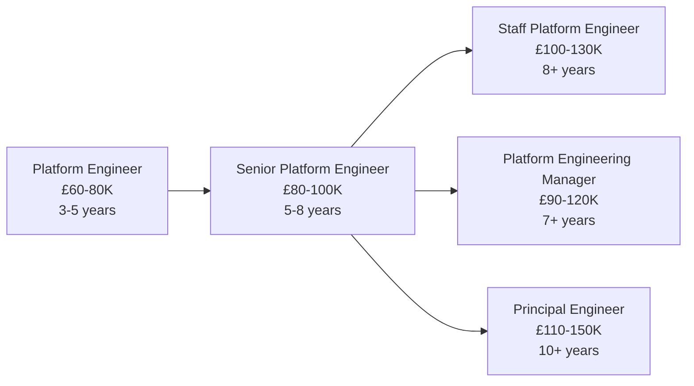

# Platform Engineer

!!! quote "In Their Own Words"
    "I build the platforms that engineers use to build products. Internal tools, infrastructure, developer experience—I make it easy for teams to ship code quickly and reliably."
    
    — *Platform Engineer, Tech Scale-Up*

---

## Role Overview

| | |
|---|---|
| **Also Known As** | Infrastructure Engineer, Internal Tools Engineer |
| **Category** | Infrastructure & Platform |
| **Typical Experience** | 3-10 years |
| **Salary Range (UK)** | £60K - £100K |
| **Remote Friendly?** | ⭐⭐⭐⭐⭐ Very (90%+ of jobs) |

---

## What Do Platform Engineers Actually Do?

Platform Engineers build **internal platforms** and **developer tools** that make other engineers more productive. Think of them as "engineers for engineers."

### The Core Responsibilities

=== "Build Internal Platforms"
    
    **Create self-service tools for developers**
    
    Example: Internal deployment platform
    
    ```python title="platform-cli/deploy.py"
    import click
    import requests
    from pathlib import Path
    
    @click.group()
    def cli():
        """Internal deployment CLI"""
        pass
    
    @cli.command()
    @click.option('--env', default='staging', help='Environment to deploy to')
    @click.option('--service', required=True, help='Service name')
    def deploy(env, service):
        """
        Deploy service to environment
        
        Usage: platform deploy --service=api --env=production
        """
        click.echo(f"Deploying {service} to {env}...")
        
        # Load service config
        config_path = Path(f'services/{service}/config.yml')
        if not config_path.exists():
            click.echo(f"Error: Service {service} not found", err=True)
            return
        
        # Build Docker image
        click.echo("Building Docker image...")
        image_tag = f"{service}:{get_version()}"
        
        # Push to registry
        click.echo("Pushing to registry...")
        
        # Deploy to Kubernetes
        click.echo(f"Deploying to {env} cluster...")
        
        # Update monitoring
        click.echo("Configuring monitoring...")
        
        # Run health checks
        click.echo("Running health checks...")
        
        click.echo(f"✓ {service} deployed successfully to {env}")
        click.echo(f"URL: https://{service}.{env}.company.com")
    
    @cli.command()
    @click.option('--service', required=True)
    def logs(service):
        """Stream logs for a service"""
        click.echo(f"Streaming logs for {service}...")
        # Implementation here
    
    @cli.command()
    @click.option('--service', required=True)
    def scale(service):
        """Scale service replicas"""
        replicas = click.prompt('Number of replicas', type=int)
        click.echo(f"Scaling {service} to {replicas} replicas...")
        # Implementation here
    
    if __name__ == '__main__':
        cli()
    ```

=== "Improve Developer Experience"
    
    **Make common tasks easier**
    
    ```yaml title="platform-templates/new-service.yml"
    # Template for creating new microservice
    # Usage: platform create-service --name=user-auth
    
    service:
      name: "{{ service_name }}"
      language: "{{ language }}"
      
    structure:
      - src/
        - main.{{ extension }}
        - config/
        - tests/
      - Dockerfile
      - .github/
        - workflows/
          - ci.yml
          - deploy.yml
      - kubernetes/
        - deployment.yml
        - service.yml
      - README.md
    
    includes:
      - database: true  # Postgres by default
      - cache: true     # Redis by default
      - monitoring: true  # Prometheus + Grafana
      - logging: true     # ELK stack
      - ci_cd: true       # GitHub Actions
    
    documentation:
      - API_GUIDE.md
      - DEPLOYMENT.md
      - MONITORING.md
    ```
    
    Result: New service set up in 5 minutes instead of 2 days

=== "Manage Infrastructure"
    
    **Provision and maintain cloud resources**
    
    ```hcl title="terraform/modules/service/main.tf"
    # Reusable module for deploying services
    
    variable "service_name" {
      type = string
    }
    
    variable "environment" {
      type = string
    }
    
    variable "replicas" {
      type    = number
      default = 3
    }
    
    # EKS cluster
    resource "aws_eks_cluster" "main" {
      name     = "${var.environment}-cluster"
      role_arn = aws_iam_role.cluster.arn
      
      vpc_config {
        subnet_ids = var.subnet_ids
      }
    }
    
    # RDS database
    resource "aws_db_instance" "service_db" {
      identifier        = "${var.service_name}-${var.environment}"
      engine            = "postgres"
      instance_class    = var.environment == "production" ? "db.t3.medium" : "db.t3.small"
      allocated_storage = var.environment == "production" ? 100 : 20
      
      db_name  = var.service_name
      username = var.db_username
      password = random_password.db_password.result
      
      backup_retention_period = var.environment == "production" ? 30 : 7
      
      tags = {
        Service     = var.service_name
        Environment = var.environment
        ManagedBy   = "platform-team"
      }
    }
    
    # ElastiCache Redis
    resource "aws_elasticache_cluster" "cache" {
      cluster_id      = "${var.service_name}-cache-${var.environment}"
      engine          = "redis"
      node_type       = "cache.t3.micro"
      num_cache_nodes = 1
      
      tags = {
        Service     = var.service_name
        Environment = var.environment
      }
    }
    
    # S3 bucket for service assets
    resource "aws_s3_bucket" "assets" {
      bucket = "${var.service_name}-assets-${var.environment}"
      
      tags = {
        Service     = var.service_name
        Environment = var.environment
      }
    }
    
    # Outputs for service configuration
    output "database_endpoint" {
      value = aws_db_instance.service_db.endpoint
    }
    
    output "redis_endpoint" {
      value = aws_elasticache_cluster.cache.cache_nodes[0].address
    }
    ```

=== "Build CI/CD Infrastructure"
    
    **Automate testing and deployment**
    
    ```yaml title=".github/workflows/platform-pipeline.yml"
    name: Platform CI/CD
    
    on:
      push:
        branches: [main, staging]
      pull_request:
    
    jobs:
      # Job 1: Run all tests
      test:
        runs-on: ubuntu-latest
        strategy:
          matrix:
            service: [api, worker, frontend]
        steps:
          - uses: actions/checkout@v3
          
          - name: Run tests for ${{ matrix.service }}
            run: |
              cd services/${{ matrix.service }}
              docker-compose -f docker-compose.test.yml up --abort-on-container-exit
      
      # Job 2: Security scanning
      security:
        runs-on: ubuntu-latest
        steps:
          - uses: actions/checkout@v3
          
          - name: Run Snyk security scan
            uses: snyk/actions/node@master
            env:
              SNYK_TOKEN: ${{ secrets.SNYK_TOKEN }}
      
      # Job 3: Build and push images
      build:
        needs: [test, security]
        runs-on: ubuntu-latest
        strategy:
          matrix:
            service: [api, worker, frontend]
        steps:
          - uses: actions/checkout@v3
          
          - name: Build ${{ matrix.service }}
            run: |
              docker build -t company/${{ matrix.service }}:${{ github.sha }} \
                services/${{ matrix.service }}
              
              docker tag company/${{ matrix.service }}:${{ github.sha }} \
                company/${{ matrix.service }}:latest
          
          - name: Push to registry
            run: |
              echo ${{ secrets.DOCKER_PASSWORD }} | docker login -u ${{ secrets.DOCKER_USERNAME }} --password-stdin
              docker push company/${{ matrix.service }}:${{ github.sha }}
              docker push company/${{ matrix.service }}:latest
      
      # Job 4: Deploy to staging
      deploy-staging:
        needs: build
        if: github.ref == 'refs/heads/staging'
        runs-on: ubuntu-latest
        steps:
          - name: Deploy all services to staging
            run: |
              kubectl config use-context staging
              kubectl set image deployment/api api=company/api:${{ github.sha }}
              kubectl set image deployment/worker worker=company/worker:${{ github.sha }}
              kubectl set image deployment/frontend frontend=company/frontend:${{ github.sha }}
      
      # Job 5: Deploy to production (manual approval)
      deploy-production:
        needs: build
        if: github.ref == 'refs/heads/main'
        runs-on: ubuntu-latest
        environment:
          name: production
          url: https://app.company.com
        steps:
          - name: Deploy to production
            run: |
              kubectl config use-context production
              # Blue-green deployment for zero downtime
              kubectl apply -f k8s/production/
    ```

=== "Create Documentation"
    
    **Document platforms and best practices**
    
    ```markdown title="docs/platform/getting-started.md"
    # Platform Getting Started Guide
    
    ## For New Engineers
    
    ### 1. Get Access
    ```bash
    # Request access
    platform access request --slack=@yourname
    
    # Verify access
    platform whoami
    ```
    
    ### 2. Create Your First Service
    ```bash
    # Create from template
    platform create-service \
      --name=my-api \
      --language=python \
      --database=postgres
    
    # This creates:
    # - GitHub repository
    # - CI/CD pipeline
    # - Staging environment
    # - Database
    # - Monitoring dashboards
    ```
    
    ### 3. Deploy
    ```bash
    # Deploy to staging
    cd my-api
    platform deploy --env=staging
    
    # Check status
    platform status my-api --env=staging
    
    # View logs
    platform logs my-api --env=staging --follow
    ```
    
    ### 4. Monitor
    - Grafana: https://grafana.company.com
    - Logs: https://kibana.company.com
    - Alerts: https://alertmanager.company.com
    
    ## Common Tasks
    
    ### Scale a Service
    ```bash
    platform scale my-api --replicas=5 --env=production
    ```
    
    ### Database Migrations
    ```bash
    platform db migrate my-api --env=staging
    ```
    
    ### Rollback
    ```bash
    platform rollback my-api --env=production --to-version=v1.2.3
    ```
    
    ## Getting Help
    - Slack: #platform-help
    - Docs: https://docs.company.com/platform
    - Office hours: Thursdays 2-4pm
    ```

---

## A Day in the Life

### Morning (9:00 AM - 12:00 PM)

```text
09:00 - Check platform health
        All services: Green
        Build pipeline success rate: 98%
        Average deployment time: 4 minutes
        
09:30 - Slack message from engineer
        "How do I add a new database to my service?"
        Point them to docs, offer to pair if needed

10:00 - Weekly platform meeting
        Review metrics: Developer satisfaction up 15%
        Plan new features: Self-service observability
        Discuss: Kubernetes upgrade next month

11:00 - Work on new feature: Database provisioning
        Add command to CLI
        Integrate with Terraform
        Update documentation
        Test with example service
```

### Afternoon (1:00 PM - 5:00 PM)

```text
13:00 - Optimize build pipeline
        Builds taking 12 minutes
        Add caching for Docker layers
        Parallel test execution
        New time: 6 minutes

15:00 - Help team debug deployment
        Service failing to start
        Check logs: Database connection issue
        Verify secrets configured correctly
        Issue resolved

16:00 - Platform improvements
        Analyze usage patterns
        Identify pain points
        Prioritise improvements
        Write proposals for next quarter

16:45 - Documentation session
        Record video: "How to deploy your first service"
        Update troubleshooting guide
        Publish to internal wiki
```

---

## Key Skills

### Must-Have Skills

| Skill | Why It Matters | Proficiency Needed |
|-------|----------------|-------------------|
| **Cloud Platforms** | AWS, GCP, or Azure | ⭐⭐⭐⭐⭐ Expert |
| **Kubernetes** | Container orchestration | ⭐⭐⭐⭐ Advanced |
| **Infrastructure as Code** | Terraform, CloudFormation | ⭐⭐⭐⭐ Advanced |
| **CI/CD** | Build and deployment | ⭐⭐⭐⭐ Advanced |
| **Programming** | Python, Go, or similar | ⭐⭐⭐ Intermediate |

### Important Skills

| Skill | Why It Matters | Proficiency Needed |
|-------|----------------|-------------------|
| **System Design** | Architecture patterns | ⭐⭐⭐⭐ Advanced |
| **Networking** | Load balancers, DNS | ⭐⭐⭐ Intermediate |
| **Monitoring** | Observability tools | ⭐⭐⭐ Intermediate |
| **Security** | IAM, secrets management | ⭐⭐⭐ Intermediate |
| **Documentation** | Clear guides and runbooks | ⭐⭐⭐⭐ Advanced |

### Nice-to-Have Skills

- Service mesh (Istio, Linkerd)
- GitOps (ArgoCD, Flux)
- Multiple cloud providers
- Database administration
- Cost optimization

---

## Tools You'll Use Daily

### Core Stack

<div class="grid cards" markdown>

-   **Kubernetes**
    
    ---
    
    Container orchestration platform

-   **Terraform**
    
    ---
    
    Infrastructure as code

-   **AWS/GCP/Azure**
    
    ---
    
    Cloud platforms

-   **Docker**
    
    ---
    
    Containerization

</div>

### Supporting Tools

- **Helm** - Kubernetes package manager
- **ArgoCD** - GitOps deployment
- **Prometheus/Grafana** - Monitoring
- **Vault** - Secrets management

---

## Hands-On Project

!!! example "Build Internal Platform CLI"
    
    **Objective:** Create tool for deploying services
    
    **What you'll build:**
    
    1. CLI tool in Python (Click library)
    2. Commands:
        - `deploy` - Deploy service
        - `status` - Check service health
        - `logs` - Stream logs
        - `scale` - Adjust replicas
    3. Integration with Kubernetes
    4. Configuration management
    5. Documentation
    
    **Time estimate:** 2-3 hours
    
    [Start Tutorial →](../../hands-on/03-database-setup.md){ .md-button .md-button--primary }

---

## Career Path

### Entry Points

=== "From DevOps Engineer"
    
    **Most common path**
    
    **You have:**
    
    - Infrastructure experience
    - CI/CD knowledge
    - Cloud platforms
    
    **Add:**
    
    - Product mindset (internal customers)
    - Tool building
    - Developer experience focus
    - API design
    
    **Timeline:** 6-12 months

=== "From Backend Engineer"
    
    **Common transition**
    
    **You have:**
    
    - Programming skills
    - System design
    - Application knowledge
    
    **Add:**
    
    - Kubernetes expertise
    - Infrastructure as code
    - Cloud platforms
    - Operations mindset
    
    **Timeline:** 6-9 months

=== "From Site Reliability Engineer"
    
    **Natural progression**
    
    **You have:**
    
    - Reliability focus
    - Monitoring expertise
    - Incident response
    
    **Add:**
    
    - Platform development
    - Internal tools
    - Developer experience
    - Product thinking
    
    **Timeline:** 4-6 months

### Progression



---

## When This Role Fits You

!!! success "You'll Love This Role If..."
    
    - ✅ You enjoy **building tools** that others use
    - ✅ You like **improving developer experience**
    - ✅ You appreciate **enabling teams** to move faster
    - ✅ You're comfortable with **infrastructure and code**
    - ✅ You value **automation** and self-service
    - ✅ You like **product thinking** (internal products)
    - ✅ You enjoy **working with many teams**

!!! warning "This Might Not Be For You If..."
    
    - ❌ You want to build **user-facing products**
    - ❌ You prefer **solo work** (this role is collaborative)
    - ❌ You dislike **supporting others**
    - ❌ You want to avoid **on-call responsibilities**
    - ❌ You prefer **deep specialization** over breadth
    - ❌ You dislike **context switching**

---

## Common Interview Questions

??? question "How would you design an internal deployment platform?"
    
    **Good answer structure:**
    
    **1. Requirements gathering:**
    - Who are the users? (engineers, product teams)
    - What do they need? (easy deployments, visibility)
    - Current pain points? (slow, manual, error-prone)
    
    **2. Core features:**
    - Self-service deployment
    - Environment management (staging, production)
    - Rollback capability
    - Health monitoring
    - Log aggregation
    
    **3. Technical design:**
    - CLI + web UI
    - GitOps workflow (ArgoCD)
    - Kubernetes backend
    - Terraform for infrastructure
    - Prometheus for monitoring
    
    **4. Developer experience:**
    - Simple commands: `platform deploy`
    - Clear error messages
    - Good documentation
    - Fast feedback (< 10 minutes)
    
    **5. Safety:**
    - Automated tests
    - Staging environment required
    - Production requires approval
    - Automatic rollback on failure

??? question "How do you measure platform success?"
    
    **Good answer:**
    
    "I use both quantitative and qualitative metrics:
    
    **Quantitative:**
    - Deployment frequency (target: multiple per day)
    - Lead time for changes (< 1 hour)
    - Mean time to recovery (< 15 minutes)
    - Build success rate (> 95%)
    - Average build time (< 10 minutes)
    - Platform uptime (99.9%+)
    
    **Qualitative:**
    - Developer satisfaction surveys
    - Number of support requests (decreasing)
    - Onboarding time for new engineers
    - Platform adoption rate
    
    **Leading indicators:**
    - Documentation views
    - CLI tool usage
    - Self-service vs manual requests
    - Feature requests from teams"

??? question "How would you handle a platform outage?"
    
    **Good answer:**
    
    **1. Immediate response:**
    - Assess impact (which teams affected?)
    - Post status update (#incidents channel)
    - Form incident response team
    
    **2. Investigation:**
    - Check monitoring dashboards
    - Review recent changes
    - Examine logs
    - Form hypothesis
    
    **3. Mitigation:**
    - Quick fix if possible
    - Rollback if recent deploy
    - Failover to backup if available
    - Communicate ETA
    
    **4. Resolution:**
    - Implement fix
    - Verify all systems operational
    - Monitor for stability
    
    **5. Post-mortem:**
    - Timeline of events
    - Root cause analysis
    - Action items to prevent recurrence
    - Share learnings with team"

---

## Learning Resources

### Courses

- [:fontawesome-solid-graduation-cap: **Platform Engineering**](https://www.udemy.com/) - Udemy course
- [:fontawesome-solid-graduation-cap: **Kubernetes Administration**](https://training.linuxfoundation.org/certification/certified-kubernetes-administrator-cka/) - Official cert
- [:fontawesome-solid-graduation-cap: **AWS Solutions Architect**](https://aws.amazon.com/certification/) - AWS certification

### Books

- 📚 **"Team Topologies"** by Skelton & Pais - Platform team patterns
- 📚 **"Infrastructure as Code"** by Kief Morris - IaC practices
- 📚 **"Building Secure and Reliable Systems"** by Google - SRE/Platform

### Practice

- [Our Platform Tutorial](../../hands-on/03-database-setup.md) - Build internal tools
- [Kubernetes the Hard Way](https://github.com/kelseyhightower/kubernetes-the-hard-way) - Deep K8s learning
- [Terraform Tutorials](https://learn.hashicorp.com/terraform) - Official guides

### Communities

- [:fontawesome-brands-slack: Platform Engineering Slack](https://platformengineering.org/) - Active community
- [:fontawesome-brands-reddit: r/kubernetes](https://reddit.com/r/kubernetes) - K8s discussions
- [:fontawesome-brands-linkedin: Platform Engineering Groups](https://linkedin.com) - Networking

---

## Related Roles

| Role | Overlap | Key Difference |
|------|---------|----------------|
| [DevOps Engineer](devops-engineer.md) | 80% | Platform Engineers build platforms, DevOps focuses on CI/CD |
| [Backend Engineer](backend-engineer.md) | 40% | Backend builds user-facing apps, Platform builds internal tools |
| [Site Reliability Engineer](devops-engineer.md) | 70% | SRE focuses on reliability, Platform on developer experience |
| [Data Engineer](../data-pipeline/data-engineer.md) | 30% | Data Engineers build data pipelines, Platform Engineers build deployment platforms |

---

## Next Steps

Ready to try Platform Engineering?

[Build Platform Tools Tutorial →](../../hands-on/03-database-setup.md){ .md-button .md-button--primary }

Want to explore more roles?

[Back to All Roles →](../index.md){ .md-button }