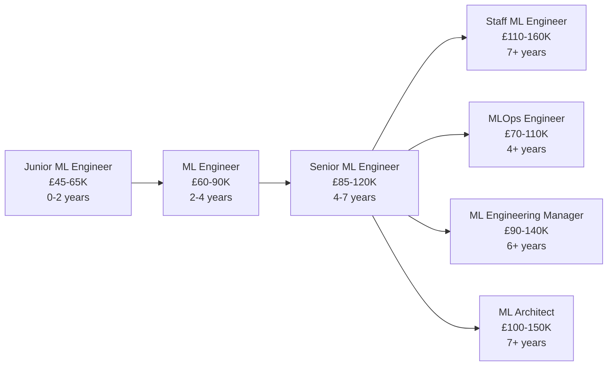

# ML Engineer

!!! quote "In Their Own Words"
    "I take models from Jupyter notebooks and put them into production where they serve millions of predictions. Data Scientists build models that work on laptops. I build models that work at scale, reliably, 24/7."
    
    — *ML Engineer, Tech Unicorn*

---

## Role Overview

| | |
|---|---|
| **Also Known As** | Machine Learning Engineer, Applied ML Engineer |
| **Category** | Production |
| **Typical Experience** | 3-8 years |
| **Salary Range (UK)** | £60K - £120K |
| **Remote Friendly?** | ⭐⭐⭐⭐⭐ Very (90%+ of jobs) |

---

## What Do ML Engineers Actually Do?

ML Engineers bridge the gap between Data Science and Software Engineering. They take machine learning models and **deploy them to production** where they can serve predictions at scale.

### The Core Responsibilities

=== "Deploy Models to Production"
    
    **Turn research code into production systems**
    
    ```python title="app.py - Production ML API"
    from flask import Flask, request, jsonify
    import joblib
    import numpy as np
    import logging
    
    # Set up logging
    logging.basicConfig(level=logging.INFO)
    logger = logging.getLogger(__name__)
    
    app = Flask(__name__)
    
    # Load model at startup
    try:
        model = joblib.load('models/churn_model_v2.pkl')
        logger.info("Model loaded successfully")
    except Exception as e:
        logger.error(f"Failed to load model: {e}")
        raise
    
    @app.route('/health', methods=['GET'])
    def health_check():
        """Health check endpoint for monitoring"""
        return jsonify({'status': 'healthy', 'model_version': 'v2'}), 200
    
    @app.route('/predict', methods=['POST'])
    def predict():
        """
        Predict customer churn probability
        
        Request body:
        {
            "customer_id": "CUST_123",
            "days_since_last_order": 45,
            "total_orders": 12,
            "lifetime_value": 567.89,
            "email_open_rate": 0.35
        }
        """
        try:
            # Get input data
            data = request.get_json()
            customer_id = data.get('customer_id')
            
            # Validate input
            required_fields = [
                'days_since_last_order',
                'total_orders', 
                'lifetime_value',
                'email_open_rate'
            ]
            
            for field in required_fields:
                if field not in data:
                    return jsonify({
                        'error': f'Missing required field: {field}'
                    }), 400
            
            # Prepare features (in same order as training)
            features = np.array([[
                data['days_since_last_order'],
                data['total_orders'],
                data['lifetime_value'],
                data['email_open_rate']
            ]])
            
            # Make prediction
            churn_probability = model.predict_proba(features)[0][1]
            churn_prediction = int(churn_probability > 0.5)
            
            # Log prediction
            logger.info(
                f"Prediction for {customer_id}: "
                f"probability={churn_probability:.3f}"
            )
            
            # Return response
            return jsonify({
                'customer_id': customer_id,
                'churn_probability': float(churn_probability),
                'churn_prediction': churn_prediction,
                'risk_level': 'high' if churn_probability > 0.7 
                             else 'medium' if churn_probability > 0.4 
                             else 'low',
                'model_version': 'v2'
            }), 200
            
        except Exception as e:
            logger.error(f"Prediction error: {e}")
            return jsonify({'error': 'Prediction failed'}), 500
    
    if __name__ == '__main__':
        app.run(host='0.0.0.0', port=5000)
    ```

=== "Containerise Applications"
    
    **Package models with Docker for consistent deployment**
    
    ```dockerfile title="Dockerfile"
    FROM python:3.11-slim
    
    # Set working directory
    WORKDIR /app
    
    # Install dependencies
    COPY requirements.txt .
    RUN pip install --no-cache-dir -r requirements.txt
    
    # Copy application code
    COPY app.py .
    COPY models/ ./models/
    
    # Expose port
    EXPOSE 5000
    
    # Health check
    HEALTHCHECK --interval=30s --timeout=3s --start-period=5s --retries=3 \
      CMD curl -f http://localhost:5000/health || exit 1
    
    # Run application
    CMD ["gunicorn", "--bind", "0.0.0.0:5000", "--workers", "4", "app:app"]
    ```
    
    ```txt title="requirements.txt"
    flask==3.0.0
    gunicorn==21.2.0
    scikit-learn==1.3.2
    joblib==1.3.2
    numpy==1.26.2
    pandas==2.1.3
    ```
    
    ```bash
    # Build and run
    docker build -t churn-model:v2 .
    docker run -p 5000:5000 churn-model:v2
    
    # Test
    curl http://localhost:5000/health
    ```

=== "Optimise for Performance"
    
    **Make models fast and efficient**
    
    **Problem:** Model inference takes 2 seconds (too slow)
    
    **Solutions:**
    
    1. **Model compression**
    
        ```python
        from sklearn.ensemble import RandomForestClassifier
        
        # Original: 100 trees
        model = RandomForestClassifier(n_estimators=100)
        
        # Optimised: 20 trees (faster, similar accuracy)
        model = RandomForestClassifier(n_estimators=20, max_depth=10)
        
        # Benchmark
        import time
        
        start = time.time()
        predictions = model.predict(X_test)
        elapsed = time.time() - start
        print(f"Inference time: {elapsed:.3f}s")
        ```
    
    2. **Batch predictions**
    
        ```python
        # Bad: Predict one at a time
        for customer in customers:
            prediction = model.predict([customer])
            # Takes: 0.1s × 1000 customers = 100s
        
        # Good: Predict in batches
        predictions = model.predict(customers)
        # Takes: 2s for 1000 customers
        ```
    
    3. **Model caching**
    
        ```python
        from functools import lru_cache
        import hashlib
        
        @lru_cache(maxsize=1000)
        def predict_with_cache(features_hash):
            """Cache predictions for common inputs"""
            features = deserialise(features_hash)
            return model.predict([features])[0]
        
        def make_prediction(features):
            # Create hash of features
            features_str = str(sorted(features.items()))
            features_hash = hashlib.md5(
                features_str.encode()
            ).hexdigest()
            
            return predict_with_cache(features_hash)
        ```

=== "Build ML Pipelines"
    
    **Automate model training and deployment**
    
    ```python title="training_pipeline.py"
    import mlflow
    from sklearn.ensemble import RandomForestClassifier
    from sklearn.model_selection import train_test_split
    from sklearn.metrics import accuracy_score, roc_auc_score
    
    def train_model():
        """Train churn prediction model"""
        
        # Start MLflow run
        with mlflow.start_run():
            
            # Load data
            df = load_data_from_warehouse()
            
            # Prepare features
            X = df[feature_columns]
            y = df['churned']
            
            X_train, X_test, y_train, y_test = train_test_split(
                X, y, test_size=0.2, random_state=42
            )
            
            # Train model
            model = RandomForestClassifier(
                n_estimators=20,
                max_depth=10,
                random_state=42
            )
            model.fit(X_train, y_train)
            
            # Evaluate
            y_pred = model.predict(X_test)
            y_pred_proba = model.predict_proba(X_test)[:, 1]
            
            accuracy = accuracy_score(y_test, y_pred)
            roc_auc = roc_auc_score(y_test, y_pred_proba)
            
            # Log metrics
            mlflow.log_metric("accuracy", accuracy)
            mlflow.log_metric("roc_auc", roc_auc)
            
            # Log parameters
            mlflow.log_param("n_estimators", 20)
            mlflow.log_param("max_depth", 10)
            
            # Save model
            mlflow.sklearn.log_model(
                model, 
                "model",
                registered_model_name="churn_predictor"
            )
            
            # Check if model is better than production
            current_model_auc = get_production_model_auc()
            
            if roc_auc > current_model_auc:
                print(f"New model is better: {roc_auc:.3f} > {current_model_auc:.3f}")
                promote_to_production(model)
            else:
                print(f"Current model is still best: {current_model_auc:.3f}")
            
            return model
    
    if __name__ == "__main__":
        train_model()
    ```

=== "Monitor in Production"
    
    **Track model performance and health**
    
    ```python title="monitoring.py"
    import prometheus_client as prom
    from datetime import datetime
    
    # Define metrics
    prediction_counter = prom.Counter(
        'ml_predictions_total',
        'Total number of predictions',
        ['model_version', 'outcome']
    )
    
    prediction_latency = prom.Histogram(
        'ml_prediction_latency_seconds',
        'Time spent making predictions',
        ['model_version']
    )
    
    prediction_score = prom.Histogram(
        'ml_prediction_score',
        'Distribution of prediction scores',
        ['model_version']
    )
    
    def track_prediction(model_version, features, prediction, latency):
        """Log prediction for monitoring"""
        
        # Increment counter
        prediction_counter.labels(
            model_version=model_version,
            outcome=prediction
        ).inc()
        
        # Record latency
        prediction_latency.labels(
            model_version=model_version
        ).observe(latency)
        
        # Record score distribution
        prediction_score.labels(
            model_version=model_version
        ).observe(prediction)
        
        # Store prediction for analysis
        store_prediction_log({
            'timestamp': datetime.now(),
            'model_version': model_version,
            'features': features,
            'prediction': prediction,
            'latency_ms': latency * 1000
        })
    ```

---

## A Day in the Life

### Morning (9:00 AM - 12:00 PM)

```text
09:00 - Check monitoring dashboard
        Churn model: 15K predictions yesterday, avg latency 120ms ✓
        Recommendation model: Error rate spiked to 2% ⚠
        Investigate logs, find upstream data issue
        Alert Data Engineering team

09:45 - Standup with ML team
        "Deployed new churn model v3 yesterday"
        "Working on model serving optimization today"
        "Blocked: Need feature store access"

10:15 - Code review: Data Scientist's new model
        Check for production readiness:
        - Are dependencies documented?
        - Is inference fast enough?
        - Are features available in production?
        - Is model size reasonable?
        Suggest using smaller model, approve

11:00 - Performance optimization
        Recommendation model too slow (500ms)
        Profile code, find bottleneck in feature generation
        Precompute features in batch job
        New latency: 500ms → 80ms
```

### Afternoon (1:00 PM - 5:00 PM)

```text
13:00 - Build new model serving endpoint
        Wrap model in Flask API
        Add input validation
        Add logging and monitoring
        Write unit tests
        Test locally with sample data

15:00 - Deploy to staging environment
        Build Docker container
        Push to container registry
        Deploy to Kubernetes
        Run integration tests
        Monitor for issues

16:00 - Documentation
        Update API docs
        Add deployment runbook
        Document monitoring setup
        Share with team

16:30 - Incident response drill
        Practice: "What if model accuracy drops suddenly?"
        Walk through:
        1. Check monitoring dashboard
        2. Compare feature distributions
        3. Rollback to previous version
        4. Investigate root cause
        5. Document learnings
```

---

## Key Skills

### Must-Have Skills

| Skill | Why It Matters | Proficiency Needed |
|-------|----------------|-------------------|
| **Python** | Primary language | ⭐⭐⭐⭐⭐ Expert |
| **Machine Learning** | Understand models you deploy | ⭐⭐⭐⭐ Advanced |
| **APIs** | Flask, FastAPI for serving | ⭐⭐⭐⭐ Advanced |
| **Docker** | Containerization | ⭐⭐⭐⭐ Advanced |
| **Cloud Platforms** | AWS, GCP, Azure | ⭐⭐⭐ Intermediate |

### Important Skills

| Skill | Why It Matters | Proficiency Needed |
|-------|----------------|-------------------|
| **Kubernetes** | Container orchestration | ⭐⭐⭐ Intermediate |
| **CI/CD** | Automated deployment | ⭐⭐⭐ Intermediate |
| **Monitoring** | Prometheus, Grafana | ⭐⭐⭐ Intermediate |
| **SQL** | Feature engineering | ⭐⭐⭐ Intermediate |
| **Performance Tuning** | Optimize inference | ⭐⭐⭐ Intermediate |

### Nice-to-Have Skills

- TensorFlow Serving / TorchServe
- Model compression techniques
- MLflow or similar MLOps tools
- Spark for batch scoring
- Message queues (Kafka, RabbitMQ)

---

## Tools You'll Use Daily

### ML Frameworks

<div class="grid cards" markdown>

-   **scikit-learn**
    
    ---
    
    Classical ML models
    
    Easy to deploy

-   **TensorFlow**
    
    ---
    
    Deep learning
    
    TensorFlow Serving for production

-   **PyTorch**
    
    ---
    
    Deep learning
    
    TorchServe for serving

-   **XGBoost**
    
    ---
    
    Gradient boosting
    
    Fast inference

</div>

### Deployment

<div class="grid cards" markdown>

-   **Docker**
    
    ---
    
    Containerization
    
    ```bash
    docker build -t model:v1 .
    docker run -p 5000:5000 model:v1
    ```

-   **Kubernetes**
    
    ---
    
    Orchestration
    
    Scale and manage containers

-   **Flask/FastAPI**
    
    ---
    
    API frameworks
    
    Serve predictions

-   **MLflow**
    
    ---
    
    Model tracking
    
    Registry and deployment

</div>

---

## Hands-On Project

!!! example "Deploy ML Model to Production"
    
    **Objective:** Take trained churn model and deploy as API
    
    **What you'll do:**
    
    1. Load trained scikit-learn model
    2. Wrap in Flask API with endpoints:
        - `/health` - Health check
        - `/predict` - Make predictions
    3. Add input validation
    4. Add logging and monitoring
    5. Write unit tests
    6. Containerise with Docker
    7. Deploy to free hosting (Railway/Render)
    8. Test production endpoint
    
    **Time estimate:** 2-2.5 hours
    
    [Start Tutorial →](../../hands-on/09-deployment.md){ .md-button .md-button--primary }

---

## Career Path

### Entry Points

=== "From Data Scientist"
    
    **Most common path:** 60% of ML Engineers
    
    **You have:**
    
    - ML knowledge
    - Python skills
    - Model building experience
    
    **Add:**
    
    - Software engineering practices
    - Docker and containers
    - API development
    - Cloud platforms
    - System design
    
    **Timeline:** 6-12 months

=== "From Software Engineer"
    
    **Common path:** 30% of ML Engineers
    
    **You have:**
    
    - Strong coding skills
    - System design
    - Production systems experience
    
    **Add:**
    
    - Machine learning fundamentals
    - ML frameworks (scikit-learn, TensorFlow)
    - Model evaluation
    - Feature engineering
    
    **Timeline:** 6-9 months

=== "Self-Taught"
    
    **Focus on:**
    
    1. Python programming (essential)
    2. ML fundamentals (courses)
    3. Build and deploy projects
    4. Learn Docker and cloud
    5. Contribute to open source ML projects
    
    **Timeline:** 12-18 months

### Progression



---

## When This Role Fits You

!!! success "You'll Love This Role If..."
    
    - ✅ You enjoy **building production systems**
    - ✅ You like **both ML and software engineering**
    - ✅ You appreciate **seeing models impact millions of users**
    - ✅ You're comfortable with **DevOps and infrastructure**
    - ✅ You like **optimising performance**
    - ✅ You value **reliability and scalability**
    - ✅ You enjoy **bridging research and production**

!!! warning "This Might Not Be For You If..."
    
    - ❌ You want to focus on **model research** (that's ML Scientist)
    - ❌ You prefer **experimentation over deployment**
    - ❌ You dislike **on-call responsibilities**
    - ❌ You want to avoid **infrastructure work**
    - ❌ You prefer **Jupyter notebooks to production code**
    - ❌ You dislike **debugging production issues**

---

## Common Interview Questions

??? question "How would you deploy a model to production?"
    
    **Good answer structure:**
    
    1. **Wrap model in API**
        - Flask or FastAPI
        - Input validation
        - Error handling
        - Logging
    
    2. **Containerise**
        - Dockerfile
        - Dependencies specified
        - Health checks
    
    3. **Set up CI/CD**
        - Automated testing
        - Build pipeline
        - Deployment automation
    
    4. **Deploy to infrastructure**
        - Kubernetes or cloud service
        - Load balancer
        - Auto-scaling
    
    5. **Monitor**
        - Latency metrics
        - Error rates
        - Prediction distributions
        - Model performance
    
    6. **Plan for updates**
        - Blue-green deployment
        - Canary releases
        - Rollback strategy

??? question "How do you handle model versioning?"
    
    **Good answer:**
    
    "I use a combination of approaches:
    
    **1. Model Registry (MLflow)**
    - Track all trained models
    - Version metadata (parameters, metrics)
    - Tag production models
    
    **2. API Versioning**
    ```python
    # Serve multiple versions
    @app.route('/v1/predict')
    def predict_v1():
        return model_v1.predict(features)
    
    @app.route('/v2/predict')
    def predict_v2():
        return model_v2.predict(features)
    ```
    
    **3. Feature Flags**
    - Gradually roll out new models
    - A/B test model versions
    - Quick rollback if issues
    
    **4. Git for Code**
    - Model training code versioned
    - Deployment configs versioned
    - Tag releases
    
    **5. Model Artifacts**
    - Store in versioned storage (S3 with versioning)
    - Include metadata (training date, dataset, metrics)"

??? question "Design: How would you scale model serving to 1M requests/day?"
    
    **Good answer:**
    
    "Current: 1M requests/day = ~12 requests/second (manageable)
    
    **Architecture:**
    
    1. **Horizontal scaling**
        - Multiple API instances behind load balancer
        - Auto-scaling based on CPU/requests
        - Start with 3-5 instances
    
    2. **Caching**
        - Redis for common predictions
        - Cache frequently requested features
        - TTL based on business needs
    
    3. **Batch predictions**
        - Pre-compute predictions for known users
        - Update daily/hourly
        - Serve from database
    
    4. **Model optimization**
        - Smaller model if possible
        - Quantization
        - ONNX runtime for faster inference
    
    5. **Async processing**
        - For non-real-time predictions
        - Queue system (Celery + Redis)
        - Return prediction ID, poll for result
    
    6. **Database**
        - Connection pooling
        - Read replicas for features
        - Cache feature lookups
    
    **Monitoring:**
    - Request rate
    - Latency (p50, p95, p99)
    - Error rate
    - Cache hit rate"

---

## Learning Resources

### Courses

- [:fontawesome-solid-graduation-cap: **Full Stack Deep Learning**](https://fullstackdeeplearning.com/) - Free, comprehensive
- [:fontawesome-solid-graduation-cap: **MLOps Specialization**](https://www.deeplearning.ai/courses/machine-learning-engineering-for-production-mlops/) - Andrew Ng
- [:fontawesome-solid-graduation-cap: **Made With ML**](https://madewithml.com/) - Production ML

### Books

- 📚 **"Building Machine Learning Powered Applications"** by Emmanuel Ameisen
- 📚 **"Machine Learning Design Patterns"** by Lakshmanan et al.
- 📚 **"Designing Machine Learning Systems"** by Chip Huyen

### Practice

- [Our Deployment Tutorial](../../hands-on/09-deployment.md) - Deploy BookStore model
- [Made With ML Projects](https://madewithml.com/) - Production ML examples
- [TensorFlow Extended](https://www.tensorflow.org/tfx) - Production pipelines

### Communities

- [:fontawesome-brands-slack: MLOps Community](https://mlops.community/) - Very active
- [:fontawesome-brands-reddit: r/MLOps](https://reddit.com/r/mlops) - Discussions
- [:fontawesome-brands-linkedin: ML Engineering Groups](https://linkedin.com) - Networking

---

## Related Roles

| Role | Overlap | Key Difference |
|------|---------|----------------|
| [Data Scientist](../analysis/data-scientist.md) | 60% | Scientists build models, Engineers deploy them |
| [MLOps Engineer](mlops-engineer.md) | 70% | MLOps focuses on monitoring/operations, less on building |
| [Backend Engineer](../infrastructure/backend-engineer.md) | 40% | Backend Engineers build apps, ML Engineers deploy models |
| [DevOps Engineer](../infrastructure/devops-engineer.md) | 50% | DevOps for applications, ML Engineers for models |

---

## Next Steps

Ready to try ML Engineering?

[Model Deployment Tutorial →](../../hands-on/09-deployment.md){ .md-button .md-button--primary }

Want to explore more roles?

[Back to All Roles →](../index.md){ .md-button }